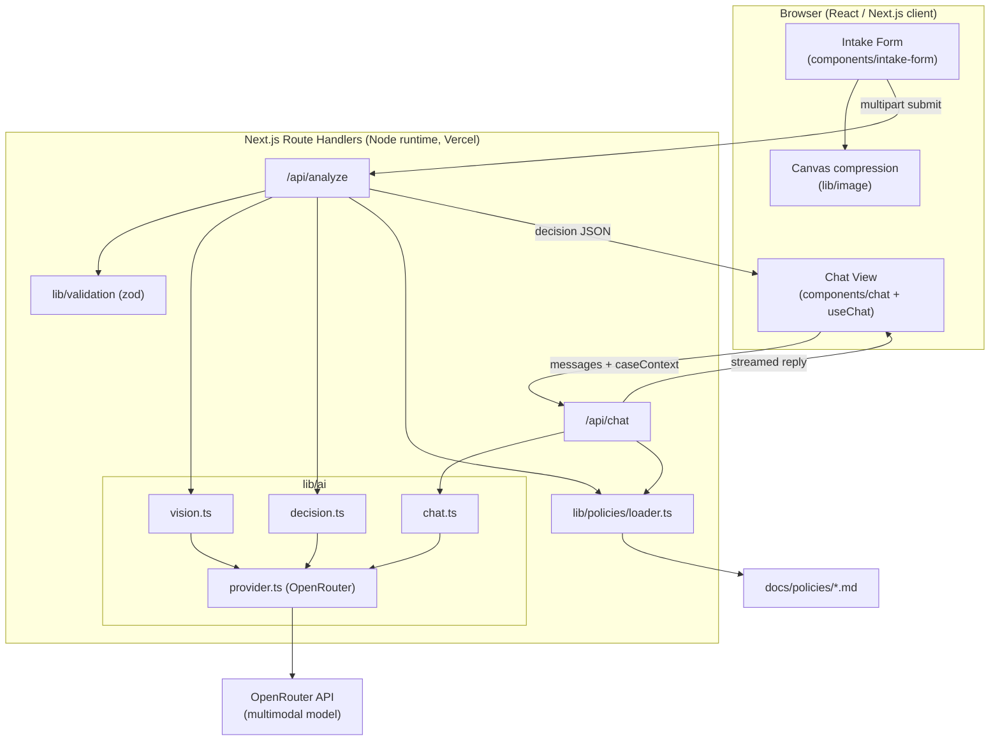
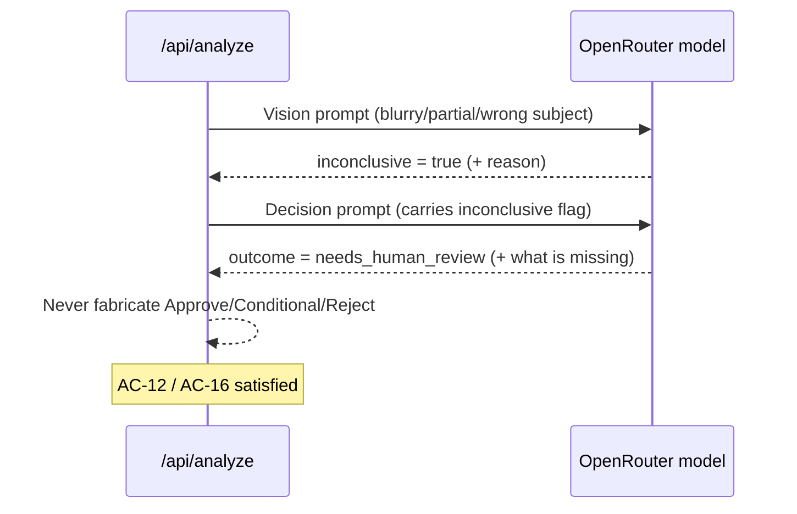

# ADR: Hardware Service Decision Copilot — Main Architecture

**Date:** 2026-06-17
**Status:** Accepted
**PRD:** [docs/PRD-Hardware-Service-Decision-Copilot.md](../PRD-Hardware-Service-Decision-Copilot.md)

---

## 1. Overview

The Hardware Service Decision Copilot is an MVP web application that helps customer-support and hardware-service staff make **complaint** and **return** decisions for consumer electronics. A user fills a short intake form and uploads one photo. The system:

1. analyzes the photo with a **multimodal LLM** (vision),
2. feeds the resulting condition description plus the form data plus the matching **policy document** to a **reasoning step** that produces a structured decision (**Approve / Conditional / Reject / Needs human review**) with a justification,
3. presents that decision as the first message of a **chat** where the user can ask follow-up questions with full case context.

This is a proof-of-concept. **No persistence** — sessions, decisions, and images live only in browser/runtime memory for the duration of a case (PRD §7). Authentication, customer history, and a RAG knowledge base are explicitly out of scope.

This ADR-000 defines the overall system: stack, module map, data models, environment, cross-cutting decisions, diagrams, and the overall testing strategy. Three focused ADRs detail each layer:

- [001-frontend.md](001-frontend.md) — Next.js UI, intake form, chat, client-side image handling
- [002-backend-api.md](002-backend-api.md) — route handlers, image validation/normalization, provider plumbing
- [003-ai-agent.md](003-ai-agent.md) — vision analysis, structured decision, chat agent, prompts, policy injection

---

## 2. Context7 Library References

Implementing agents must fetch docs using these handles. The Context7 MCP API key was invalid at authoring time — if a call fails, resolve the handle again via `resolve-library-id` or fall back to the bundled skill docs in `.agents/skills/ai-sdk/` and the official sites.

| Library | Context7 Handle | Used for |
|---|---|---|
| Vercel AI SDK | `/vercel/ai` | `streamText`, `generateText` + `Output.object`, `useChat`, multimodal message parts, UI message streaming |
| Next.js | `/vercel/next.js` | App Router, route handlers, server-side validation, Vercel function config |
| React | `/reactjs/react.dev` | Client components, form/chat state |
| Tailwind CSS | `/tailwindlabs/tailwindcss.com` | v4 theming via `@theme`, dark-first design tokens |
| Zod | `/colinhacks/zod` | Schema validation for form input, structured LLM output, route payloads |
| OpenRouter AI SDK provider | resolve `@openrouter/ai-sdk-provider` | OpenRouter provider for the AI SDK (`createOpenRouter`) |
| Vitest | resolve `vitest` | Unit + integration test runner |
| Playwright | `/microsoft/playwright` | E2E tests against the running app |

> **AI SDK version note (verified against bundled skill docs):** target **`ai` v6+**. `generateObject` is deprecated → use `generateText` with `output: Output.object({ schema })`. `useChat` is imported from `@ai-sdk/react`, no longer manages input state, and uses `transport: new DefaultChatTransport(...)` + `sendMessage()`. Server routes for `useChat` must return `result.toUIMessageStreamResponse()`. Tools use `inputSchema`; step limits use `stopWhen: stepCountIs(n)`; token cap is `maxOutputTokens`. Implementing agents must re-verify these against `node_modules/ai/docs/` before coding.

---

## 3. System Architecture

### Architecture pattern

**Single Next.js (App Router) full-stack application**, deployed as a Vercel-ready project. The frontend (React Server/Client Components) and the backend (route handlers under `app/api/`) live in one repository and one deployable unit. There is no separate backend service and no database.

- Frontend: client components for the interactive form and chat.
- Backend: Next.js **route handlers** (Node.js runtime) that call the LLM provider. All secrets stay server-side.
- AI: Vercel AI SDK targeting **OpenRouter**, single multimodal model for both vision and reasoning.

### Repository structure

The app is built inside the existing `app/` scaffold described in the repo (`AGENTS.md`). Proposed layout:

```
app/                          Next.js project root (the course "app/" scaffold)
  app/                        App Router tree
    layout.tsx                Root layout, fonts, global styles
    page.tsx                  Entry screen (hosts intake form ↔ chat view switch)
    globals.css               Tailwind v4 entry + @theme design tokens
    api/
      analyze/route.ts        POST: image + form → vision analysis → structured decision
      chat/route.ts           POST: follow-up chat turns (streaming)
  lib/
    ai/
      provider.ts             OpenRouter provider configuration
      vision.ts               Vision (image → condition description) call
      decision.ts             Structured decision (Output.object) call
      chat.ts                 Chat streaming call (context assembly)
      prompts.ts              All prompt templates (PL), per request type
    policies/
      loader.ts               Reads docs/policies/*.md at runtime
    validation/
      form-schema.ts          Zod schemas for intake form + API payloads
    image/
      compress.ts             Client-side canvas compression helper
    types.ts                  Shared domain types (RequestType, Decision, etc.)
  components/
    intake-form/              Form fields, validation display, submit state
    chat/                     Message list, bubbles, input, loading indicator, error/retry
    ui/                       Reusable primitives (button, select, etc.)
  __tests__/ or *.test.ts     Unit/integration tests (co-located or grouped)
  e2e/                        Playwright E2E specs
  .env.example                Documented env vars
  package.json, tsconfig, next.config, tailwind/postcss config
docs/policies/                complaint-policy.md, return-policy.md (read at runtime)
```

> The two policy documents already live in `docs/policies/` and are read by the backend at runtime (see §5 and ADR-003). They are **not** copied into `app/`.

### Technology stack

| Layer | Technology | Reason |
|---|---|---|
| Language | TypeScript (strict) | Type safety across UI, API, and LLM schemas; matches course demo stack |
| Framework | Next.js (App Router) | Full-stack React with route handlers; first-class Vercel deploy; AI SDK integration |
| UI runtime | React (client components) | Interactive form + streaming chat |
| Styling | Tailwind CSS v4 | Utility-first; design tokens via `@theme`; implements the Spotify-inspired dark system |
| AI orchestration | Vercel AI SDK (`ai`, `@ai-sdk/react`) | Multimodal input, `Output.object` structured decisions, `useChat` streaming |
| LLM access | OpenRouter (`@openrouter/ai-sdk-provider`) | Single API for a swappable multimodal model; keeps provider choice flexible |
| Validation | Zod | One schema source reused for form, API payload, and LLM structured output |
| Image handling | Browser Canvas API (client compression) + server-side validation | Keeps serverless payloads small; server enforces final format/size limits |
| Unit/integration tests | Vitest | Fast, TS-native; mocks deps and the LLM API |
| E2E tests | Playwright | Real-stack browser tests against the running app |

---

## 4. Module Structure & Dependencies

Dependency direction flows **UI → API route → ai/* + policies + validation → provider**. No circular dependencies. UI never imports `lib/ai/*` provider modules directly; it talks only to the two API routes.

| Module | Responsibility | Depends on | Depended on by |
|---|---|---|---|
| `components/intake-form` | Render fields, client validation, image preview/compression, submit | `lib/validation`, `lib/image`, `lib/types` | `app/page.tsx` |
| `components/chat` | Render messages, input, loading/typing, error/retry, "New case" | `@ai-sdk/react` (useChat), `lib/types` | `app/page.tsx` |
| `app/page.tsx` | Top-level state machine: `form` ↔ `chat`; holds the active case in memory | intake-form, chat components | — |
| `app/api/analyze/route.ts` | Validate payload, normalize image, run vision + decision, return decision + case context | `lib/validation`, `lib/ai/vision`, `lib/ai/decision`, `lib/policies` | frontend (fetch) |
| `app/api/chat/route.ts` | Stream follow-up replies with full case context | `lib/ai/chat`, `lib/policies`, `lib/validation` | frontend (useChat) |
| `lib/ai/provider.ts` | Configure OpenRouter provider + model from env | env | vision, decision, chat |
| `lib/ai/vision.ts` | Image → structured condition description, per request type | provider, prompts | analyze route |
| `lib/ai/decision.ts` | Condition + form + policy → structured decision (`Output.object`) | provider, prompts | analyze route |
| `lib/ai/chat.ts` | Assemble system context + history → streamed reply | provider, prompts | chat route |
| `lib/ai/prompts.ts` | PL prompt templates per request type and per step | — | vision, decision, chat |
| `lib/policies/loader.ts` | Load + cache policy markdown by request type | filesystem | decision, chat |
| `lib/validation/form-schema.ts` | Zod schemas: form, analyze payload, decision output, chat payload | zod | form, both routes, decision |
| `lib/image/compress.ts` | Client canvas resize/compress to target max dimension/quality | browser APIs | intake-form |
| `lib/types.ts` | Shared enums/types | — | most modules |

---

## 5. Data Models

All models are **in-memory only** (no DB). They exist within a single browser session and the request/response cycle.

### RequestType
- Values: `complaint` | `return`.
- Drives which prompts and which policy document are used.

### EquipmentCategory
- Enum of the predefined list (PRD §8 → Functional): Smartphone, Laptop, Tablet, TV, Audio/Headphones, Smartwatch/Wearable, Camera, Home appliance, Accessory, Other.

### IntakeForm
- `requestType: RequestType`
- `category: EquipmentCategory`
- `model: string` (name/model, free text, required, non-empty)
- `purchaseDate: string` (ISO date; not in the future)
- `reason: string` (required when `requestType = complaint`, optional for `return`)
- `image: File/Blob` (exactly one; JPEG/PNG/WebP; ≤ 10 MB pre-compression)
- Persistence: client memory only; cleared on "New case".

### ImageAnalysis (vision output)
- `requestType`-aware structured description of the equipment condition.
- Complaint fields (conceptual): `isDamaged: boolean | "unknown"`, `damageDescription: string`, `likelyCause: string`, `inconclusive: boolean`, `inconclusiveReason?: string`.
- Return fields (conceptual): `showsDamage: boolean | "unknown"`, `showsUsageSigns: boolean | "unknown"`, `resaleableAsNew: boolean | "unknown"`, `observations: string`, `inconclusive: boolean`, `inconclusiveReason?: string`.
- Persistence: produced server-side per analyze call; returned to client and re-sent on each chat turn as part of case context.

### Decision
- `outcome: "approve" | "conditional" | "reject" | "needs_human_review"`
- `justification: string` (mandatory, references policy basis + observed condition; PRD AC-15)
- `policyBasis: string[]` (referenced clauses/sections from the policy doc)
- `conditions?: string[]` (for `conditional`)
- `missingInfo?: string` (for `needs_human_review` / better-photo requests)
- `nextSteps: string`
- Persistence: returned to client; held in chat state for the session.

### CaseContext
- Bundle re-sent to the chat route on every follow-up turn: `{ requestType, form (sans raw image), imageAnalysis, decision, policyId }`.
- The **raw image is not re-sent** on chat turns; only its textual analysis is carried forward (keeps payloads small, deterministic).

### ChatMessage (UIMessage)
- AI SDK `UIMessage` shape: `{ id, role: "user" | "assistant", parts: [...] }`.
- The first assistant message is the rendered Decision (greeting + outcome + justification + next steps).
- Persistence: client memory only.

### PolicyDocument
- `id: "complaint" | "return"`, `content: string` (raw markdown).
- Source files: `docs/policies/complaint-policy.md`, `docs/policies/return-policy.md`.
- Loaded and cached in module memory at runtime by `lib/policies/loader.ts`.

---

## 6. API / Interface Contracts

Conceptual contracts only. Full per-field detail in ADR-002 and ADR-003.

### POST `/api/analyze`
- **Purpose:** Submit a validated case; run vision analysis + structured decision.
- **Input:** `multipart/form-data` — fields (`requestType`, `category`, `model`, `purchaseDate`, `reason`) + one image file (already client-compressed).
- **Output:** JSON `{ decision: Decision, imageAnalysis: ImageAnalysis, caseContext: CaseContext, firstMessage: string }`. `firstMessage` is the PL-formatted decision text for the first chat bubble.
- **Errors:**
  - `400` — validation failure (invalid/missing field, bad image format/size, future date). Body lists field-level errors (PL).
  - `502/503` — LLM/provider failure. Body signals a retryable error (PL); never a fabricated decision (AC-23).
- **Notes:** Node runtime; server re-validates everything (never trusts the client); secrets server-side only; may take several seconds → see `maxDuration` decision §8.

### POST `/api/chat`
- **Purpose:** Generate a follow-up reply using full case context.
- **Input:** JSON `{ messages: UIMessage[], caseContext: CaseContext }` (AI SDK `useChat` transport body).
- **Output:** **Streamed** UI message stream (`toUIMessageStreamResponse()`).
- **Errors:** Stream error surfaced to client as an inline error with retry (AC-21/AC-23). Off-topic requests are answered by the agent with a polite decline (AC-20) — not an HTTP error.
- **Notes:** Stateless; the client holds the conversation and re-sends it each turn.

### Interface: `lib/policies/loader.ts`
- `getPolicy(requestType) → PolicyDocument` (cached). Throws a clear error if the file is missing (config error, not a user error).

---

## 7. Environment Variables

| Variable | Purpose | Required | Example value |
|---|---|---|---|
| `OPENROUTER_API_KEY` | Auth for OpenRouter (server-side only) | Yes | `sk-or-v1-…` |
| `OPENROUTER_MODEL` | Multimodal model ID used for vision + decision + chat | Yes | `openai/gpt-4o` *(placeholder — verify against the live OpenRouter model list before coding; pick a current vision-capable model)* |
| `OPENROUTER_BASE_URL` | Override OpenRouter base URL | No | `https://openrouter.ai/api/v1` |
| `MAX_IMAGE_MB` | Server-side max accepted upload size (pre/post compression cap) | No (default 10) | `10` |
| `OPENROUTER_APP_URL` | `HTTP-Referer` header value OpenRouter recommends for attribution | No | `https://your-app.vercel.app` |
| `OPENROUTER_APP_NAME` | `X-Title` header value for OpenRouter attribution | No | `Hardware Service Copilot` |

> `OPENAI_API_KEY` from the repo's `.env.example` is **not** used in this MVP (we standardized on OpenRouter). Keep `.env.example` in `app/` aligned with this table.

---

## 8. Technical Decisions

### Single Next.js full-stack app (no separate backend, no DB)
**Status:** Accepted · **Date:** 2026-06-17
**Context:** MVP with no persistence, one team, one deployable. PRD defers DB/history/RAG to phase 2.
**Decision:** Build one Next.js App Router app; backend logic lives in route handlers. State is in-memory only.
**Rejected alternatives:**
- Separate Node/Express API: extra deploy + CORS overhead with no MVP benefit.
- Server-component-only with Server Actions for everything: streaming chat is cleaner with a dedicated route handler + `useChat`.
**Consequences:** (+) Minimal moving parts, fast to build, one Vercel deploy. (−) No durability; a page refresh loses the case (acceptable per PRD §7).
**Review trigger:** When persistence (phase 2 SQLite) or auth is introduced.

### LLM access via OpenRouter, single multimodal model
**Status:** Accepted · **Date:** 2026-06-17
**Context:** Need both image understanding and policy reasoning; the course wants provider flexibility.
**Decision:** Use the Vercel AI SDK with the OpenRouter provider and **one** multimodal model (configurable via `OPENROUTER_MODEL`) for vision, decision, and chat.
**Rejected alternatives:**
- OpenAI direct: fewer swappable models; the team chose OpenRouter.
- Split vision vs reasoning models: more complexity than the MVP needs; revisit if quality/cost demands it.
**Consequences:** (+) One key, one provider, easy model swaps. (−) Single model must be good at both vision and reasoning; coupled cost.
**Review trigger:** If decision quality or cost makes a dedicated reasoning model worthwhile.

### Structured decision via `generateText` + `Output.object`; free-form chat via `streamText`
**Status:** Accepted · **Date:** 2026-06-17
**Context:** The first decision must be machine-checkable (one of four outcomes, mandatory justification — AC-13/AC-15). Follow-up chat is conversational.
**Decision:** Produce the first decision as a typed object (Zod schema → `Output.object`), then render it as the first chat message. Follow-ups use `streamText` + `useChat` streaming.
**Rejected alternatives:**
- All free-form text with outcome parsed from prose: brittle; fails AC validation.
- AI SDK `ToolLoopAgent`/tools: heavier than needed; no external tools in MVP (policy is injected, not fetched).
**Consequences:** (+) Outcome is validated and testable; chat stays natural and streams. (−) Two distinct call shapes to maintain.
**Review trigger:** If we add tools (e.g. live policy lookup, customer history) — move to the agent/tool-loop pattern.

### Client-side image compression; server-side validation
**Status:** Accepted · **Date:** 2026-06-17
**Context:** AC-09 requires reducing the image before the LLM; Vercel functions have payload/time limits.
**Decision:** Compress/resize in the browser (Canvas) before upload; the API route still validates format/size and rejects anything outside limits, and may downscale further if needed before the vision call.
**Rejected alternatives:**
- Server-side `sharp`: native binary friction on serverless; larger inbound payloads.
- Both (client + heavy server processing): more code than the MVP warrants.
**Consequences:** (+) Small payloads, fast uploads, fits serverless. (−) Compression quality depends on the browser; server must still guard limits. **Note:** PRD AC-09 says "backend reduces the image" — we satisfy its intent (image is reduced before the LLM call) with the reduction happening client-side and the backend enforcing the final constraint.
**Review trigger:** If client compression proves inconsistent across target browsers.

### Vercel-ready deployment with Node runtime + raised `maxDuration`
**Status:** Accepted · **Date:** 2026-06-17
**Context:** Vision + reasoning can take several seconds; default serverless timeouts may be too short.
**Decision:** Target Vercel; run AI routes on the **Node.js runtime** and set a raised `maxDuration` (e.g. 60s) on `/api/analyze` and `/api/chat`. No reliance on local filesystem writes; policy files are read-only at build/runtime.
**Rejected alternatives:**
- Edge runtime: provider SDK and longer LLM calls fit Node better for the MVP.
**Consequences:** (+) Production-realistic, deployable as-is. (−) Must respect serverless constraints (no writable FS, cold starts).
**Review trigger:** If a single call risks exceeding the platform's max function duration.

### Policies read from `docs/policies/*.md` at runtime, cached in memory
**Status:** Accepted · **Date:** 2026-06-17
**Context:** Policies are static seed files; no admin UI in MVP.
**Decision:** `lib/policies/loader.ts` reads the matching markdown file and caches it. The full policy text is injected into the decision/chat prompt verbatim.
**Rejected alternatives:**
- Hardcode policy text in code: drifts from the source docs; harder to update.
- DB/CMS: out of scope.
**Consequences:** (+) Single source of truth; easy to edit. (−) Files must be included in the deployment bundle and reachable at runtime.
**Review trigger:** When versioning/admin editing of policies is added (phase 2).

### Polish-only UI and generated text, enforced by prompts + content
**Status:** Accepted · **Date:** 2026-06-17
**Context:** AC-22 requires all user-facing text in Polish.
**Decision:** All static UI strings are authored in Polish; all prompts instruct the model to respond in Polish; validation messages are Polish.
**Consequences:** (+) Meets AC-22. (−) No i18n layer (acceptable; multilingual is out of scope).
**Review trigger:** If multilingual support is requested.

---

## 9. Diagrams

### 9.1 Architecture / Component Diagram



### 9.2 Data Flow Diagram

```mermaid
flowchart LR
    A[Form data + image] --> B[Client compress image]
    B --> C[/api/analyze/]
    C --> D[Validate + normalize]
    D --> E[Vision: image + form -> condition description]
    E --> F[Load policy by requestType]
    F --> G[Decision: condition + form + policy -> structured Decision]
    G --> H[Format first message PL]
    H --> I[Chat view: first assistant message]
    I --> J[User follow-up + caseContext]
    J --> K[/api/chat/]
    K --> L[Assemble system context + history]
    L --> M[Stream reply PL]
    M --> I
```



### 9.3 Sequence Diagrams

#### Submit case → decision (happy path)

```mermaid
sequenceDiagram
    actor U as User
    participant FE as Form (client)
    participant API as /api/analyze
    participant POL as Policy loader
    participant LLM as OpenRouter model
    U->>FE: Fill form + select image
    FE->>FE: Client validate + compress image
    U->>FE: Submit
    FE->>API: multipart (form + image)
    API->>API: Re-validate + normalize image
    API->>LLM: Vision prompt (image + form, per requestType)
    LLM-->>API: Condition description (structured)
    API->>POL: getPolicy(requestType)
    POL-->>API: Policy markdown
    API->>LLM: Decision prompt + Output.object schema
    LLM-->>API: { outcome, justification, ... }
    API-->>FE: decision + imageAnalysis + caseContext + firstMessage
    FE->>U: Switch to chat; show first message (decision)
```

#### Inconclusive image → Needs human review



#### Follow-up chat (streaming)

```mermaid
sequenceDiagram
    actor U as User
    participant CV as Chat view (useChat)
    participant API as /api/chat
    participant LLM as OpenRouter model
    U->>CV: Type follow-up
    CV->>API: messages[] + caseContext
    API->>API: Build system context (form, analysis, policy, decision)
    API->>LLM: streamText(system + history)
    LLM-->>API: token stream
    API-->>CV: UI message stream
    CV->>U: Render streamed reply; lock input until done
```

#### Service error → retry

```mermaid
sequenceDiagram
    participant FE as Client
    participant API as /api/analyze or /api/chat
    participant LLM as OpenRouter
    FE->>API: request
    API->>LLM: call
    LLM--xAPI: error / timeout
    API-->>FE: error state (PL), retryable=true
    FE->>FE: Show inline error + retry; no fabricated decision
```

---

## 10. Testing Strategy

### Philosophy

**TDD per AGENTS.md.** Write/extend tests before production code, confirm they fail for the right reason, implement the minimum to pass, then refactor green. The test pyramid follows the project's table: unit (mock all deps), integration (mock only the external LLM API), E2E (no mocks, real stack).

### Test layers

| Layer | Type | Scope | Tools |
|---|---|---|---|
| Unit | Pure functions | Zod schemas (form/decision), image-compress helper, policy loader, prompt builders, message formatting | Vitest |
| Integration | Route handlers | `/api/analyze` and `/api/chat` with the **LLM provider mocked**; validation, error mapping, policy injection, payload shapes | Vitest (+ AI SDK mock model) |
| E2E | Full stack | Form → decision → chat → new case in a real browser against the running app | Playwright |

> For integration tests, mock the model with the AI SDK's test/mock model utilities (verify exact name in `node_modules/ai/`), so no network/LLM calls occur. Only the **external LLM API** is mocked at this layer.

### Key test scenarios

- **Form validation (unit + E2E):** missing required field; future purchase date rejected; reason required for complaint, optional for return; image format/size enforced; field-level PL errors shown; entered values preserved on failure. (AC-01..AC-08)
- **Image reduction (unit):** compress helper outputs a smaller image within target dimensions/format; server rejects oversized/wrong-format files. (AC-08, AC-09)
- **Vision per request type (integration):** complaint prompt asks damage/type/cause; return prompt asks no-damage/no-usage; inconclusive flag propagates. (AC-10..AC-12)
- **Decision (integration):** returns exactly one of four outcomes; justification always present; correct policy injected per request type; inconclusive → `needs_human_review`, never a fabricated verdict. (AC-13..AC-16)
- **First message (integration + E2E):** first chat bubble contains greeting + outcome + justification + next steps, in Polish, with the "recommendation, not binding" notice. (AC-17, mandatory notices)
- **Chat (integration + E2E):** follow-ups use full context; off-topic politely declined; loading indicator + duplicate-submit lock; streamed reply. (AC-18..AC-21)
- **Errors (integration + E2E):** provider failure → clear PL error + retry, never a fabricated/partial decision. (AC-23)
- **New case (E2E):** returns to empty form; previous conversation discarded. (AC-24)

### Technical acceptance criteria

- **TAC-01:** `npm run lint`, `npm run build`, and `npm test` all pass with zero errors before any commit.
- **TAC-02:** The decision structured output is validated against the Zod schema; a response missing `outcome` or `justification` is rejected as invalid (no fabricated fallback).
- **TAC-03:** No API key or provider secret is referenced in any client component or shipped to the browser bundle.
- **TAC-04:** `/api/analyze` rejects (HTTP 400) any payload failing server-side validation, independent of client checks.
- **TAC-05:** The correct policy file is injected based on `requestType` (complaint ↔ complaint-policy, return ↔ return-policy), verified by integration test.
- **TAC-06:** On a mocked provider error, both routes return a retryable error state and the UI shows no decision content.
- **TAC-07:** All assertions on user-facing strings confirm Polish text.
- **TAC-08:** The app boots (`npm run dev`/`build` + start) and the happy-path E2E passes against the real stack before completion (per AGENTS.md "tests passing ≠ app working").
