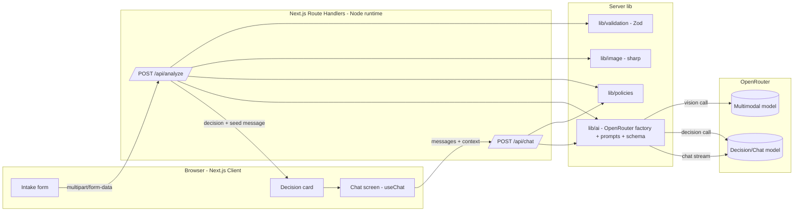
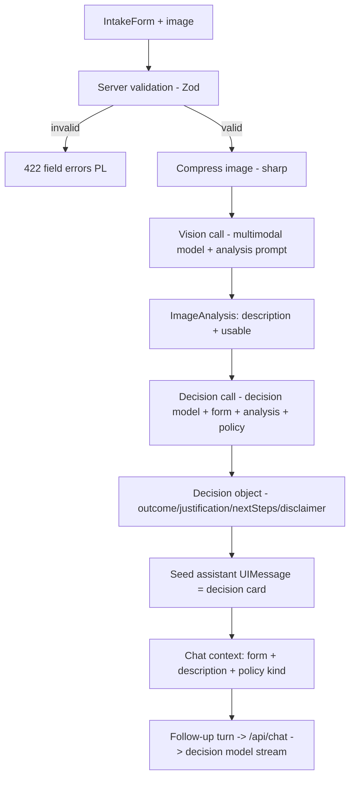
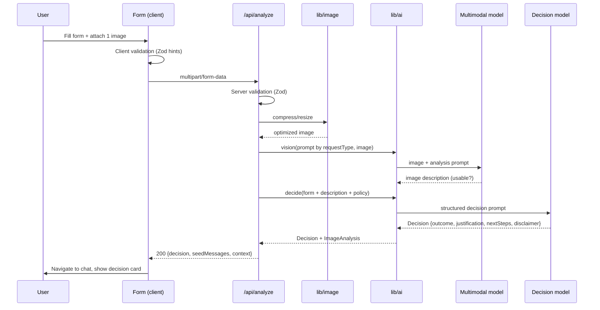
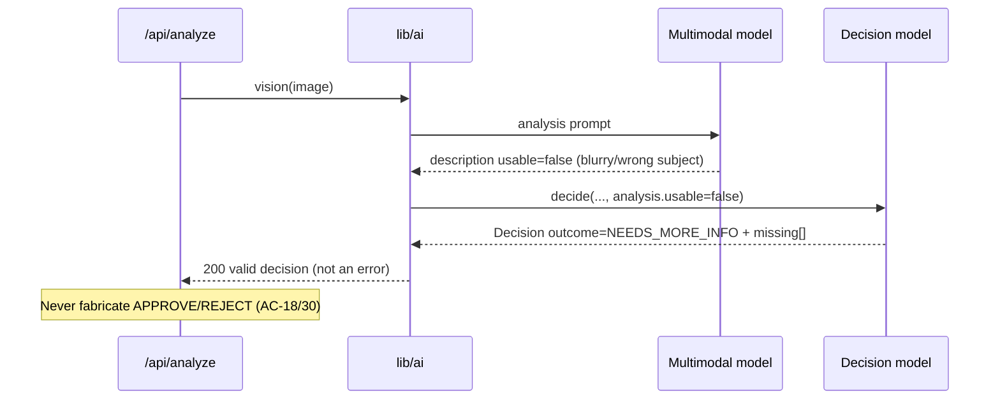
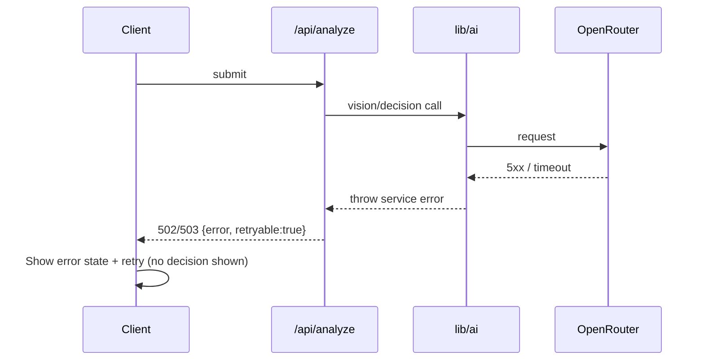
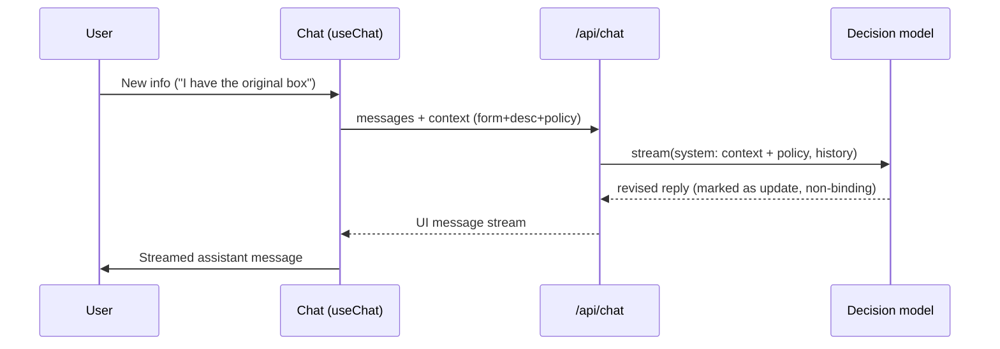

# ADR: Hardware Service Decision Copilot — Main Architecture

**Date:** 2026-06-18
**Status:** Accepted
**PRD:** `docs/PRD-Product-Requirements-Document.md` (Hardware Service Decision Copilot)

---

## 1. Overview

Hardware Service Decision Copilot is a self-service web app (MVP/PoC) that gives a
customer an **instant, preliminary, non-binding** assessment of whether their
**return** (*Zwrot*) or **complaint** (*Reklamacja*) for a consumer-electronics
device is likely to be accepted.

The customer fills a short intake form and uploads **exactly one** photo. A
**multimodal LLM** produces an objective description of the device's condition. A
**separate reasoning LLM** combines that description with the form data and the
matching policy document (return vs complaint) and returns exactly one decision —
**APPROVE, REJECT, NEEDS_MORE_INFO, CONDITIONAL, ESCALATE** — with a Polish
justification. The user is then placed in a chat that opens with the decision card
and can ask follow-up questions; the agent may revise the (still non-binding)
recommendation when new information warrants it.

This ADR set is the implementation contract for the developer agents. It covers the
overall system; three granular ADRs cover each technical area:

| ADR | Area |
|---|---|
| `001-frontend.md` | Next.js App Router UI, AI SDK UI (`useChat`), form, chat, states |
| `002-backend-api.md` | Route handlers, validation, image compression, orchestration |
| `003-ai-agent.md` | OpenRouter provider, vision + decision models, prompts, structured output |

**Relationship to the PRD:** the PRD defines *what* and *why* (flows, AC-01…AC-31,
agent behavior). This ADR defines *how* — stack, module boundaries, data shapes,
interface contracts, env vars, and the testing strategy. Where the PRD defers a
decision to the ADR (model/provider, image compression, prompt storage, API
contracts, data models, testing), this document resolves it.

---

## 2. Context7 Library References

Implementing agents MUST fetch docs through these handles (do not re-search).

| Library | Context7 Handle | Used for |
|---|---|---|
| Next.js | `/vercel/next.js` | App Router, route handlers, FormData, server components |
| Vercel AI SDK (core) | `/vercel/ai` | `generateText`, `streamText`, `Output.object`, UI message streams |
| AI SDK React (UI) | `/vercel/ai` (package `@ai-sdk/react`) | `useChat`, `DefaultChatTransport` |
| OpenRouter AI SDK provider | `/openrouterteam/ai-sdk-provider` | `createOpenRouter`, model selection, vision + chat models |
| React | `/reactjs/react.dev` | Components, hooks |
| Tailwind CSS | `/tailwindlabs/tailwindcss.com` | Styling per `docs/design-guidelines.md` |
| Shadcn/ui | `/shadcn-ui/ui` | Form, dialog, button, select primitives |
| Zod | resolve via `resolve-library-id` (`Zod`) | Form + decision schema validation (shared) |

> Versions float; pin in `package.json` at scaffold time and record the pinned
> versions back into the relevant ADR.

---

## 3. System Architecture

### Architecture pattern
**Single Next.js (App Router) application** — one deployable unit that serves both
the UI (React Server/Client Components) and the backend (route handlers under
`app/api/*`). No separate backend service. This is a "full-stack monolith on the
edge/node runtime" appropriate for an MVP with no database.

Rationale: the PRD has no persistence, no auth, and a single linear flow
(form → analysis → decision → chat). A split frontend/backend would add deployment
and contract overhead with no MVP benefit. The frontend/backend boundary is kept
**logical** (HTTP route handlers) so it can be extracted later.

### Repository structure

```
app/                          Next.js application (App Router)
  layout.tsx                  Root layout, fonts, global providers
  page.tsx                    Intake form screen (Server Component shell)
  chat/                       Chat screen route (client-driven)
  api/
    analyze/route.ts          POST: validate form + image, compress, vision call, decision call
    chat/route.ts             POST: streaming chat continuation (useChat transport target)
  components/                 UI components (form, chat, decision card, states)
  lib/
    ai/                       Provider + model factory, prompt builders, schemas
    validation/               Shared Zod schemas (form + decision)
    image/                    Image compression/normalization
    policies/                 Policy loader (reads docs/policies/*.md at runtime)
docs/
  PRD-Product-Requirements-Document.md
  ADR/                        This ADR set
  policies/                   complaint-policy.md, return-policy.md (agent rules)
  design-guidelines.md        Design tokens
assets/                       Logo, favicon, tokens
```

> The frontend and backend live in the same Next.js project; their contract is the
> two JSON/streaming HTTP endpoints in §6. `lib/` is shared server-only code.

### Technology stack

| Layer | Technology | Reason |
|---|---|---|
| Framework | Next.js (App Router) | One deployable for UI + API; first-class AI SDK + Vercel support |
| Language | TypeScript (strict) | Type-safe contracts shared between UI, API, and AI layer |
| UI runtime | React 19 + AI SDK UI (`@ai-sdk/react`) | `useChat` gives streaming chat, message state, statuses out of the box |
| Styling | Tailwind CSS + Shadcn/ui | Matches `design-guidelines.md`; accessible primitives |
| Validation | Zod | One schema reused for client hints, server validation, and decision parsing |
| AI orchestration | Vercel AI SDK core (`ai`) | `generateText` (vision), `Output.object`/structured (decision), `streamText` (chat) |
| LLM provider | OpenRouter via `@openrouter/ai-sdk-provider` | Single key, two **different** models (vision + reasoning) behind one provider |
| Image processing | `sharp` (server-only) | Fast resize/recompress before vision call (AC-10) |
| Persistence | **None** (in-memory per request / client session state) | PRD §7: no DB, no sessions across restart |
| Tests | Vitest (unit/integration) + Playwright (E2E) | Per AGENTS.md test strategy |
| Deployment | Vercel (and local `next dev`) | Default course stack; serverless route handlers |

---

## 4. Module Structure & Dependencies

Dependency direction is **UI → API (HTTP) → AI/lib**. No module imports "upward".
No circular dependencies.

| Module | Responsibility | Depends on | Depended on by |
|---|---|---|---|
| `app/page.tsx` + form components | Render intake form, client validation, submit `FormData` | `lib/validation`, design system | — |
| `app/chat` + chat components | Render decision card + chat thread via `useChat` | `app/api/chat`, AI SDK UI | — |
| `app/api/analyze/route.ts` | Orchestrate: server-validate → compress → vision → decision | `lib/validation`, `lib/image`, `lib/ai`, `lib/policies` | Form submit |
| `app/api/chat/route.ts` | Stream follow-up replies with full case context | `lib/ai`, `lib/policies` | `useChat` transport |
| `lib/ai` | OpenRouter provider, model factory, prompt builders, decision schema, agent calls | `lib/policies`, Zod | both route handlers |
| `lib/validation` | Shared Zod schemas + Polish messages | Zod | UI, analyze route |
| `lib/image` | Compress/resize/normalize image, enforce format/size | `sharp` | analyze route |
| `lib/policies` | Load + cache the two policy markdown files | filesystem | `lib/ai` (prompt injection) |

State management: **client-only, ephemeral.** The form screen holds form state; on
success it hands the analysis result + seed messages to the chat screen (via client
navigation/state). `useChat` owns the conversation array. Nothing is persisted
(AC-27/AC-28: context lives for the session; "new request" clears it).

---

## 5. Data Models

All models are **conceptual / in-memory only** — there is no database (PRD §7).

### IntakeForm
- **Purpose:** the customer's submission.
- **Fields:** `requestType` (`"complaint" | "return"`), `category` (enum, 10 values
  AC-02), `model` (string, trimmed non-empty), `purchaseDate` (ISO date ≤ today),
  `reason` (string; required iff `requestType="complaint"`), `image` (one file,
  JPEG/PNG/WebP, ≤ 10 MB).
- **Relationships:** produced by the form; consumed by `analyze`.
- **Persistence:** none (request body only).

### ImageAnalysis
- **Purpose:** the multimodal model's objective description of the device condition.
- **Fields:** `description` (Polish text), `usable` (boolean — false when blurry /
  wrong subject / unreadable), `signals` (optional structured notes: damage type,
  signs of use, likely cause).
- **Relationships:** output of the vision call; input to the decision call; retained
  in chat context (AC-14, AC-23).
- **Persistence:** held in conversation context for the session only.

### Decision
- **Purpose:** the agent's structured verdict.
- **Fields:** `outcome` (`APPROVE | REJECT | NEEDS_MORE_INFO | CONDITIONAL |
  ESCALATE`), `justification` (Polish, references concrete policy reason — AC-17),
  `nextSteps` (Polish), `missing` (list, only for NEEDS_MORE_INFO — AC-18),
  `conditions` (only for CONDITIONAL — AC-15), `disclaimer` (Polish, mandatory —
  AC-19/§11).
- **Relationships:** produced from `IntakeForm` + `ImageAnalysis` + policy doc;
  rendered as the first chat message (AC-20/21/22).
- **Persistence:** session only.

### ChatMessage / Conversation (UIMessage)
- **Purpose:** the chat thread used by AI SDK UI.
- **Fields:** AI SDK `UIMessage` shape — `id`, `role` (`user|assistant|system`),
  `parts[]` (text). The seed assistant message carries the rendered Decision.
- **Relationships:** the conversation is the full context passed to `chat` route on
  every turn (AC-23).
- **Persistence:** client memory; cleared on new request / reload (AC-27/28).

### PolicyDocument
- **Purpose:** decision rules injected into prompts.
- **Fields:** `kind` (`complaint|return`), `markdown` (full text).
- **Source:** `docs/policies/complaint-policy.md`, `docs/policies/return-policy.md`
  (read at runtime; see decision in §8 about the filename mismatch with the PRD).

---

## 6. API / Interface Contracts

Two route handlers. No auth (PRD §7). All user-facing strings in Polish.

### `POST /api/analyze`
- **Purpose:** validate the submission, compress the image, run vision analysis,
  run the decision agent, return the seed decision + analysis context.
- **Input:** `multipart/form-data` — fields `requestType`, `category`, `model`,
  `purchaseDate`, `reason` (optional for return), and `image` (single file).
- **Output (200, JSON):**
  - `decision`: the `Decision` object (§5).
  - `imageAnalysis`: the `ImageAnalysis` object (description + usable flag).
  - `seedMessages`: array with one assistant `UIMessage` = rendered decision card,
    ready to hydrate `useChat`.
  - `context`: the immutable case context (form fields + image description + policy
    kind) echoed back so the client can attach it to chat requests.
- **Error cases:**
  - `422` validation failed → `{ errors: { field: polishMessage } }` (AC-07, AC-08,
    AC-09). Client renders inline field errors.
  - `502/503` vision or decision service unavailable → `{ error, retryable: true }`
    (AC-29). **Never** return a fabricated decision (AC-30).
  - `422` with `decision.outcome = NEEDS_MORE_INFO` is a **valid 200**, not an error
    (image unusable but service worked — AC-18, AC-30).
- **Notes:** Node.js runtime (sharp needs Node, not Edge). Streaming not required
  here; this is request/response. Enforce body size for the 10 MB image.

### `POST /api/chat`
- **Purpose:** stream follow-up agent replies with full case context (AC-23–AC-25).
- **Input (JSON):** the AI SDK UI request body — `messages` (UIMessage[]) plus a
  custom `context` object (form data + image description + policy kind), attached via
  `useChat`'s `prepareSendMessagesRequest`.
- **Output:** a **UI message stream** (`createUIMessageStreamResponse` /
  `toUIMessageStream`) consumed by `useChat` — streamed assistant text.
- **Behavior:** system prompt re-injects the case context + the matching policy doc;
  the agent answers in scope, may issue a marked **revised** decision (AC-25), and
  declines off-topic requests (AC-26).
- **Error cases:** on model/provider failure, stream an error part; the client shows
  an inline retry on that turn (AC-29). No fabricated decision.
- **Notes:** streaming response; Node.js runtime; one model = the **decision/chat**
  model (not the vision model).

---

## 7. Environment Variables

> ⚠️ **Unverified names.** Read/Bash/Grep are blocked on `.env*` in this environment,
> so `.env.example` could not be read. The names below are the conventional ones
> (`OPENROUTER_API_KEY` is confirmed by `AGENTS.md`). **Confirm against
> `.env.example` and adjust the code + this table to match before implementing.**

| Variable | Purpose | Required | Example value |
|---|---|---|---|
| `OPENROUTER_API_KEY` | OpenRouter auth (single key for both models) | Yes | `sk-or-v1-...` |
| `OPENROUTER_BASE_URL` | Provider base URL | No | `https://openrouter.ai/api/v1` |
| `OPENROUTER_MULTIMODAL_MODEL` | Vision model id for image analysis | Yes | `openai/gpt-4o` |
| `OPENROUTER_DECISION_MODEL` | Reasoning model id for decision + chat | Yes | `anthropic/claude-3.5-sonnet` |
| `OPENROUTER_APP_NAME` | `X-OpenRouter-Title` header | No | `Hardware Service Copilot` |
| `OPENROUTER_APP_URL` | `HTTP-Referer` header | No | `http://localhost:3000` |
| `MAX_IMAGE_MB` | Upload size guard (default 10) | No | `10` |

The **two distinct models** are the core requirement: `OPENROUTER_MULTIMODAL_MODEL`
is used only by the vision call; `OPENROUTER_DECISION_MODEL` only by the decision +
chat calls. Both resolve through one `createOpenRouter` instance.

---

## 8. Technical Decisions

### TD-1 — Single Next.js full-stack app (no separate backend)
**Status:** Accepted · **Date:** 2026-06-18
**Context:** MVP with no DB/auth and a single linear flow. Need UI + a couple of
server endpoints that hold the OpenRouter key and do image processing.
**Decision:** One Next.js App Router project; backend = route handlers under
`app/api`. Keep the boundary as HTTP so it can be split later.
**Rejected alternatives:**
- Separate Node/Express API: extra deploy + contract overhead, no MVP benefit.
- Server Actions only (no route handlers): chat needs a streaming HTTP endpoint for
  `useChat`; route handlers are the idiomatic target.
**Consequences:** (+) one deploy, shared TS types, fast iteration. (−) UI and API
scale together; fine for PoC.
**Review trigger:** When persistence, auth, or a second client is added.

### TD-2 — OpenRouter as the single provider with two distinct models
**Status:** Accepted · **Date:** 2026-06-18
**Context:** PRD requires a **separate multimodal model** for image analysis and a
**separate reasoning model** for the decision + chat. Both must be swappable.
**Decision:** Use `@openrouter/ai-sdk-provider`; one `createOpenRouter` instance,
two model ids from env (`OPENROUTER_MULTIMODAL_MODEL`, `OPENROUTER_DECISION_MODEL`).
**Rejected alternatives:**
- Two provider packages (e.g. `@ai-sdk/openai` + `@ai-sdk/anthropic`): two keys,
  two SDKs, harder to swap models; OpenRouter unifies access behind one key.
- Hard-coded model ids: blocks experimentation; PRD explicitly defers model choice.
**Consequences:** (+) one key, trivial model swaps, access to many models.
(−) extra hop/latency via OpenRouter; dependent on its availability.
**Review trigger:** If a required model is unavailable on OpenRouter or latency/cost
becomes unacceptable.

### TD-3 — Structured decision output via schema (not free-text parsing)
**Status:** Accepted · **Date:** 2026-06-18
**Context:** The decision must be exactly one of five outcomes and always carry a
justification + disclaimer (AC-15, AC-17, AC-19); the UI must label the outcome
(AC-22).
**Decision:** The decision call returns a **schema-constrained object** (AI SDK
`Output.object` / structured generation with a Zod schema for `Decision`). The UI
renders the card from typed fields; the visible Polish prose is built from them.
**Rejected alternatives:**
- Parse a free-text reply with regex: brittle, fails AC-15/AC-22 reliably.
**Consequences:** (+) deterministic outcome handling, easy status labeling.
(−) schema must be model-compatible (use `.nullable()` not `.optional()` for
OpenAI-style structured output).
**Review trigger:** If a chosen model cannot do reliable structured output.

### TD-4 — Image compressed server-side before the vision call
**Status:** Accepted · **Date:** 2026-06-18
**Context:** AC-10 requires backend compression; vision input limits and cost favor
smaller images; sharp needs the Node runtime.
**Decision:** `lib/image` uses `sharp` to resize/recompress to a bounded dimension
and quality before encoding for the vision model. `analyze` route runs on Node.js
runtime.
**Rejected alternatives:**
- Send the raw upload: larger payloads, higher cost/latency, possible provider
  rejection.
- Client-side compression only: not authoritative; AC-10 specifies backend.
**Consequences:** (+) predictable payloads. (−) Node runtime required (no Edge for
this route).
**Review trigger:** If vision provider input limits change materially.

### TD-5 — Policy documents loaded from `docs/policies/` at runtime (filename fix)
**Status:** Accepted · **Date:** 2026-06-18
**Context:** PRD §8 names `polityka-zwrotow.md` / `polityka-reklamacji.md`, but the
files on disk are `return-policy.md` / `complaint-policy.md`.
**Decision:** Use the **actual files**: `docs/policies/complaint-policy.md`
(complaint) and `docs/policies/return-policy.md` (return). `lib/policies` reads and
caches them; the kind is chosen by `requestType`. Treat them as the source of truth
for agent rules; the agent must not invent rules beyond them (PRD §8, §11).
**Rejected alternatives:**
- Rename files to match the PRD: unnecessary churn; PRD names are illustrative.
**Consequences:** (+) no missing-file errors. (−) PRD text and code differ on
names; documented here.
**Review trigger:** If policies move to a DB/admin editor (backlog).

### TD-6 — No persistence; ephemeral client session
**Status:** Accepted · **Date:** 2026-06-18
**Context:** PRD §7 excludes DB, sessions, history.
**Decision:** Conversation + case context live in client memory only; "new request"
clears them (AC-27/28). The server is stateless between requests.
**Rejected alternatives:** SQLite/session store — explicitly backlog.
**Consequences:** (+) trivial infra. (−) reload loses the case (acceptable per PRD).
**Review trigger:** When auditability or history is required.

---

## 9. Diagrams

### 9.1 Architecture / Component Diagram


### 9.2 Data Flow Diagram


### 9.3 Sequence Diagrams

#### Form submission → analysis → decision (happy path)


#### Image unusable → NEEDS_MORE_INFO (alternative)


#### Service failure (error path)


#### Chat continuation with revision


---

## 10. Testing Strategy

### Philosophy
TDD per `AGENTS.md`: write/extend tests from the AC before production code; confirm
they fail for the right reason; implement minimally; keep green while refactoring.
The LLM is the only external dependency that gets mocked below the E2E layer.

### Test layers

| Layer | Type | Scope | Tools |
|---|---|---|---|
| Unit | All deps mocked | validation schemas, image module, prompt builders, decision schema parsing, NBV-free pure logic (date checks) | Vitest |
| Integration | Mock **only** the LLM provider | `/api/analyze` and `/api/chat` end-to-end within the server (real validation, real image compression, mocked OpenRouter) | Vitest + route handler invocation |
| E2E | Nothing mocked (real stack) | Full form → decision → chat in a browser; error/retry; new request | Playwright |

### Key test scenarios
- **Valid return, APPROVE** — complete form + clean image → 200 with decision card,
  disclaimer present. Edge: purchase date = today.
- **Complaint without reason** — blocked with Polish field error (AC-05). Edge:
  whitespace-only reason.
- **Future purchase date** — rejected inline (AC-04).
- **Bad image format / >10 MB** — rejected with Polish message naming formats/limit
  (AC-08/09), not sent to backend if caught client-side; server re-checks.
- **Unusable image** — vision `usable=false` → NEEDS_MORE_INFO with `missing[]`, not
  APPROVE/REJECT (AC-18/30).
- **Service down** — mocked OpenRouter 5xx → error state + retry, no decision
  (AC-29/30).
- **Chat revision** — new info changes case → revised, marked update, still
  non-binding (AC-25).
- **Off-topic** — agent declines and redirects (AC-26).
- **New request** — clears form + conversation (AC-28).
- **Two-model wiring** — vision call uses `OPENROUTER_MULTIMODAL_MODEL`, decision +
  chat use `OPENROUTER_DECISION_MODEL` (assert in integration via mock capture).

### Technical acceptance criteria
- **TAC-01** Every `Decision` returned by `/api/analyze` has `outcome` ∈ the five
  values and a non-empty `justification` and `disclaimer` (else the request fails).
- **TAC-02** `/api/analyze` rejects with `422` + per-field Polish messages for every
  invalid-form case in AC-04–AC-09; valid fields are echoed back.
- **TAC-03** The image sent to the vision model is ≤ the configured bound and is the
  compressed artifact, never the raw upload (assert in integration).
- **TAC-04** The vision call uses the multimodal model id and the decision/chat calls
  use the decision model id (distinct), both from env.
- **TAC-05** On mocked provider failure no decision object is emitted; the response is
  a retryable error (AC-30).
- **TAC-06** `/api/chat` always receives form data + image description + policy kind
  in context and streams a UI-message response.
- **TAC-07** All asserted user-facing strings are Polish (AC-31).
- **TAC-08** The complaint flow loads `complaint-policy.md` and the return flow loads
  `return-policy.md` (assert policy text reaches the prompt).
```
