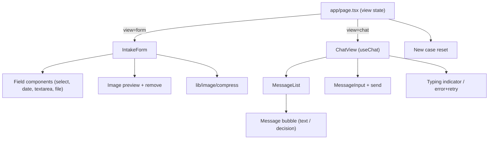
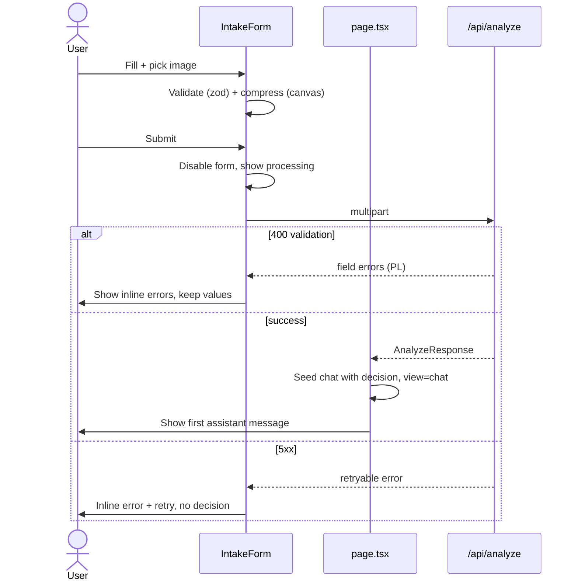

# ADR-001: Frontend (Next.js UI, Form & Chat)

**Date:** 2026-06-17
**Status:** Accepted
**Relates to:** [docs/ADR/000-main-architecture.md](000-main-architecture.md)

---

## 1. Scope

Covers the user-facing layer: the entry screen state machine (intake form ↔ chat), the intake form with validation and client-side image compression, the chat view with streaming replies and error/retry, and the Spotify-inspired Tailwind v4 theming.

**Does NOT cover:** server route handlers and image server-validation (ADR-002), LLM prompts/decision logic (ADR-003).

---

## 2. Context7 References

| Library | Context7 Handle | Used for |
|---|---|---|
| Next.js | `/vercel/next.js` | App Router, client components, `next/font`, metadata/favicon |
| React | `/reactjs/react.dev` | Component state, controlled inputs |
| AI SDK React | `/vercel/ai` | `useChat` from `@ai-sdk/react`, `DefaultChatTransport`, `sendMessage`, message parts |
| Tailwind CSS | `/tailwindlabs/tailwindcss.com` | v4 `@theme`, dark-first tokens, utility classes |
| Zod | `/colinhacks/zod` | Client-side form schema (shared with server) |

Design source: [docs/design-guidelines.md](../design-guidelines.md) and `assets/design-tokens.json`.

---

## 3. Component Design

### View state machine (`app/page.tsx`, client component)
- Holds `view: "form" | "chat"` and the active `case` (form data + decision + caseContext) in React state (in-memory only).
- `form` → on successful `/api/analyze` response, store decision + caseContext, switch to `chat`, seed the chat with the first assistant message.
- `chat` → "New case" resets all state back to an empty `form`.

### Intake form (`components/intake-form/`)
- Controlled fields rendered in PRD order: Request type, Equipment category, Name/Model, Date of purchase, Reason, Equipment photo.
- **Request type** segmented control (Complaint/Return). Changing it toggles the Reason field's required/optional label and validation.
- **Equipment category** select populated from the fixed enum.
- **Date of purchase** date input with `max = today`; future dates rejected in UI and schema.
- **Reason** textarea; required iff request type = complaint.
- **Equipment photo**: single file input; on select → validate format/size, show thumbnail preview with remove/replace, run client compression to produce the upload blob.
- **Submit**: disabled while submitting; shows processing state; the whole form is disabled during the request to prevent double submit.
- **Validation display**: on submit, run the shared Zod schema; render field-level PL error messages beneath each invalid field; keep entered values; do not advance until clean.

### Chat view (`components/chat/`)
- Uses `useChat` (`@ai-sdk/react`) with `transport: new DefaultChatTransport({ api: "/api/chat", body: { caseContext } })` (or per-message `body`), input state via `useState`, send via `sendMessage`.
- **Seeding the first message:** initialize `useChat` with the decision as the first assistant `UIMessage` (rendered from `firstMessage`/`decision`), so the chat opens on the decision (AC-17).
- **Message rendering:** map `message.parts`; render `text` parts; the first assistant message renders the structured decision (heading per outcome, justification, conditions/missing-info, next steps, mandatory "recommendation, not binding" notice).
- **Loading/typing indicator:** while `status` is streaming, show a typing indicator and lock the input + send button (AC-21).
- **Error/retry:** on transport error, show an inline PL error with a retry affordance; never render a fabricated decision (AC-23).
- **New case action:** button that calls the parent reset.

### Client image compression (`lib/image/compress.ts`)
- Input: a `File` (JPEG/PNG/WebP, ≤ `MAX_IMAGE_MB`). Output: a compressed `Blob`/`File`.
- Draws the image onto a Canvas scaled to a max dimension (e.g. longest side ~1568 px, a common vision-model sweet spot — confirm against the chosen model's limits), re-encodes (e.g. JPEG/WebP at a quality target), and returns the smaller of original/compressed.
- Pure, unit-testable; no React.

### Styling / theme (`app/globals.css`)
- Tailwind v4 via CSS-first config: `@import "tailwindcss";` + a `@theme` block mapping the design tokens to CSS variables (colors, radii, spacing, fonts) from [design-guidelines.md](../design-guidelines.md).
- Dark-first: `background.base #121212`, text `#FFFFFF`/`#B3B3B3`, accent `brand.primary #1ED760`. Primary button = green pill, **black** text, weight 700, pill radius (`9999px`). Cards `#181818`→`#282828` hover, 8px radius. Inputs `#1F1F1F`, pill/`md` radius per control.
- Fonts: fallback stack `"Helvetica Neue", Helvetica, Arial, sans-serif` (no license to SpotifyMixUI); load via `next/font` if a near-match (e.g. Montserrat) is desired for display titles.

---

## 4. Data Structures

- **FormState** (client): mirrors `IntakeForm` (ADR-000 §5) with the image as a `File`; plus per-field `errors: Record<field, string>` and `isSubmitting: boolean`.
- **AnalyzeResponse** (client view of `/api/analyze` output): `{ decision, imageAnalysis, caseContext, firstMessage }`.
- **ChatState:** `UIMessage[]` managed by `useChat`, seeded with the first assistant decision message; `input: string` via `useState`.
- **CaseContext:** sent on every chat turn (no raw image) — see ADR-000 §5.

---

## 5. Interface Contracts (consumed)

- **`POST /api/analyze`** — `multipart/form-data`; returns `AnalyzeResponse` or `400` (validation, field-level PL errors) / `5xx` (retryable). See ADR-002.
- **`POST /api/chat`** — JSON `{ messages, caseContext }`; returns a UI message stream. See ADR-002/003.

The frontend treats both routes as the only backend surface; it never imports `lib/ai/*`.

---

## 6. Technical Decisions

### `useChat` seeded with a synthetic first assistant message
**Status:** Accepted · **Date:** 2026-06-17
**Context:** The decision is produced by `/api/analyze` (not `/api/chat`), but it must appear as the first chat message (AC-17).
**Decision:** Initialize `useChat` with `messages: [firstAssistantMessage]` built from the analyze response; subsequent turns hit `/api/chat`.
**Rejected alternatives:** Re-call the model from `/api/chat` to "introduce" the decision — wasteful and risks drift from the validated decision.
**Consequences:** (+) Single source of truth for the decision; instant first render. (−) Must construct a valid `UIMessage` shape manually.
**Review trigger:** If the AI SDK changes `UIMessage` seeding APIs.

### Image compression in the browser via Canvas
**Status:** Accepted · **Date:** 2026-06-17
**Context:** Keep upload payloads small for Vercel functions; AC-09 wants reduction before the LLM.
**Decision:** Compress client-side (Canvas) before upload; the server still validates (ADR-002).
**Rejected alternatives:** Upload raw 10 MB to the server — slow, risks serverless limits.
**Consequences:** (+) Fast uploads. (−) Quality varies by browser; covered by server guard + E2E across target browsers.
**Review trigger:** Inconsistent results across Chrome/Edge/Firefox/Safari.

### Tailwind v4 CSS-first theming from design tokens
**Status:** Accepted · **Date:** 2026-06-17
**Context:** A defined Spotify-inspired token set exists; v4 favors `@theme` over a JS config.
**Decision:** Map `assets/design-tokens.json` into a `@theme` block; use semantic utility classes.
**Rejected alternatives:** Tailwind v3 + `tailwind.config.js` — older pattern; v4 is current.
**Consequences:** (+) Tokens live in CSS, match the guidelines. (−) Team must know v4 conventions.
**Review trigger:** If a component library (e.g. shadcn/ui) is adopted with its own theming.

---

## 7. Diagrams

### Component tree

### Submit + transition sequence

---

## 8. Testing Strategy

### Test scenarios for this area

| Scenario | Type | Input | Expected output | Edge cases |
|---|---|---|---|---|
| Required-field validation | Unit (schema) + E2E | Empty model / category | Field-level PL errors; submit blocked | All fields empty at once |
| Future purchase date | Unit + E2E | Date > today | "data nie może być przyszła" error | Today's date allowed |
| Reason conditional | Unit + E2E | Complaint w/o reason; Return w/o reason | Complaint blocked; Return allowed | Switching type re-validates |
| Image format/size | Unit + E2E | .gif file / >10 MB | Inline rejection error; not sent | Exactly 10 MB boundary |
| Client compression | Unit | Large JPEG | Smaller blob within max dimension | Tiny image returned unchanged |
| Submit lock | E2E | Double-click submit | Only one request; form disabled | Rapid clicks |
| First message render | E2E | Successful decision | Greeting + outcome + justification + next steps + notice (PL) | Each of 4 outcomes renders |
| Chat send + typing | E2E | Follow-up question | Streamed reply; input locked while streaming | Empty input not sent |
| Error + retry | E2E (mock 5xx) | Forced server error | Inline PL error + retry; no decision shown | Retry succeeds second time |
| New case reset | E2E | Click "New case" | Empty form; prior chat gone | State fully cleared |

### Technical acceptance criteria

- **TAC-101:** The shared Zod form schema rejects future dates, empty required fields, and (for complaints) empty reason — verified by unit tests without the DOM.
- **TAC-102:** No client component imports from `lib/ai/*`; the only backend calls are to `/api/analyze` and `/api/chat`.
- **TAC-103:** While a chat reply streams, the send control is disabled and a typing indicator is visible (E2E assertion).
- **TAC-104:** All rendered labels, errors, and the decision message assert Polish text.
- **TAC-105:** The compress helper never returns an image larger than the configured max dimension and preserves an accepted format.
