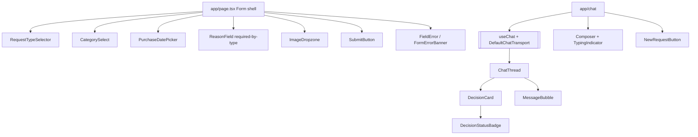
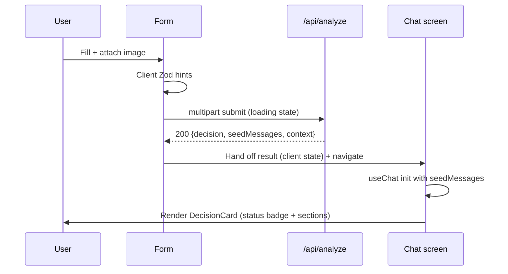

# ADR-001: Frontend (Next.js App Router + AI SDK UI)

**Date:** 2026-06-18
**Status:** Accepted
**Relates to:** `docs/ADR/000-main-architecture.md`

---

## 1. Scope

This ADR covers the **client UI**: the intake form screen, the processing/transition
state, the chat screen (decision card + thread), error/empty/loading states, client
validation, and the wiring of AI SDK UI (`useChat`) to `/api/chat`.

**Not covered here:** server validation, image compression, model calls, prompts,
and the decision schema (see `002-backend-api.md` and `003-ai-agent.md`). The
frontend trusts the server for authoritative validation and decisions.

---

## 2. Context7 References

| Library | Context7 Handle | Used for |
|---|---|---|
| Next.js | `/vercel/next.js` | App Router routing, Server/Client Components, navigation |
| AI SDK React | `/vercel/ai` (`@ai-sdk/react`) | `useChat`, message `parts`, status, `DefaultChatTransport` |
| AI SDK core | `/vercel/ai` | `DefaultChatTransport`, `UIMessage` type, `prepareSendMessagesRequest` |
| React | `/reactjs/react.dev` | Components, hooks, controlled inputs |
| Tailwind CSS | `/tailwindlabs/tailwindcss.com` | Tokens from `design-guidelines.md` |
| Shadcn/ui | `/shadcn-ui/ui` | Select, Input, Textarea, Button, Dialog, file dropzone |
| Zod | resolve `Zod` | Client-side validation hints (shared schema) |

---

## 3. Component Design

Two screens, navigated **Form → (processing) → Chat**, with "start new request"
returning to Form (PRD §9 navigation). State is **client-only and ephemeral**.

### Screen 1 — Intake form (`app/page.tsx` + form components)
Responsibilities:
- Render fields in PRD order (§9.1): request-type selector (Reklamacja/Zwrot),
  category dropdown (10 values, AC-02), name/model text, date-of-purchase picker
  (future blocked, AC-04), reason textarea (required/optional toggles with request
  type, AC-05), single-image dropzone with thumbnail + remove (AC-06/11), submit.
- **Client validation** (mirrors server, using the shared Zod schema) for fast
  feedback; the server remains authoritative.
- Image guardrails client-side: accept only JPEG/PNG/WebP, ≤ 10 MB; reject with
  inline Polish error before upload (AC-08/09) — but never assume client check is
  enough.
- On submit: build `multipart/form-data`, POST `/api/analyze`, show **loading state**
  (form locked, status text e.g. "Analizujemy zdjęcie i przygotowujemy ocenę…",
  AC-07 submit blocked while invalid/processing).
- On 200: store `decision`, `imageAnalysis`, `seedMessages`, `context`; navigate to
  chat. On `422`: render per-field Polish errors, focus first error. On `5xx`: go to
  error state with retry (AC-29), no decision shown.

Key components: `RequestTypeSelector`, `CategorySelect`, `PurchaseDatePicker`,
`ReasonField` (required-state bound to request type), `ImageDropzone`,
`SubmitButton`, `FieldError`, `FormErrorBanner`.

### Screen 2 — Chat (`app/chat` + chat components)
Responsibilities:
- Initialize `useChat` with the **seed assistant message** (the decision card) as
  initial messages, and a `DefaultChatTransport` pointed at `/api/chat`.
- Use `prepareSendMessagesRequest` to attach the immutable **case `context`**
  (form data + image description + policy kind) to every request body, alongside
  messages (AC-23).
- Render the **Decision card** as the first assistant message: greeting, prominent
  outcome status label (AC-22), justification, next steps, disclaimer (AC-21).
- Render subsequent turns as bubbles; show typing/streaming indicator while the
  agent composes (AC-24, §9.3); lock duplicate sends.
- Mark a **revised** decision visibly when the agent updates it (AC-25, §9.3).
- Inline per-turn error + retry if a reply fails (AC-29); no fabricated content.
- "Rozpocznij nowe zgłoszenie" (new request) clears conversation + form and returns
  to Form (AC-28).

Key components: `ChatThread`, `MessageBubble`, `DecisionCard`, `DecisionStatusBadge`,
`Composer`, `TypingIndicator`, `TurnError`, `NewRequestButton`.

### State management
- **Form state:** local component state (controlled inputs).
- **Hand-off:** on success, the analysis result is passed to the chat screen via
  client state (e.g. a lightweight client store or router state) — no server round
  trip to re-fetch.
- **Conversation:** owned by `useChat` (`messages` array). Cleared on new request /
  reload (AC-27/28). No persistence.

---

## 4. Data Structures

Frontend-facing shapes (typed via the shared TS types from `lib`):

- **FormValues** — `{ requestType, category, model, purchaseDate, reason?, image:File }`.
- **AnalyzeResponse** — `{ decision: Decision, imageAnalysis: { description, usable },
  seedMessages: UIMessage[], context: CaseContext }`.
- **CaseContext** — `{ requestType, category, model, purchaseDate, reason?,
  imageDescription, policyKind }` (attached to every chat request).
- **Decision** — `{ outcome, justification, nextSteps, missing?, conditions?,
  disclaimer }` (rendered, not re-validated, by the UI).
- **UIMessage** — AI SDK shape: `{ id, role, parts: [{type:'text', text}] }`.
- **FieldErrors** — `Record<fieldName, polishMessage>` from a `422`.

---

## 5. Interface Contracts

The frontend consumes the two endpoints from ADR-000 §6:

- **`POST /api/analyze`** (multipart) → consumes `AnalyzeResponse` (200), `FieldErrors`
  (422), `{error, retryable}` (5xx). The UI maps 422 → inline errors, 5xx → error
  state.
- **`POST /api/chat`** (JSON, via `useChat` transport) → consumes a streamed UI
  message response. The UI attaches `messages` + `context` through
  `prepareSendMessagesRequest`. On stream error → per-turn retry.

The frontend exposes no public interface beyond these calls and the rendered UI.

---

## 6. Technical Decisions

### FE-1 — AI SDK UI `useChat` for the chat thread
**Status:** Accepted · **Date:** 2026-06-18
**Context:** The chat needs streaming replies, message state, status/typing
indicators, and a customizable request body to carry case context.
**Decision:** Use `@ai-sdk/react`'s `useChat` with `DefaultChatTransport` and
`prepareSendMessagesRequest` to attach `context`. Seed it with the decision message
as initial messages.
**Rejected alternatives:**
- Hand-rolled fetch + SSE parsing: re-implements what `useChat` provides; more bugs.
- AI SDK RSC (`streamUI`): heavier than needed; UI route + `useChat` is the current
  idiomatic path.
**Consequences:** (+) streaming, statuses, message parts for free; (−) couples UI to
the AI SDK UI message protocol (acceptable; it's the chosen stack).
**Review trigger:** If the chat needs generative tool UIs or persistence.

### FE-2 — Decision card from typed fields, not raw model text
**Status:** Accepted · **Date:** 2026-06-18
**Context:** AC-21/22 require an ordered, readable card with a distinguishable
outcome label.
**Decision:** Render `DecisionCard` from the typed `Decision` (status badge from
`outcome`; sections for justification, next steps, disclaimer). The seed assistant
message text is generated from these fields server-side for chat history.
**Rejected alternatives:** Render the model's free-text blob directly — fails the
"visually distinguishable outcome" requirement and ordering guarantees.
**Consequences:** (+) consistent, accessible card; (−) two representations (typed +
rendered text) must stay consistent — generated together server-side.
**Review trigger:** If outcomes or card sections change.

### FE-3 — Client validation mirrors server via shared Zod schema
**Status:** Accepted · **Date:** 2026-06-18
**Context:** Fast inline feedback (AC-04–AC-09) without duplicating rules.
**Decision:** Import the shared Zod form schema for client hints; the server
re-validates authoritatively. Polish messages live with the schema.
**Rejected alternatives:** Separate client rules — risk of drift from server truth.
**Consequences:** (+) one source of validation truth; (−) schema must be
isomorphic (no Node-only refinements in the shared part).
**Review trigger:** If client/server validation needs diverge.

---

## 7. Diagrams

### Component / Class Diagram


### Sequence — form submit to chat hand-off


### Sequence — chat turn with context
```mermaid
sequenceDiagram
    participant U as User
    participant C as Chat (useChat)
    participant API as /api/chat
    U->>C: Type follow-up
    C->>API: prepareSendMessagesRequest -> {messages, context}
    API-->>C: UI message stream (typing indicator)
    C->>U: Streamed reply; mark "update" if revised
    Note over C: On stream error -> per-turn retry, no fabricated text
```

---

## 8. Testing Strategy

### Test scenarios for this area

| Scenario | Type | Input | Expected output | Edge cases |
|---|---|---|---|---|
| Reason required toggles with type | Unit | Switch to Complaint | Reason marked required; empty → error | Switch back to Return clears requirement |
| Future date blocked | Unit | purchaseDate > today | Inline Polish error, submit blocked | Date = today allowed |
| Image format/size guard | Unit | .gif / 12 MB file | Inline Polish error naming formats/limit | Exactly 10 MB allowed |
| Single image only | Unit | Add 2nd image | Replaces first or blocked (AC-11) | Remove then re-add |
| 422 from analyze | Integration | Server returns field errors | Inline errors, focus first, no navigation | Multiple field errors |
| 5xx from analyze | Integration | Server 503 | Error state + retry, no decision | Retry succeeds |
| Decision card render | Unit | Decision per outcome | Correct status badge + ordered sections + disclaimer | All five outcomes |
| Chat sends context | Integration | Follow-up message | Request body includes messages + context | Long thread |
| Revised decision marked | Unit | Assistant "update" message | Visibly marked as update | Multiple revisions |
| New request clears state | E2E | Click new request | Form empty, conversation gone | After several turns |
| Polish everywhere | E2E | Walk full flow | All visible text Polish | Error + empty states |

### Technical acceptance criteria
- **TAC-001-01** Reason field's required state is bound to request type; a Complaint
  with empty/whitespace reason cannot submit (AC-05).
- **TAC-001-02** Client rejects non-JPEG/PNG/WebP and > 10 MB before upload with a
  Polish message (AC-08/09); server still re-checks.
- **TAC-001-03** `DecisionCard` shows a distinct status label for each of the five
  outcomes and always renders the disclaimer (AC-19/22).
- **TAC-001-04** Every `/api/chat` request from the UI includes the case `context`
  (form data + image description + policy kind) (AC-23).
- **TAC-001-05** "New request" resets form state and `useChat` messages (AC-28).
- **TAC-001-06** On analyze/chat service error the UI shows an explicit error/retry
  and never renders a decision (AC-29/30).
- **TAC-001-07** All asserted UI strings are Polish (AC-31).
```
