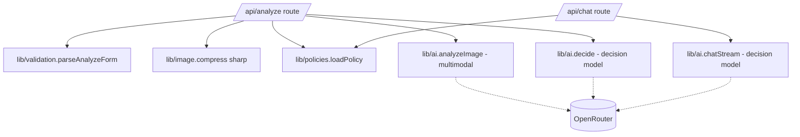
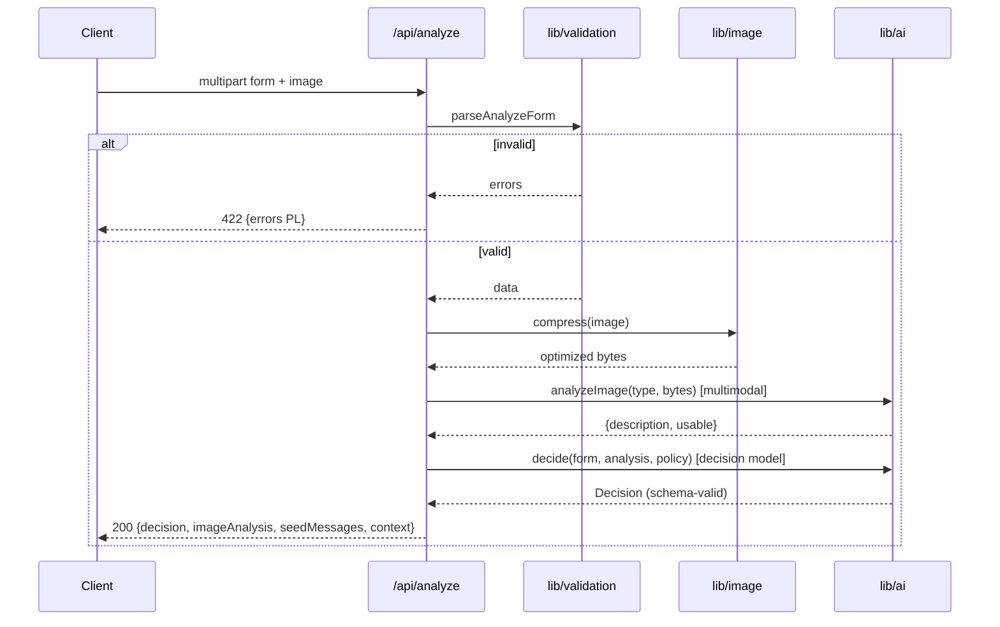
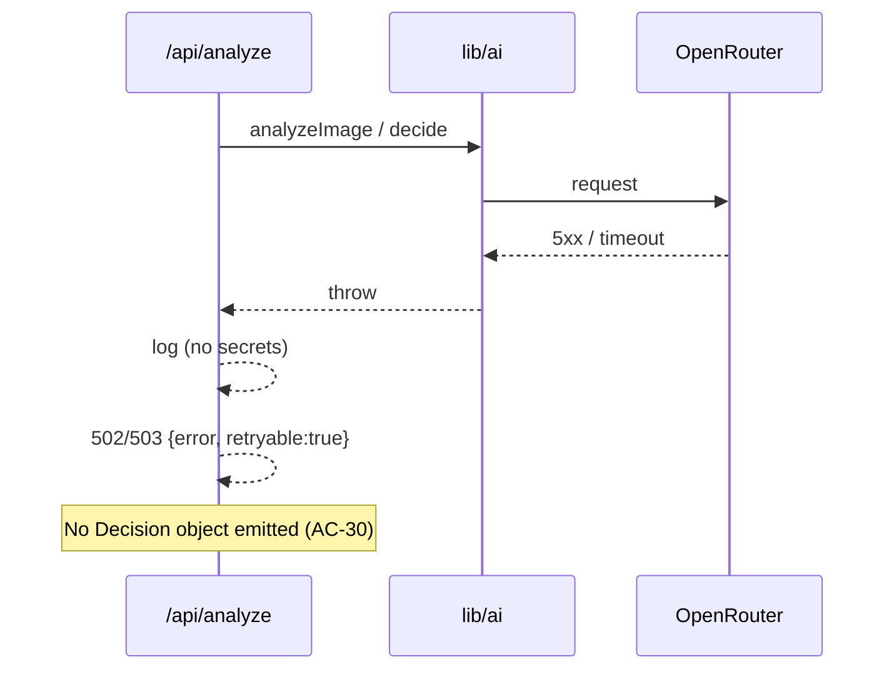
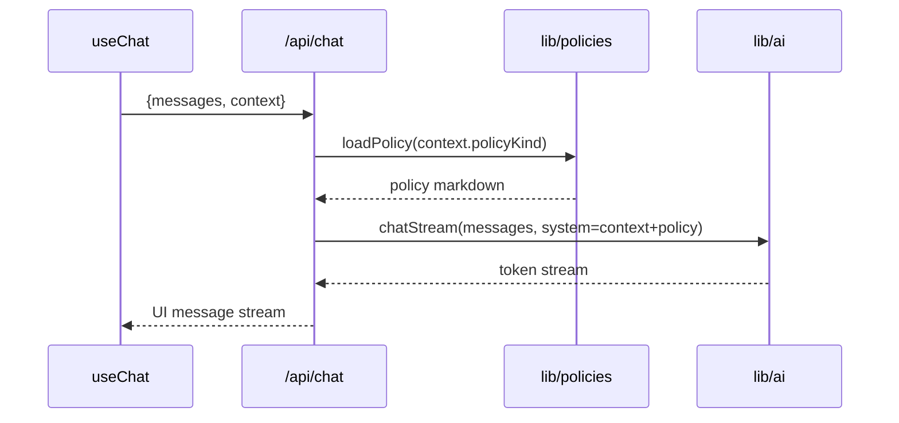

# ADR-002: Backend API (Route Handlers, Validation, Image, Orchestration)

**Date:** 2026-06-18
**Status:** Accepted
**Relates to:** `docs/ADR/000-main-architecture.md`

---

## 1. Scope

This ADR covers the **server side** implemented as Next.js App Router route handlers:
`POST /api/analyze` (validate → compress → vision → decision) and `POST /api/chat`
(streaming chat continuation), plus the shared server libraries for validation
(`lib/validation`), image processing (`lib/image`), and policy loading
(`lib/policies`). It defines runtime, request/response contracts, error semantics,
and orchestration order.

**Not covered here:** the provider/model setup, prompt content, and decision schema
internals (see `003-ai-agent.md`); the UI (see `001-frontend.md`). This ADR consumes
`lib/ai`'s functions but does not define them.

---

## 2. Context7 References

| Library | Context7 Handle | Used for |
|---|---|---|
| Next.js | `/vercel/next.js` | Route handlers, `request.formData()`, runtime config, `Response.json` |
| AI SDK core | `/vercel/ai` | `createUIMessageStreamResponse`, `toUIMessageStream` (chat route) |
| Zod | resolve `Zod` | Server-authoritative validation |
| sharp | resolve `sharp` | Image resize/recompress |

---

## 3. Component Design

### `POST /api/analyze` (Node.js runtime)
Orchestration order (fail-fast):
1. Parse `multipart/form-data` via `request.formData()`.
2. **Validate** all fields with the shared Zod schema (server-authoritative):
   request type, category ∈ enum, model non-empty (trimmed), purchaseDate ≤ today,
   reason required iff Complaint, exactly one image, format ∈ {JPEG,PNG,WebP}, size
   ≤ 10 MB. On failure → `422 { errors }` (Polish messages). Nothing downstream runs.
3. **Compress** the image via `lib/image` (resize to a bounded max dimension,
   re-encode at bounded quality). Result is what goes to the model (AC-10), never the
   raw upload.
4. **Vision call** via `lib/ai.analyzeImage(requestType, compressedImage)` → returns
   `ImageAnalysis { description, usable, signals? }`. Uses the **multimodal** model.
5. **Decision call** via `lib/ai.decide(form, imageAnalysis, policyKind)` → returns a
   schema-validated `Decision`. Uses the **decision** model. If `imageAnalysis.usable
   === false` or signals are insufficient, the agent must return `NEEDS_MORE_INFO`
   (AC-18), not APPROVE/REJECT.
6. Build the **seed assistant message** (rendered decision card text) and the
   immutable **CaseContext** (form fields + image description + policy kind).
7. Return `200 { decision, imageAnalysis, seedMessages, context }`.

Failure handling: any thrown provider/model error (steps 4–5) → `502/503
{ error, retryable: true }`; **no decision is fabricated** (AC-29/30). Errors are
logged server-side without leaking secrets.

### `POST /api/chat` (Node.js runtime, streaming)
1. Parse JSON body: `{ messages: UIMessage[], context: CaseContext }`.
2. Load the matching policy via `lib/policies` by `context.policyKind`.
3. Build the system prompt = case context + policy doc + chat behavior rules
   (in-scope only, may revise with a marked update, decline off-topic — AC-25/26).
4. Call `lib/ai.chatStream(messages, systemPrompt)` using the **decision** model and
   return `createUIMessageStreamResponse({ stream: toUIMessageStream(...) })`.
5. On model failure → stream an error part; the client retries that turn. No
   fabricated decision.

### `lib/validation`
- One Zod schema for the form (shared with the client) + a server-only refinement
  layer for image bytes (format sniff + size). Polish messages colocated.
- Exposes `parseAnalyzeForm(formData)` → `{ data } | { errors }`.

### `lib/image`
- `compress(file)` using sharp: enforce accepted formats, downscale to a bounded max
  edge, re-encode (e.g. JPEG/WebP at bounded quality), return bytes + mediaType for
  the vision call. Pure-ish, unit-testable with fixture images.

### `lib/policies`
- `loadPolicy(kind)` reads + caches `docs/policies/complaint-policy.md` (complaint)
  or `docs/policies/return-policy.md` (return). In-memory cache; files are static.

---

## 4. Data Structures

- **AnalyzeForm (parsed)** — `{ requestType, category, model, purchaseDate, reason?,
  image: { bytes, mediaType, sizeBytes } }`.
- **FieldErrors** — `Record<fieldName, polishMessage>` (422 body).
- **ImageAnalysis** — `{ description: string, usable: boolean, signals?: object }`.
- **Decision** — defined in `003-ai-agent.md`; treated here as an opaque validated
  object passed through to the response.
- **CaseContext** — `{ requestType, category, model, purchaseDate, reason?,
  imageDescription, policyKind }`.
- **ChatRequestBody** — `{ messages: UIMessage[], context: CaseContext }`.
- **AnalyzeResponse** — `{ decision, imageAnalysis: { description, usable },
  seedMessages: UIMessage[], context: CaseContext }`.

---

## 5. Interface Contracts

### `POST /api/analyze`
- **Input:** `multipart/form-data` — `requestType` (`complaint|return`), `category`
  (enum), `model` (string), `purchaseDate` (`YYYY-MM-DD`), `reason` (optional for
  return), `image` (one file).
- **Output 200:** `AnalyzeResponse`.
- **Output 422:** `{ errors: FieldErrors }` — at least one of: missing/invalid field,
  bad format (names accepted formats), too large (states 10 MB).
- **Output 502/503:** `{ error: string, retryable: true }` on provider failure.
- **Notes:** Node.js runtime (sharp); enforce request body size for the 10 MB image
  (configure the route/proxy body limit accordingly). Not streamed.

### `POST /api/chat`
- **Input:** `application/json` — `ChatRequestBody`.
- **Output:** UI message stream (text) consumed by `useChat`.
- **Errors:** stream an error part on model failure (client retries).
- **Notes:** Node.js runtime; streaming; uses the decision/chat model only.

---

## 6. Technical Decisions

### BE-1 — `/api/analyze` is request/response; `/api/chat` is streamed
**Status:** Accepted · **Date:** 2026-06-18
**Context:** Analysis is a multi-step pipeline whose result hydrates the chat; the
chat itself benefits from token streaming.
**Decision:** `analyze` returns a single JSON payload after the pipeline completes;
`chat` returns a UI message stream via `createUIMessageStreamResponse`.
**Rejected alternatives:**
- Stream `analyze` too: the decision card needs the complete structured decision
  before render (AC-21 ordering, AC-22 status); streaming adds complexity for no UX
  win here.
**Consequences:** (+) simple, atomic decision; clear error semantics. (−) the user
waits through a processing state (covered by the loading UI, §9.1/9.2 of PRD).
**Review trigger:** If perceived analyze latency needs progressive feedback.

### BE-2 — Server-authoritative validation; client checks are hints
**Status:** Accepted · **Date:** 2026-06-18
**Context:** AC-07/08/09 must hold even if the client is bypassed.
**Decision:** The shared Zod schema runs again on the server, plus a server-only
image byte/format/size refinement. 422 carries per-field Polish messages.
**Rejected alternatives:** Trust client validation — insecure and unreliable.
**Consequences:** (+) guarantees; (−) rules duplicated in execution (not in source —
schema is shared).
**Review trigger:** If validation moves to a shared edge function.

### BE-3 — Node.js runtime for both routes
**Status:** Accepted · **Date:** 2026-06-18
**Context:** sharp requires Node; provider SDK works on Node; keeps runtimes uniform.
**Decision:** Both route handlers run on the Node.js runtime.
**Rejected alternatives:** Edge runtime — incompatible with sharp; image compression
is mandatory (AC-10).
**Consequences:** (+) compatible with sharp + provider; (−) no Edge cold-start
benefit (irrelevant for MVP).
**Review trigger:** If image processing moves off-request (e.g. to a worker).

### BE-4 — Image bytes never bypass compression to the model
**Status:** Accepted · **Date:** 2026-06-18
**Context:** AC-10 mandates backend compression before the vision call.
**Decision:** The vision call receives only the `lib/image.compress` output; the raw
upload is discarded after compression.
**Rejected alternatives:** Forward raw on "small" images — inconsistent, harder to
test the guarantee.
**Consequences:** (+) one code path, testable (TAC-03); (−) tiny CPU cost per
request.
**Review trigger:** If a provider requires original-resolution input.

---

## 7. Diagrams

### Component / Class Diagram


### Sequence — analyze pipeline (happy + branch)


### Sequence — provider failure


### Sequence — chat stream


---

## 8. Testing Strategy

### Test scenarios for this area

| Scenario | Type | Input | Expected output | Edge cases |
|---|---|---|---|---|
| Valid complaint pipeline | Integration (mock LLM) | Full form + image | 200, Decision present, policy = complaint | Reason at min length |
| Missing reason (complaint) | Integration | reason empty | 422 with Polish field error | Whitespace reason |
| Future purchase date | Integration | date > today | 422 | date = today passes |
| Bad format / oversize | Integration | gif / 12 MB | 422 naming formats/limit | exactly 10 MB passes |
| Compression applied | Unit + Integration | large jpeg | bytes to model ≤ bound, not raw | already-small image still re-encoded |
| Unusable image → NMI | Integration | mock vision usable=false | 200 Decision outcome=NEEDS_MORE_INFO | contradictory signals |
| Provider 5xx | Integration | mock OpenRouter error | 502/503 retryable, no Decision | timeout |
| Policy selection | Unit | requestType=return | loads return-policy.md | switch to complaint |
| Chat stream context | Integration | messages + context | system prompt contains policy + context; streamed reply | empty messages guarded |
| Two-model wiring | Integration | run pipeline | analyzeImage→multimodal id, decide/chat→decision id | env overrides honored |

### Technical acceptance criteria
- **TAC-002-01** `/api/analyze` returns `422` with per-field Polish messages for
  every AC-04–AC-09 violation and runs no model call in that case.
- **TAC-002-02** The artifact passed to the vision model is the compressed output and
  is ≤ the configured bound (never the raw upload).
- **TAC-002-03** When the vision result is `usable=false`, the decision is
  `NEEDS_MORE_INFO`; no APPROVE/REJECT is produced (AC-18).
- **TAC-002-04** On any provider error, the response is a retryable `502/503` with no
  `decision` field (AC-29/30).
- **TAC-002-05** `analyzeImage` uses `OPENROUTER_MULTIMODAL_MODEL`; `decide` and
  `chatStream` use `OPENROUTER_DECISION_MODEL` (distinct, from env).
- **TAC-002-06** `/api/chat` injects the correct policy (by `policyKind`) and the
  full case context into the system prompt and returns a UI message stream.
- **TAC-002-07** Both routes run on the Node.js runtime (sharp + provider load
  without runtime errors).
```
