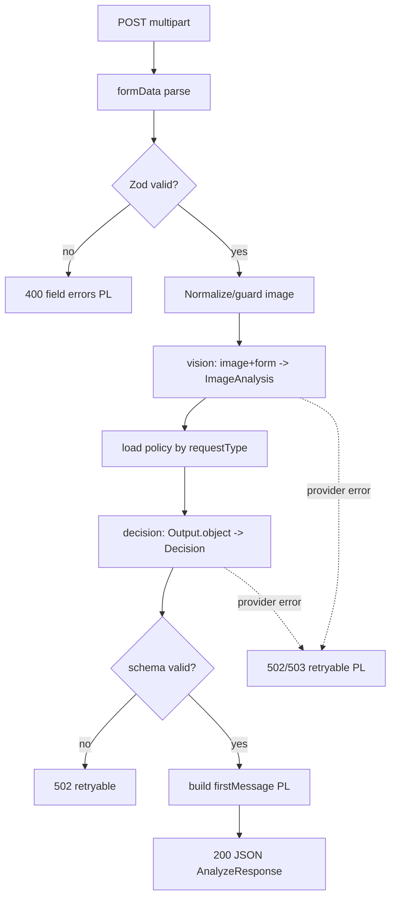
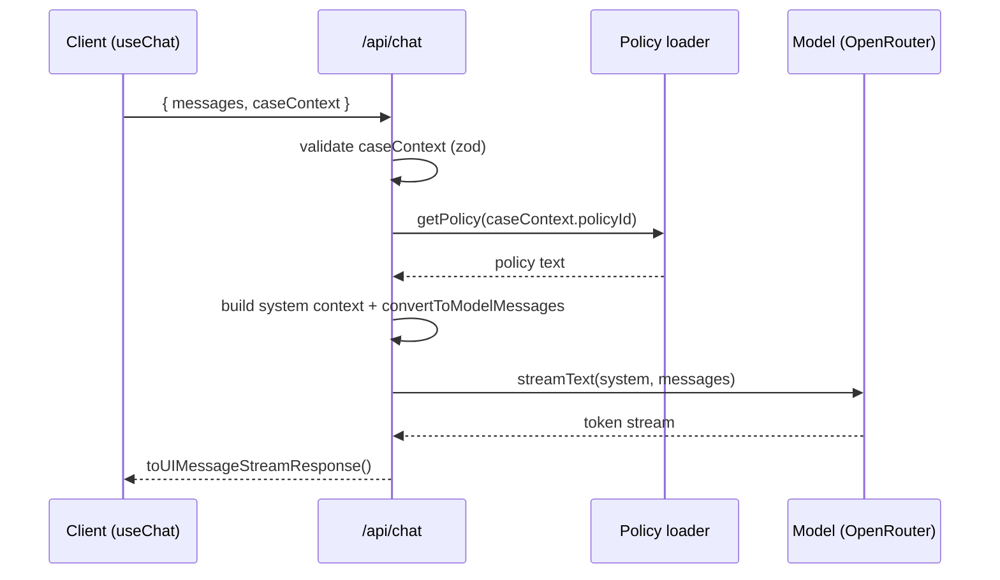

# ADR-002: Backend API (Route Handlers & Image Handling)

**Date:** 2026-06-17
**Status:** Accepted
**Relates to:** [docs/ADR/000-main-architecture.md](000-main-architecture.md)

---

## 1. Scope

Covers the server boundary: the two Next.js route handlers (`/api/analyze`, `/api/chat`), server-side validation, image normalization/guarding, OpenRouter provider configuration, error mapping, and Vercel function configuration.

**Does NOT cover:** the UI (ADR-001) or the prompt content and decision schema semantics (ADR-003).

---

## 2. Context7 References

| Library | Context7 Handle | Used for |
|---|---|---|
| Next.js | `/vercel/next.js` | Route handlers, `Request`/`Response`, `formData()`, runtime + `maxDuration` config |
| AI SDK | `/vercel/ai` | `streamText`, `generateText` + `Output.object`, `toUIMessageStreamResponse`, `convertToModelMessages` |
| OpenRouter provider | resolve `@openrouter/ai-sdk-provider` | `createOpenRouter({ apiKey })` → model factory |
| Zod | `/colinhacks/zod` | Server-side validation of multipart fields and chat payload |

---

## 3. Component Design

### Provider config (`lib/ai/provider.ts`)
- Reads `OPENROUTER_API_KEY`, `OPENROUTER_MODEL`, optional `OPENROUTER_BASE_URL`, attribution headers.
- Exposes a single configured model factory used by vision/decision/chat. Centralizes the model ID so a swap is one change.
- **Server-only**: never imported by client code; no `NEXT_PUBLIC_` exposure.

### `/api/analyze` route handler
Responsibilities, in order:
1. Parse `multipart/form-data` via `request.formData()`.
2. **Server-side re-validation** with the shared Zod schema: requestType ∈ {complaint, return}; category ∈ enum; model non-empty; purchaseDate ≤ today; reason required iff complaint; exactly one image; image MIME ∈ {jpeg, png, webp}; size ≤ `MAX_IMAGE_MB`. On failure → `400` with a field-keyed PL error map.
3. **Normalize image**: read bytes, confirm decodable, enforce the size cap; if still large, downscale before the vision call. Convert to the form the AI SDK expects for image parts (bytes/base64/`Uint8Array` + `mediaType`).
4. Call **vision** (ADR-003) → `ImageAnalysis`.
5. **Load policy** for the request type (`lib/policies/loader`).
6. Call **decision** (ADR-003) with condition + form + policy → validated `Decision` (`Output.object`).
7. Build the **PL first message** string from the decision (greeting + outcome + justification + conditions/missing-info + next steps + mandatory notice).
8. Return JSON `{ decision, imageAnalysis, caseContext, firstMessage }`.
9. On any LLM/provider error → map to `502/503` retryable error (PL); **never** return a partial/fabricated decision (AC-23).

### `/api/chat` route handler
1. Parse JSON `{ messages: UIMessage[], caseContext }`; validate `caseContext` with Zod.
2. Load the policy referenced by `caseContext.policyId`.
3. Build the **system context** (form, image analysis, policy text, original decision, behavior rules — ADR-003) and convert UI messages with `convertToModelMessages`.
4. `streamText({ model, system, messages })`.
5. Return `result.toUIMessageStreamResponse()`.
6. On error → emit a stream error the client surfaces as inline PL error + retry.

### Runtime config
- Both AI routes export `runtime = "nodejs"` and `maxDuration = 60` (raise within plan limits). No edge runtime.
- No filesystem writes. Policy files are read-only (bundled); `loader` caches them in module memory.

---

## 4. Data Structures

### `/api/analyze` request (multipart fields)
| Field | Type | Constraint |
|---|---|---|
| `requestType` | string | `complaint` \| `return` |
| `category` | string | one of the predefined enum |
| `model` | string | non-empty, trimmed |
| `purchaseDate` | string | ISO date, ≤ today |
| `reason` | string | required iff complaint |
| `image` | file | jpeg/png/webp, ≤ `MAX_IMAGE_MB` |

### `/api/analyze` response (JSON)
`{ decision: Decision, imageAnalysis: ImageAnalysis, caseContext: CaseContext, firstMessage: string }` — shapes per ADR-000 §5.

### `/api/chat` request (JSON)
`{ messages: UIMessage[], caseContext: CaseContext }`.

### Error body (both routes, non-stream)
`{ error: { code: "validation" | "provider_unavailable" | "bad_request", message: string /* PL */, fields?: Record<string,string> /* PL, validation only */, retryable: boolean } }`.

---

## 5. Interface Contracts (exposed)

### POST `/api/analyze`
- **Input:** `multipart/form-data` (table §4).
- **Success:** `200` JSON AnalyzeResponse.
- **Errors:** `400` validation (`fields` map, `retryable:false`); `413` if image exceeds cap before processing; `502/503` provider failure (`retryable:true`).
- **Notes:** Node runtime; `maxDuration` raised; all validation server-authoritative regardless of client checks.

### POST `/api/chat`
- **Input:** JSON `{ messages, caseContext }`.
- **Success:** `200` UI message stream (`text/event-stream`-style per AI SDK).
- **Errors:** `400` malformed body; stream-level error for provider failure (client shows retry). Off-topic handled in-content (AC-20), not as HTTP error.
- **Notes:** Stateless; conversation re-sent each turn; no raw image in `caseContext`.

---

## 6. Technical Decisions

### Server-authoritative validation (never trust the client)
**Status:** Accepted · **Date:** 2026-06-17
**Context:** Client validation is for UX; the server must enforce contracts and the image limits (AC-07/AC-08).
**Decision:** Re-run the shared Zod schema and image checks on the server; reject with `400` + field-level PL errors.
**Rejected alternatives:** Trust client validation — insecure, bypassable.
**Consequences:** (+) Robust, testable boundary. (−) Some duplicated validation (mitigated by sharing the schema).
**Review trigger:** Adding auth/roles or new fields.

### Node runtime + raised `maxDuration`; no edge
**Status:** Accepted · **Date:** 2026-06-17
**Context:** Vision + reasoning is multi-second; provider SDK fits Node.
**Decision:** `runtime="nodejs"`, `maxDuration=60` on AI routes.
**Rejected alternatives:** Edge runtime — tighter limits, SDK friction.
**Consequences:** (+) Reliable long calls. (−) Cold starts; must stay within plan's max duration.
**Review trigger:** A single call risks exceeding the platform max.

### Carry image analysis (text), not the raw image, into chat
**Status:** Accepted · **Date:** 2026-06-17
**Context:** Re-sending the image every chat turn is costly and slow; the vision result is already textual.
**Decision:** `caseContext` carries the `imageAnalysis` text + form + decision + policyId; the image is analyzed once in `/api/analyze`.
**Rejected alternatives:** Re-send image each turn — bandwidth/latency/cost for no benefit.
**Consequences:** (+) Small, fast chat payloads. (−) Chat cannot "re-look" at the photo (acceptable; a new photo means a new case).
**Review trigger:** If follow-ups need fresh visual re-analysis.

### Map provider failures to retryable errors; never fabricate
**Status:** Accepted · **Date:** 2026-06-17
**Context:** AC-23 forbids showing a fabricated/partial decision on failure.
**Decision:** Catch provider/timeout errors; return a structured retryable error (analyze) or stream error (chat). No decision content on failure.
**Rejected alternatives:** Return a best-effort partial — violates AC-23.
**Consequences:** (+) Trustworthy failure mode. (−) User must retry.
**Review trigger:** Adding automatic retry/backoff server-side.

---

## 7. Diagrams

### Route handler internals — `/api/analyze`

### Route handler internals — `/api/chat`

---

## 8. Testing Strategy

> Integration layer mocks **only** the external LLM API (AI SDK mock model). Validation, error mapping, and policy selection are tested without network.

### Test scenarios for this area

| Scenario | Type | Input | Expected output | Edge cases |
|---|---|---|---|---|
| Valid analyze | Integration | Valid multipart + mock model | 200 AnalyzeResponse with decision + analysis | Each request type |
| Missing field | Integration | Omit `model` | 400 with `fields.model` (PL) | Multiple missing fields |
| Future date | Integration | purchaseDate > today | 400 with `fields.purchaseDate` | Boundary = today |
| Reason rule | Integration | complaint w/o reason; return w/o reason | 400 for complaint; 200 for return | — |
| Bad image | Integration | gif / oversize | 400 (or 413) not forwarded to model | Exactly cap size |
| Policy selection | Integration | complaint vs return | complaint-policy vs return-policy injected | wrong file → config error |
| Provider error | Integration | mock throws | 502/503 retryable PL; no decision body | timeout simulated |
| Decision schema invalid | Integration | mock returns missing `justification` | 502 invalid; not surfaced as decision | missing `outcome` |
| Chat stream | Integration | messages + caseContext, mock stream | UI message stream emitted | empty messages → 400 |
| Secret safety | Unit/Build | inspect client bundle | no API key in client output | — |

### Technical acceptance criteria

- **TAC-201:** `/api/analyze` returns `400` with a field-keyed PL error map for every server-side validation failure, independent of the client.
- **TAC-202:** The image is decoded and size-capped server-side before any vision call; oversized/invalid images never reach the model.
- **TAC-203:** The policy injected matches `requestType` (complaint↔complaint-policy, return↔return-policy), asserted by integration test.
- **TAC-204:** On a mocked provider error, the route returns a retryable error and no decision/partial content.
- **TAC-205:** `/api/chat` returns a UI message stream consumable by `useChat`, using `toUIMessageStreamResponse()`.
- **TAC-206:** AI routes declare `runtime="nodejs"` and a raised `maxDuration`; no provider secret appears in any client-shipped code.
