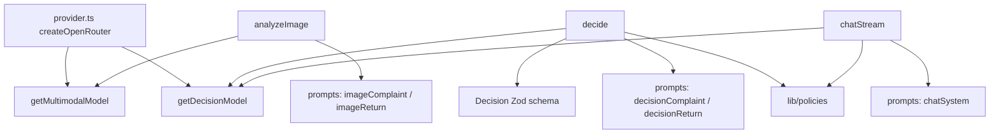
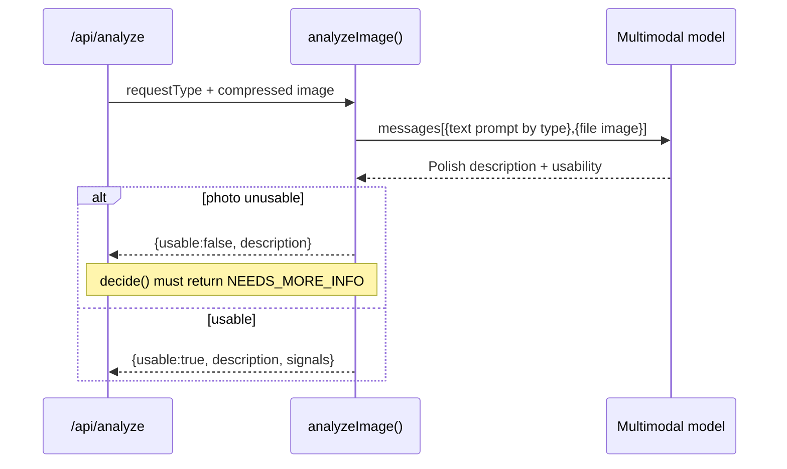

# ADR-003: AI Agent (OpenRouter Provider, Vision + Decision Models, Prompts)

**Date:** 2026-06-18
**Status:** Accepted
**Relates to:** `docs/ADR/000-main-architecture.md`

---

## 1. Scope

This ADR covers `lib/ai`: the OpenRouter provider setup, the **two distinct models**
(multimodal vision vs reasoning/decision+chat), the image-analysis prompts, the
decision prompt and **structured `Decision` schema**, the chat-continuation prompt,
and the agent behavior rules from PRD §11. It defines the functions the backend
route handlers call (`analyzeImage`, `decide`, `chatStream`).

**Not covered here:** HTTP request/response handling, validation, image compression,
or UI (see `002-backend-api.md`, `001-frontend.md`). The agent receives an
already-compressed image and already-validated form data.

---

## 2. Context7 References

| Library | Context7 Handle | Used for |
|---|---|---|
| OpenRouter AI SDK provider | `/openrouterteam/ai-sdk-provider` | `createOpenRouter`, `.chat(id)`, model selection, BYOK, extraBody |
| AI SDK core | `/vercel/ai` | `generateText` (vision), structured `Output.object`, `streamText` |
| Zod | resolve `Zod` | `Decision` schema (model-compatible) |

> Provider doc note (verified via Context7): `createOpenRouter({ apiKey, baseURL,
> appName, appUrl, headers, extraBody })`; select models with `openrouter(id)` or
> `openrouter.chat(id, { temperature, maxTokens, extraBody })`. Vision: pass
> `messages` with a `content` array containing `{type:'text'}` and
> `{type:'file', mediaType:'image', data}`. Structured output: `generateText` with
> `Output.object({ schema })`; for OpenAI-style structured output use `.nullable()`
> (not `.optional()`/`.nullish()`) to avoid `NoObjectGeneratedError`.

---

## 3. Component Design

### Provider + model factory (`lib/ai/provider.ts`)
- One `createOpenRouter` instance from `OPENROUTER_API_KEY` (+ optional `baseURL`,
  `appName`, `appUrl`).
- `getMultimodalModel()` → `openrouter.chat(OPENROUTER_MULTIMODAL_MODEL)`.
- `getDecisionModel()` → `openrouter.chat(OPENROUTER_DECISION_MODEL)`.
- The two ids must be **different roles** even if a deployment points them at the
  same id; calls never cross-wire (vision never uses the decision model and vice
  versa).

### Image analysis (`lib/ai/analyze.ts` → `analyzeImage`)
- Input: `requestType`, compressed image bytes + mediaType.
- Picks the prompt by request type:
  - **Complaint prompt:** assess whether the device is damaged, the damage type, and
    likely cause — manufacturing defect vs user-caused / mechanical / liquid (AC-12).
  - **Return prompt:** assess whether the device shows signs of use or damage that
    would prevent resale as new (AC-13).
- Both prompts instruct the model to output, **in Polish**, an objective description
  and an explicit **usability flag**: if the photo is blurry / wrong subject /
  unreadable, say so and set `usable=false` — do **not** guess (AC-30, PRD "Not
  allowed").
- Implementation: `generateText` (or structured output) with the multimodal model;
  return `ImageAnalysis { description, usable, signals? }`.

### Decision (`lib/ai/decide.ts` → `decide`)
- Input: validated form data, `ImageAnalysis`, `policyKind`.
- Loads the matching policy (via `lib/policies`) and builds the **decision prompt**:
  - **return** vs **complaint** variant (AC-14/16) — different rules, different
    prompt.
  - Injects: policy markdown (authoritative rules), form fields, image description.
  - Hard rules (PRD §11 "Not allowed"): use only the provided policy; never invent
    deadlines/rights; if evidence is insufficient/contradictory → `NEEDS_MORE_INFO`
    (never APPROVE/REJECT, AC-18); never a binding determination; always include the
    Polish non-binding disclaimer (AC-19); decline off-topic (handled in chat).
- Output: **schema-constrained** `Decision` via `Output.object` with the Zod schema.
  The visible Polish prose (greeting/justification/next steps/disclaimer) is produced
  in the same call as typed fields, so the rendered seed message and the typed object
  agree.

### Chat continuation (`lib/ai/chat.ts` → `chatStream`)
- Input: full `messages` (UIMessage[]) + a system prompt assembled from the
  `CaseContext` + policy doc + behavior rules.
- Uses the **decision** model with `streamText`; returns a stream the route adapts to
  a UI message stream.
- Behavior: stays in scope, may issue a **revised** recommendation when new info
  warrants — clearly stating it changed and why, still non-binding (AC-25); declines
  off-topic and redirects (AC-26).

### Prompt storage
- Prompts live as **TypeScript template builders** in `lib/ai/prompts/` (one module
  per concern: `imageComplaint`, `imageReturn`, `decisionComplaint`, `decisionReturn`,
  `chatSystem`). Policy text is injected at call time, not hard-coded into prompts.

---

## 4. Data Structures

### `Decision` (Zod schema — model-compatible)
- `outcome`: enum `"APPROVE" | "REJECT" | "NEEDS_MORE_INFO" | "CONDITIONAL" |
  "ESCALATE"` (exactly one — AC-15).
- `justification`: string, Polish, references the concrete policy reason (AC-17).
- `nextSteps`: string, Polish.
- `missing`: string[] — populated **only** for `NEEDS_MORE_INFO` (AC-18); use
  `.nullable()` semantics for model compatibility, treated as empty otherwise.
- `conditions`: string[] — populated only for `CONDITIONAL`.
- `disclaimer`: string, Polish, mandatory non-binding notice (AC-19, §11).
- `greeting`: string, Polish (for the decision card ordering, AC-21).

> Validation: after the model returns, parse with the Zod schema. If parsing fails or
> required fields are empty, treat as a service failure (no fabricated decision,
> AC-30) — surface a retryable error, do not down-rank to a guessed outcome.

### `ImageAnalysis`
- `description`: string (Polish, objective).
- `usable`: boolean (false when the photo cannot support assessment).
- `signals?`: `{ damaged?: boolean, damageType?: string, likelyCause?: string,
  signsOfUse?: boolean }` — optional structured hints feeding the decision.

### `CaseContext` (consumed for chat)
- `{ requestType, category, model, purchaseDate, reason?, imageDescription,
  policyKind }`.

---

## 5. Interface Contracts

`lib/ai` exposes (server-only):

- **`analyzeImage(requestType, image): Promise<ImageAnalysis>`**
  - Input: `requestType`, `{ bytes, mediaType }`.
  - Output: `ImageAnalysis`.
  - Errors: throws on provider failure (route maps to 502/503). Never returns a
    fabricated description (sets `usable=false` instead when uncertain).
- **`decide(form, analysis, policyKind): Promise<Decision>`**
  - Input: validated form, `ImageAnalysis`, `policyKind`.
  - Output: schema-valid `Decision`.
  - Errors: throws on provider failure or schema-parse failure (no fabricated
    decision). Returns `NEEDS_MORE_INFO` when evidence insufficient (a valid result,
    not an error).
- **`chatStream(messages, systemPrompt): StreamResult`**
  - Input: `UIMessage[]`, assembled system prompt.
  - Output: a text stream adaptable to a UI message stream.
  - Errors: stream error part on failure.

---

## 6. Technical Decisions

### AI-1 — Two models, one OpenRouter provider, role-separated
**Status:** Accepted · **Date:** 2026-06-18
**Context:** PRD requires a separate multimodal model for image analysis and a
separate reasoning model for the decision + chat; both swappable without code change.
**Decision:** One `createOpenRouter` instance; `getMultimodalModel()` and
`getDecisionModel()` resolve distinct env-driven ids. Vision functions only call the
multimodal model; decision + chat only call the decision model.
**Rejected alternatives:**
- One model for everything: violates the explicit "separate models" requirement and
  couples vision quality to reasoning quality.
- Two provider SDKs: two keys, more surface; OpenRouter unifies access.
**Consequences:** (+) clean role separation, hot-swappable models, single key.
(−) both roles share OpenRouter availability.
**Review trigger:** If one role needs a provider not on OpenRouter.

### AI-2 — Structured `Decision` via `Output.object` + Zod
**Status:** Accepted · **Date:** 2026-06-18
**Context:** Decision must be exactly one of five outcomes, always justified, always
carry the disclaimer, and drive a status label (AC-15/17/19/22).
**Decision:** Generate the decision with schema-constrained output and parse with
Zod. Use `.nullable()` (not `.optional()`) for fields that may be absent, per AI SDK
guidance for OpenAI-style structured output, to avoid `NoObjectGeneratedError`.
**Rejected alternatives:** Free-text + regex parsing — unreliable for AC-15/22.
**Consequences:** (+) deterministic handling, typed card. (−) schema must stay
model-friendly; some models need `compatibility`/`extraBody` tuning.
**Review trigger:** If the chosen decision model lacks reliable structured output.

### AI-3 — Policy injected per request; agent must not invent rules
**Status:** Accepted · **Date:** 2026-06-18
**Context:** PRD §8/§11: decisions grounded only in the provided policy; no invented
deadlines/rights; non-authoritative legal text.
**Decision:** The matching policy markdown is injected into the decision and chat
prompts at call time; prompts forbid rules beyond the document and require citing the
concrete policy reason.
**Rejected alternatives:** Bake rules into the prompt text — drifts from the policy
files; harder to update; risks invented rules.
**Consequences:** (+) single source of rules, easy to update files. (−) prompt size
grows with policy length (acceptable for two short docs).
**Review trigger:** If policies grow large enough to need RAG (backlog).

### AI-4 — Distinct prompts per request type and per stage
**Status:** Accepted · **Date:** 2026-06-18
**Context:** AC-12/13 (image) and AC-14/16 (decision) require different prompts for
complaint vs return.
**Decision:** Four prompt builders (image×2, decision×2) plus a chat system builder;
request type selects the pair.
**Rejected alternatives:** One parameterized mega-prompt — harder to tune/test per
scenario.
**Consequences:** (+) targeted, testable prompts. (−) more prompt modules to
maintain.
**Review trigger:** If a third request type is added.

### AI-5 — Uncertainty → NEEDS_MORE_INFO / ESCALATE, never fabricate
**Status:** Accepted · **Date:** 2026-06-18
**Context:** PRD §11 + AC-18/30: insufficient/ambiguous evidence must not yield
APPROVE/REJECT; failed analysis must not be fabricated.
**Decision:** Prompts + post-parse logic enforce: `usable=false` or insufficient
signals → `NEEDS_MORE_INFO` (list missing items); out-of-scope/dispute/high-value/low
confidence → `ESCALATE`; schema-parse failure → retryable error, not a guessed
outcome.
**Rejected alternatives:** Default to REJECT on uncertainty — wrong and user-hostile.
**Consequences:** (+) safe, honest behavior matching policy. (−) more NEEDS_MORE_INFO
outcomes (intended).
**Review trigger:** If escalation gains a real handoff (backlog).

---

## 7. Diagrams

### Component / Class Diagram


### Sequence — decision generation
```mermaid
sequenceDiagram
    participant AN as /api/analyze
    participant D as decide()
    participant POL as lib/policies
    participant DM as Decision model
    participant Z as Zod schema
    AN->>D: form + ImageAnalysis + policyKind
    D->>POL: loadPolicy(kind)
    POL-->>D: policy markdown
    D->>DM: structured decision prompt (Output.object)
    DM-->>D: candidate Decision JSON
    D->>Z: parse(Decision)
    alt parse ok
        Z-->>D: Decision
        D-->>AN: Decision
    else parse fails / empty
        D-->>AN: throw (retryable; no fabricated decision)
    end
```

### Sequence — image analysis branch


---

## 8. Testing Strategy

### Test scenarios for this area

| Scenario | Type | Input | Expected output | Edge cases |
|---|---|---|---|---|
| Complaint prompt selected | Unit | requestType=complaint | image prompt asks damage/type/cause | return path unaffected |
| Return prompt selected | Unit | requestType=return | image prompt asks resale/use signs | — |
| Decision schema valid | Unit | mock model JSON | parses to typed Decision; outcome ∈ 5 | extra fields ignored |
| Missing justification | Unit | model JSON w/o justification | throw (invalid), no Decision | empty string |
| Disclaimer always present | Unit | each outcome | disclaimer non-empty Polish | all five outcomes |
| Unusable image → NMI | Unit/Integration | analysis.usable=false | decide → NEEDS_MORE_INFO + missing[] | contradictory signals → NMI/ESCALATE |
| Policy grounding | Integration | known policy clause | justification cites a concrete policy reason | clause not present → no invented rule |
| Two distinct models | Unit | call analyze + decide | multimodal id vs decision id used | same id configured still role-correct |
| Chat in-scope | Integration | follow-up question | answer uses context + policy | off-topic → polite decline (AC-26) |
| Chat revision | Integration | new material info | revised, marked update, non-binding | irrelevant info → no revision |
| Provider error | Integration (mock) | OpenRouter 5xx | throws; route returns retryable error | timeout |

### Technical acceptance criteria
- **TAC-003-01** `analyzeImage` uses `OPENROUTER_MULTIMODAL_MODEL`; `decide` and
  `chatStream` use `OPENROUTER_DECISION_MODEL` (asserted via mock capture).
- **TAC-003-02** `decide` returns a `Decision` whose `outcome` ∈ the five values, with
  non-empty Polish `justification` and `disclaimer`; otherwise it throws (no
  fabricated decision, AC-15/17/19/30).
- **TAC-003-03** When `analysis.usable === false`, `decide` returns
  `NEEDS_MORE_INFO` with a non-empty `missing[]`; never APPROVE/REJECT (AC-18).
- **TAC-003-04** Complaint requests inject `complaint-policy.md`; return requests
  inject `return-policy.md`; the policy text reaches the prompt (AC-16, TD-5).
- **TAC-003-05** Image prompts differ by request type per AC-12/13; decision prompts
  differ by request type per AC-14.
- **TAC-003-06** `chatStream` includes form data + image description + policy in the
  system prompt and streams a reply; off-topic input is declined (AC-23/26).
- **TAC-003-07** All generated user-facing text is Polish (AC-31).
- **TAC-003-08** A schema-parse failure or empty model output yields a retryable
  error, not a guessed outcome (AC-30).
```
