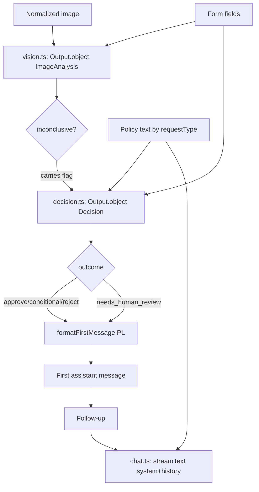
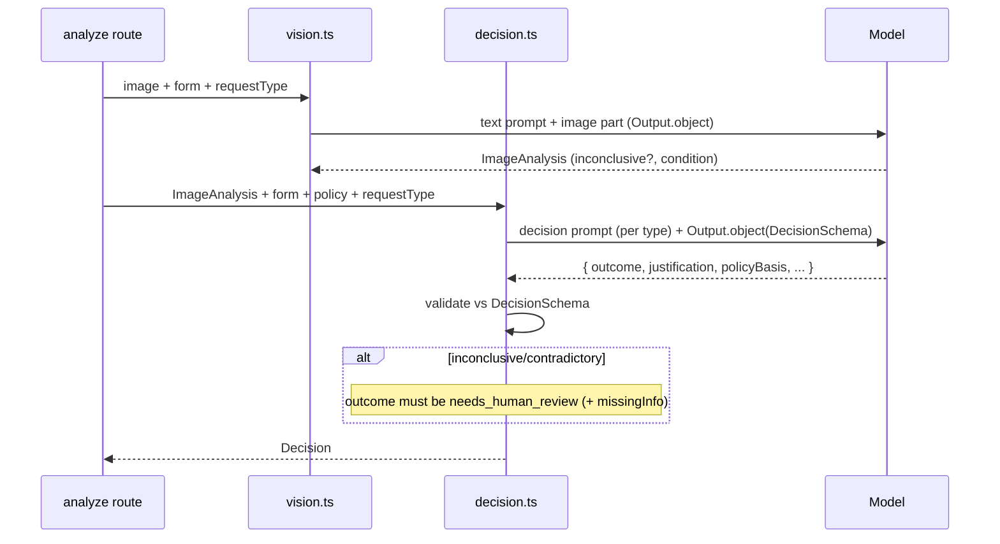

# ADR-003: AI Agent (Vision, Decision & Chat)

**Date:** 2026-06-17
**Status:** Accepted
**Relates to:** [docs/ADR/000-main-architecture.md](000-main-architecture.md)

---

## 1. Scope

Covers the AI behavior: the vision step (image → condition description), the reasoning step (structured Approve/Conditional/Reject/Needs-human-review decision grounded in policy), the chat agent (context-aware follow-ups), the prompt templates (Polish), the decision schema, and policy injection.

**Does NOT cover:** route plumbing/validation (ADR-002) or UI rendering (ADR-001).

---

## 2. Context7 References

| Library | Context7 Handle | Used for |
|---|---|---|
| AI SDK | `/vercel/ai` | `generateText` + `Output.object`, `streamText`, multimodal message parts, `convertToModelMessages` |
| OpenRouter provider | resolve `@openrouter/ai-sdk-provider` | Model factory (vision-capable) |
| Zod | `/colinhacks/zod` | Decision + image-analysis schemas for `Output.object` |

Policy source files: [docs/policies/complaint-policy.md](../policies/complaint-policy.md), [docs/policies/return-policy.md](../policies/return-policy.md).

---

## 3. Component Design

Three AI functions, all using the single OpenRouter model from `lib/ai/provider.ts`. Each builds messages from `lib/ai/prompts.ts` (PL).

### Vision (`lib/ai/vision.ts`)
- Input: normalized image bytes + `requestType` + form fields.
- Sends a message with a **text part** (the request-type-specific vision prompt) + an **image part**.
- Output: structured `ImageAnalysis` via `Output.object` (so the `inconclusive` flag and condition fields are machine-readable).
- **Complaint vision prompt:** ask whether the equipment is damaged, what the damage is, and the likely cause; require an explicit `inconclusive` flag when the photo is blurry/partial/wrong-subject (AC-10, AC-12).
- **Return vision prompt:** ask whether the equipment shows no damage and no signs of usage (resaleable-as-new); same `inconclusive` discipline (AC-11, AC-12).
- The prompt forbids inventing details not visible in the photo.

### Decision (`lib/ai/decision.ts`)
- Input: `ImageAnalysis` + form fields + the matching policy text.
- Uses `generateText` with `output: Output.object({ schema: DecisionSchema })`.
- **Different prompt per request type** (AC-14): complaint decision prompt vs return decision prompt, each injecting the corresponding policy verbatim and the rules from PRD §11.
- Hard rules in the prompt:
  - Produce exactly one of `approve | conditional | reject | needs_human_review`.
  - Ground every decision in the injected policy + observed condition; **do not invent** policy rules, dates, or facts (PRD §11 "Not allowed").
  - If `imageAnalysis.inconclusive` is true OR evidence is contradictory/borderline → `needs_human_review` (or request a clearer photo) with `missingInfo`; never fabricate a verdict (AC-16).
  - `justification` is mandatory and must reference the policy basis and the condition (AC-15).
  - State it is a **recommendation to support staff**, not a binding decision (mandatory notice).
  - Respond in Polish.

### Chat (`lib/ai/chat.ts`)
- Input: `messages` (history) + `caseContext` (form, imageAnalysis, decision, policyId).
- Builds a **system prompt** embedding: role/behavior (PRD §11), the form data, the image analysis, the full policy text, and the original decision; then streams the reply with `streamText`.
- Behavior rules in the system prompt:
  - Use the full case context; may refine the explanation if the user adds relevant info, but stay within the case + policy scope (AC-19).
  - Keep the justification explicit; never invent policy/facts.
  - Politely decline off-topic requests and steer back to the current case (AC-20).
  - Respond in Polish; professional, clear, neutral tone (PRD §11).

### Prompts (`lib/ai/prompts.ts`)
- Exposes builders: `visionPrompt(requestType, form)`, `decisionPrompt(requestType, form, imageAnalysis, policyText)`, `chatSystemPrompt(caseContext, policyText)`, and `formatFirstMessage(decision)`.
- All copy in Polish. Centralized so wording is reviewable and testable.

### Policy injection (`lib/policies/loader.ts`)
- `getPolicy(requestType)` returns `{ id, content }` from the matching file, cached in memory.
- The **full** policy markdown is injected into the decision and chat prompts (the documents are short; no chunking/RAG in MVP).

---

## 4. Data Structures

### DecisionSchema (Zod → `Output.object`)
- `outcome`: enum `"approve" | "conditional" | "reject" | "needs_human_review"`.
- `justification`: non-empty string (PL). **Required.**
- `policyBasis`: array of strings — referenced policy clause(s)/section(s).
- `conditions`: optional array of strings — present/meaningful when `outcome = "conditional"`.
- `missingInfo`: optional string — what is missing/unclear, when `outcome = "needs_human_review"`.
- `nextSteps`: string (PL).

### ImageAnalysisSchema (Zod → `Output.object`)
- Common: `inconclusive: boolean`, `inconclusiveReason?: string`, `observations: string`.
- Complaint variant: `isDamaged: "yes" | "no" | "unknown"`, `damageDescription?: string`, `likelyCause?: string`.
- Return variant: `showsDamage: "yes" | "no" | "unknown"`, `showsUsageSigns: "yes" | "no" | "unknown"`, `resaleableAsNew: "yes" | "no" | "unknown"`.
- Implement as a discriminated union on `requestType`, or two sibling schemas selected by request type.

### Message shapes
- Vision call: one user message with parts `[{ type: "text", text: visionPrompt }, { type: "image", image: <bytes>, mediaType }]` (verify exact part keys against `node_modules/ai/docs/`).
- Chat call: `system` string + `convertToModelMessages(messages)`.

---

## 5. Interface Contracts

- `analyzeImage(image, requestType, form) → ImageAnalysis` — throws on provider error; sets `inconclusive` rather than guessing.
- `decide(imageAnalysis, form, policyText, requestType) → Decision` — output validated against `DecisionSchema`; invalid output is an error (no fabricated fallback).
- `streamChat(messages, caseContext, policyText) → StreamResult` — returns a stream consumed by the route's `toUIMessageStreamResponse()`.
- `formatFirstMessage(decision) → string` — deterministic PL formatting of the decision for the first chat bubble.

---

## 6. Technical Decisions

### Two-step pipeline: vision → reasoning (not one combined call)
**Status:** Accepted · **Date:** 2026-06-17
**Context:** The condition assessment and the policy judgment are distinct concerns; separating them improves testability and grounding (PRD flow 4.1/4.2).
**Decision:** Step 1 produces a structured `ImageAnalysis`; step 2 reasons over analysis + form + policy to produce the `Decision`. Both use the same model.
**Rejected alternatives:** Single prompt doing vision + policy reasoning at once — harder to test, easier to hallucinate, can't reuse the analysis cheaply in chat.
**Consequences:** (+) Each step independently testable; analysis reused in chat without re-sending the image. (−) Two model calls per submission (latency/cost).
**Review trigger:** If latency/cost forces a single combined call.

### Structured outputs for both vision and decision
**Status:** Accepted · **Date:** 2026-06-17
**Context:** The `inconclusive` flag (AC-12) and the four-way outcome + mandatory justification (AC-13/AC-15) must be machine-verifiable.
**Decision:** Use `Output.object` with Zod schemas for vision and decision; validate before use.
**Rejected alternatives:** Parse outcomes from free-form prose — brittle, fails ACs.
**Consequences:** (+) Enforceable contracts; clean tests. (−) Schema must be kept in sync with prompt wording.
**Review trigger:** If the model struggles to satisfy the schema reliably.

### Inject full policy text verbatim (no RAG)
**Status:** Accepted · **Date:** 2026-06-17
**Context:** Two short policy docs; RAG is explicitly out of scope (PRD §7).
**Decision:** Inject the entire matching policy markdown into the decision and chat prompts.
**Rejected alternatives:** Embed + retrieve chunks — unnecessary complexity for two short documents.
**Consequences:** (+) Simple, fully grounded, deterministic. (−) Token cost grows if policies grow.
**Review trigger:** When policies become large or numerous (phase 2 knowledge base).

### Escalate, don't guess, on inconclusive/contradictory evidence
**Status:** Accepted · **Date:** 2026-06-17
**Context:** PRD §11 and AC-16 forbid fabricated verdicts.
**Decision:** If vision is inconclusive or evidence contradicts the description, the decision prompt must return `needs_human_review` (or request a clearer photo) with `missingInfo`.
**Rejected alternatives:** Force a verdict with low confidence — violates AC-16 and the business constraint.
**Consequences:** (+) Safe, defensible. (−) Some cases route to humans (intended).
**Review trigger:** If escalation rate is impractically high in practice.

---

## 7. Diagrams

### AI pipeline

### Decision reasoning sequence

---

## 8. Testing Strategy

> Integration tests mock the model (AI SDK mock model) returning canned structured outputs; prompt builders and `formatFirstMessage` are unit-tested as pure functions.

### Test scenarios for this area

| Scenario | Type | Input | Expected output | Edge cases |
|---|---|---|---|---|
| Complaint vision prompt | Unit | requestType=complaint | Prompt asks damage/type/cause; PL; forbids invention | — |
| Return vision prompt | Unit | requestType=return | Prompt asks no-damage/no-usage; PL | — |
| Inconclusive propagation | Integration | mock vision `inconclusive=true` | Decision = needs_human_review with missingInfo | wrong-subject photo |
| Decision per type | Integration | complaint vs return + mock | Correct policy injected; valid outcome | both produce justification |
| Justification mandatory | Integration | mock returns no `justification` | Treated as invalid output (error), not surfaced | empty string rejected |
| Four outcomes | Integration | mock each outcome | Each maps to a correct PL first message | conditional includes conditions |
| Grounding | Unit/Integration | inspect decision prompt | Policy text present verbatim; "no invented rules" instruction present | — |
| First message format | Unit | each Decision | greeting + outcome + justification + next steps + notice (PL) | needs_human_review wording |
| Chat context | Integration | follow-up + caseContext + mock | System prompt includes form, analysis, policy, decision | off-topic → polite decline |
| Off-topic decline | Integration | unrelated question | Reply declines politely, steers back (PL) | — |

### Technical acceptance criteria

- **TAC-301:** The vision call uses a distinct prompt for complaint vs return and always yields a parseable `ImageAnalysis` with an `inconclusive` boolean (AC-10/AC-11/AC-12).
- **TAC-302:** The decision uses a distinct prompt per request type and the matching policy text (AC-14).
- **TAC-303:** Every `Decision` validates against `DecisionSchema` with a non-empty `justification`; otherwise it is an error, never a fabricated decision (AC-15).
- **TAC-304:** When `imageAnalysis.inconclusive` is true, the produced outcome is `needs_human_review` with non-empty `missingInfo` (AC-16).
- **TAC-305:** The decision and chat prompts contain the full policy text and an explicit "do not invent rules/facts" instruction (PRD §11).
- **TAC-306:** `formatFirstMessage` output (PL) contains the outcome, the justification, next steps, and the "recommendation, not binding" notice for all four outcomes (AC-17, mandatory notices).
- **TAC-307:** The chat system prompt instructs Polish-only, in-scope answers and polite off-topic decline (AC-20).
