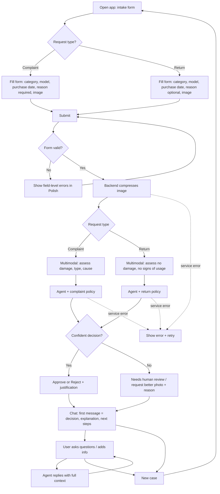

# PRD — Hardware Service Decision Copilot

---

## 1. Executive Summary

Hardware Service Decision Copilot is an MVP web application that supports customer-support and hardware-service employees in making **complaint** and **return** decisions for consumer electronics. The user fills in a short intake form and uploads one photo of the equipment; the system analyzes the image with a multimodal LLM, applies the company's complaint/return policy documents through a reasoning agent, and returns a decision with a clear justification. The user can then continue in a chat interface to ask questions or supply additional information. This is a proof-of-concept; persistence, customer history, and a knowledge base are explicitly out of scope for the MVP.

---

## 2. Problem Statement

When a customer submits a complaint (claimed defect) or a return (change-of-mind), a support employee must decide whether the request qualifies under company policy. Today this requires the employee to manually inspect the equipment photo, recall or look up the relevant policy clauses, judge whether the described/visible condition matches the policy, and write a justified answer. The judgment is inconsistent between employees, slow, and hard to defend, because the policy rules and the visual evidence are evaluated informally in the employee's head. There is no structured tool that combines the intake data, an objective description of the equipment's condition, and the written policy into a single, justified recommendation. Employees need decision support that is consistent, explainable, and grounded in the actual policy text.

---

## 3. Users / Personas

**Support agent (primary).** Front-line customer-support employee who receives complaint/return requests. Wants to enter the case details and a photo and get a fast, policy-grounded recommendation with a justification they can relay to the customer. Expects to be able to ask follow-up questions when the customer pushes back or adds information.

**Hardware service technician.** Evaluates the physical/technical condition of returned or complained equipment. Wants the system's reading of the photo (damage type, signs of usage) and how that maps to policy. Expects the decision to flag when the photo is insufficient and a physical inspection is required.

**Service team lead / reviewer.** Supervises decisions and handles escalations. Wants every recommendation to carry an explicit justification and a clear "needs human review" outcome when the case is ambiguous, so that borderline cases are routed to a person rather than auto-decided.

---

## 4. Main Flows

### 4.1 Submit a complaint (happy path)
1. User opens the application and sees the intake form.
2. User selects **Request type = Complaint**.
3. User selects the **equipment category**, enters the **name/model**, picks the **date of purchase**, writes the **reason for the complaint** (mandatory for complaints), and uploads **one image** of the equipment.
4. User submits the form.
5. System validates the form (see Acceptance Criteria). On any failure it keeps the user on the form and shows field-level errors.
6. System processes the uploaded image (compression/normalization) and sends it to the multimodal LLM using the **complaint** image prompt: judge whether the equipment is damaged, what the damage is, and what could have caused it.
7. System passes the image description plus all form data and the **complaint policy** document to the reasoning agent, which produces a decision (**Approve / Reject / Needs human review**) with a justification grounded in the policy.
8. System transitions the user to the chat interface and shows the decision as the first assistant message: greeting, decision, explanation, and next steps, nicely formatted.
9. User can continue the conversation (see 4.4).

### 4.2 Submit a return (happy path)
1. User opens the application and sees the intake form.
2. User selects **Request type = Return**.
3. User selects the **equipment category**, enters the **name/model**, picks the **date of purchase**, optionally writes a **reason**, and uploads **one image** of the equipment.
4. User submits the form.
5. System validates the form. On failure it shows field-level errors and stays on the form.
6. System processes the image and sends it to the multimodal LLM using the **return** image prompt: judge whether the equipment shows no damage and no signs of usage, i.e. whether it could be resold as new.
7. System passes the image description plus form data and the **return policy** document to the reasoning agent, which produces a decision (**Approve / Reject / Needs human review**) with a justification grounded in the policy.
8. System transitions the user to the chat interface and shows the decision as the first assistant message (greeting, decision, explanation, next steps).
9. User can continue the conversation (see 4.4).

### 4.3 Image insufficient or ambiguous (alternative)
1. During steps 4.1/4.2, the multimodal analysis cannot determine the relevant condition (photo too blurry, wrong subject, partial view, or contradictory evidence).
2. The agent does not fabricate a verdict. It returns **Needs human review** (or requests a better photo) and states exactly what is missing or unclear.
3. The first chat message explains the limitation and the next step (re-submit a clearer photo, or route to a human).

### 4.4 Continue in chat
1. After the first decision message, the user types a question or provides additional information (e.g. clarifies how the damage occurred).
2. The agent answers using the full conversation context: the form data, the image description, the policy document, the original decision, and all prior chat turns.
3. The agent may refine or revise its explanation based on the new information, but it stays within the scope of the case and the policy, and it always keeps the justification explicit.

### 4.5 Start a new case
1. From the chat interface, the user chooses to start a new request.
2. System returns to an empty intake form. The previous conversation is not retained (no persistence in the MVP).

---

## 5. User Stories

- As a support agent, I want to enter the request type, equipment details, purchase date, reason, and a photo and submit them, so that I get a policy-grounded decision without checking the policy manually.
- As a support agent, I want the first chat message to clearly state the decision, the reasons, and the next steps, so that I can relay an accurate answer to the customer.
- As a hardware service technician, I want the system to describe the damage or signs of usage it sees in the photo, so that I can confirm the technical assessment.
- As a support agent, I want to ask follow-up questions and add information in chat and have the agent use the full case context, so that I can handle the customer's objections in one place.
- As a support agent, I want clear field-level validation errors when I miss a required field or upload an invalid image, so that I can correct the form before submitting.
- As a service team lead, I want ambiguous or low-confidence cases to be returned as "Needs human review" with a stated reason, so that borderline cases reach a person instead of being auto-decided.
- As a support agent, I want a clear message when the AI service is temporarily unavailable, so that I know to retry rather than assume a decision was made.
- As a support agent, I want to start a new case from the chat view, so that I can process the next customer without reloading or carrying over the previous case.

---

## 6. Acceptance Criteria

### Form
- **AC-01** The form shows a **Request type** control with exactly two options: *Complaint* and *Return*.
- **AC-02** The form shows an **Equipment category** control populated from a predefined list (see Constraints → Functional).
- **AC-03** The form shows a **Name/Model** free-text input.
- **AC-04** The form shows a **Date of purchase** date picker; the selected date cannot be in the future.
- **AC-05** The form shows a **Reason** multi-line text input. It is **mandatory when Request type = Complaint** and optional when Request type = Return.
- **AC-06** The form requires exactly **one image upload**; submission is blocked until an image is attached.
- **AC-07** On submit with any missing or invalid required field, the system blocks submission, keeps entered values, and shows a field-level error message in Polish for each invalid field.
- **AC-08** The image upload accepts only supported formats and enforces the maximum size (see Constraints → Functional); a rejected file produces a clear inline error and is not sent to the backend.

### Image analysis
- **AC-09** On valid submission the backend reduces the image (compression/normalization) before sending it to the multimodal LLM.
- **AC-10** For **Complaint**, the multimodal prompt asks whether the equipment is damaged, what the damage is, and the likely cause.
- **AC-11** For **Return**, the multimodal prompt asks whether the equipment shows no damage and no signs of usage (resaleable-as-new).
- **AC-12** If the multimodal model cannot assess the relevant condition, the system records the analysis as inconclusive and this is reflected in the agent's outcome (see AC-16).

### Agent decision
- **AC-13** The agent receives the image description, all form fields, and the policy document matching the request type (complaint vs return) and produces one of three outcomes: **Approve**, **Reject**, or **Needs human review**.
- **AC-14** The agent uses a different decision prompt for the complaint scenario and for the return scenario.
- **AC-15** Every decision includes a justification that references the relevant policy basis and the equipment condition; a decision without a justification is invalid.
- **AC-16** When the evidence is insufficient or contradictory, the agent returns **Needs human review** (or requests a clearer photo) and states what is missing; it does not fabricate Approve/Reject.
- **AC-17** The decision is presented as the **first assistant message** in the chat, containing: greeting, decision, explanation, and next steps, formatted for readability.

### Chat
- **AC-18** After the first message the user can send free-text messages and receive agent replies.
- **AC-19** Each agent reply is generated with the full context: form data, image description, policy document, the first decision message, and all prior chat turns.
- **AC-20** The agent stays within the scope of the current case and policy; off-topic requests are politely declined (see Agent Behavior).
- **AC-21** While the agent is generating a reply, the UI shows a loading/typing indicator and prevents duplicate submissions.

### General
- **AC-22** All user-facing text, including errors, decisions, and chat, is in **Polish**.
- **AC-23** If the multimodal or agent service call fails, the system shows a clear error state and allows retry; it never shows a fabricated or partial decision as final.
- **AC-24** The user can start a new case from the chat view, which returns them to an empty form.

---

## 7. Out of Scope

- **Authentication and user accounts** — no login, roles, or per-user data in the MVP.
- **Session and decision persistence** — sessions, decisions, and actions are **not** saved to a database (phase 2).
- **Customer data and purchase-history lookup** — no retrieval of existing customer records or order history (phase 2).
- **RAG knowledge base** — no internal knowledge base of electronics specifications or procedures beyond the two injected policy documents (phase 2).
- **Multiple image uploads** — exactly one image per case; no galleries, video, or attachments.
- **Editing a submitted case** — once submitted, the case is fixed; corrections happen via a new case or via chat clarification, not by editing the form.
- **Notifications / email / ticketing integration** — no outbound messages or integration with CRM/ticketing systems.
- **Admin UI** — no interface to manage categories or policy documents; policies are provided as static files.
- **Multilingual UI** — Polish only.
- **Native mobile apps** — web only.
- **Automated execution of the decision** — the system recommends; it does not issue refunds, RMAs, or any financial/logistics action.

---

## 8. Constraints

### Business
- The system provides a **decision recommendation**; it does not by itself authorize refunds, replacements, or returns. A human remains accountable for the final action.
- Decisions must be **grounded in the provided policy documents**. The agent must not invent policy rules that are not in the documents.
- Ambiguous or low-confidence cases must be routed to a human (**Needs human review**) rather than auto-decided.
- The justification must be explainable to the customer and defensible against the policy text.

### Functional
- **Request types:** exactly two — *Complaint*, *Return*.
- **Equipment categories (predefined):** Smartphone, Laptop, Tablet, TV, Audio / Headphones, Smartwatch / Wearable, Camera, Home appliance, Accessory, Other.
- **Image upload:** exactly one image; accepted formats JPEG, PNG, WebP; maximum size 10 MB before compression. Files outside these limits are rejected client-side with an inline error.
- **Reason field:** mandatory for Complaint, optional for Return.
- **Date of purchase:** cannot be a future date.
- **Language:** all UI and generated text in Polish.
- **Supported environment:** modern desktop and mobile web browsers (current versions of Chrome, Edge, Firefox, Safari).

### External document / data references

The MVP injects two example policy documents into the agent prompt as the rules to follow. These are provided as static files and seeded with example content.

| Document name | File path | When it is used |
|---|---|---|
| Complaint policy / terms | `docs/policies/complaint-policy.md` | Injected into the agent prompt when Request type = **Complaint** |
| Return policy / terms | `docs/policies/return-policy.md` | Injected into the agent prompt when Request type = **Return** |

> Note: example content for both documents must be created as part of the MVP so the agent has rules to apply. Exact file format/location is an implementation detail to be confirmed in the ADR.

---

## 9. UI Description (wireframe level)

### 9.1 Intake form screen
- **Layout:** a single vertical form with a title, the fields in order, and a primary **Submit** button at the bottom.
- **Fields, top to bottom:**
  - **Request type** — segmented control or dropdown with two options (Complaint, Return). Selecting *Complaint* makes the Reason field mandatory; selecting *Return* makes it optional. This choice also determines which prompts and policy document are used downstream.
  - **Equipment category** — dropdown populated from the predefined list.
  - **Name / Model** — single-line text input.
  - **Date of purchase** — date picker; future dates are not selectable/accepted.
  - **Reason** — multi-line text area; label indicates required/optional based on request type.
  - **Equipment photo** — single-file upload control showing a thumbnail preview once a file is selected, with a remove/replace action.
- **Validation / error states:** each invalid field shows an inline error message in Polish below it on submit; the form does not advance until all errors are resolved.
- **Loading state:** on submit, the button shows a processing state and the form is disabled while the image is analyzed and the decision is generated; the user cannot submit twice.
- **Navigation:** successful submission replaces the form view with the chat view.

### 9.2 Chat screen
- **Layout:** a conversation view with message bubbles (assistant on one side, user on the other), a message input field, and a send button at the bottom.
- **First message:** the assistant's first bubble contains the decision: greeting, the outcome (Approve / Reject / Needs human review), the explanation/justification, and the next steps, formatted for readability (headings/list as appropriate).
- **Interaction:** the user types follow-up questions or additional information and sends them; replies appear in the conversation in order.
- **Loading state:** while the agent generates a reply, a typing/loading indicator is shown and the input is locked against duplicate sends.
- **Error state:** if a service call fails, an inline error message appears with a retry affordance; no fabricated decision is shown.
- **Empty state:** not applicable after entry, since the chat always opens with the decision message.
- **Navigation:** a **New case** action returns the user to an empty intake form (9.1); the current conversation is discarded.

---

## 10. User Flow Diagram

---

## 11. Agent / System Behavior Specification

### Role and purpose
The agent is a decision-support assistant for complaint and return cases on consumer electronics. It combines (a) an objective description of the equipment's condition from the multimodal model, (b) the structured intake data, and (c) the applicable policy document, to produce a justified recommendation and to answer follow-up questions about that specific case.

### Allowed
- Produce one of three outcomes — **Approve**, **Reject**, **Needs human review** — with a justification grounded in the policy and the equipment condition.
- Cite the relevant policy basis and the observed condition in its explanation.
- Ask the user for a clearer photo or additional information when the evidence is insufficient.
- Refine its explanation in chat when the user provides new, relevant information.

### Not allowed
- Inventing policy rules, warranty terms, dates, or facts not present in the provided policy document or the case data.
- Issuing a final Approve/Reject when the evidence is insufficient or contradictory — it must escalate to **Needs human review**.
- Executing or promising any action (refund, replacement, RMA, shipping); it only recommends.
- Answering questions unrelated to the current complaint/return case.

### Decision categories and how each is communicated
- **Approve** — the request qualifies under policy. Communicate the outcome, the policy basis, and the next steps.
- **Reject** — the request does not qualify. Communicate the outcome, the specific policy reason(s), and what (if anything) the customer can do next.
- **Needs human review** — evidence is insufficient/ambiguous or the case is borderline. Communicate that a human will review, state exactly what is missing or unclear, and what would help (e.g. a clearer photo).

### Mandatory notices
- Every decision message must state that it is a **recommendation to support staff**, not a final, binding company decision.
- Every decision must include an explicit justification; a verdict without reasons is not a valid output.

### Off-topic / out-of-scope handling
- If the user asks something unrelated to the case (general product advice, other orders, topics outside the policy), the agent politely declines and steers back to the current complaint/return case.

### Language and tone
- All output in **Polish**. Tone: professional, clear, concise, and neutral. No marketing language. Explanations should be understandable by both the support employee and, when relayed, the customer.

---

## 12. Further Notes

Assumptions made while writing this PRD (override any of these if incorrect):

1. **MVP scope** is the core flow only: intake form → multimodal image analysis → agent decision → chat follow-up. Session/decision persistence (SQLite), customer-data/purchase-history lookup, and the RAG knowledge base from the source brief are deferred to phase 2 and listed in Out of Scope.
2. **Decision outcomes** are three: Approve / Reject / Needs human review, with escalation on low confidence. If a binary verdict or a "Conditional/partial" outcome is preferred, AC-13 and Section 11 must change.
3. **Equipment category list** uses a standard consumer-electronics set (Section 8 → Functional). Replace with the company's actual catalog if one exists.
4. **Low-confidence handling** defaults to escalation with an explanation (AC-16). The alternative "ask for a better photo first" is included as an allowed agent behavior.
5. **Image limits** (one image; JPEG/PNG/WebP; ≤ 10 MB pre-compression) are reasonable defaults; confirm against the multimodal provider's actual input limits in the ADR.
6. **Policy documents** must be authored as example content during implementation; their exact storage format and injection mechanism are deferred to the ADR.

Open questions to resolve in the ADR / next iteration:
- Which multimodal and reasoning models are used, and their concrete input/size limits.
- Whether "Needs human review" should also produce a structured hand-off artifact for the team lead (relevant once persistence is added).
- How policy documents are versioned and updated once an admin capability exists.
