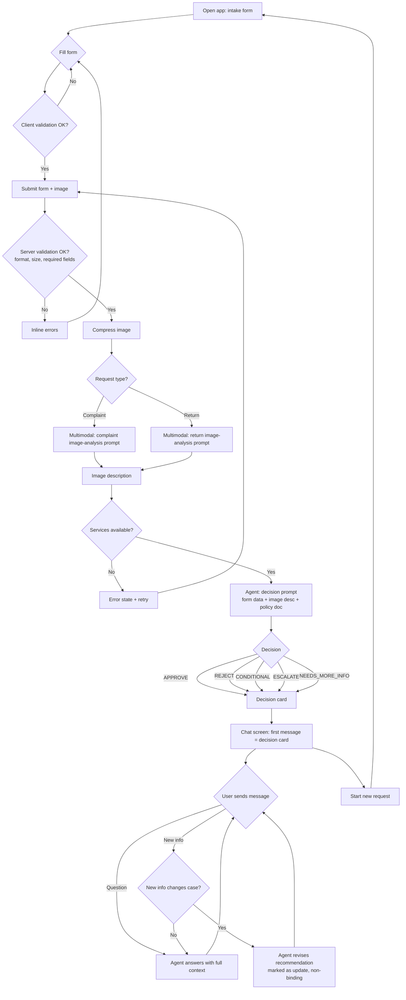

# PRD — Hardware Service Decision Copilot

> **Status:** MVP / Proof of Concept
> **Audience:** Developer agent that will produce the ADR and implement the app.
> **Language note:** This PRD is written in English. All **user-facing** product
> text (UI labels, agent messages, decisions) must be in **Polish**.

---

## 1. Executive Summary

Hardware Service Decision Copilot is a customer-facing web tool that gives a person
who bought consumer electronics an **instant, preliminary assessment** of whether
their **return** or **complaint** is likely to be accepted. The customer fills a
short form and uploads one photo of the device; a multimodal model analyzes the
image, and a reasoning agent combines that analysis with the form data and the
company's return/complaint policies to produce a decision with a clear
justification. The customer can then chat with the agent for clarification. This is
an **MVP/PoC**: the agent's decision is **advisory and non-binding** — the final
decision is always confirmed by the company's human service team.

---

## 2. Problem Statement

When a customer wants to return a device or file a complaint, they cannot tell in
advance whether their case qualifies. Return rules (14-day withdrawal, resellable
condition) and complaint rules (2-year liability, mechanical damage exclusions) are
written in legal language scattered across policy pages. As a result customers:

- submit requests that have no chance of approval (e.g. mechanically broken device
  filed as a manufacturing complaint, or a used device returned after the deadline),
  wasting their time and the service team's time;
- abandon valid requests because they assume they will be rejected;
- cannot get a quick, understandable explanation of *why* a case does or does not
  qualify, tied to the actual policy.

Today this triage is done manually by service staff, one case at a time, with no
immediate feedback for the customer at the moment of submission.

---

## 3. Users / Personas

The MVP is **self-service**: the user is the **end customer**, not an employee.

### Persona A — Anna, the returner
Bought wireless headphones online 5 days ago, changed her mind. The product is
unused and complete. She wants to know if she can return it and get her money back,
and what to do next. Expects a fast yes/no with conditions.

### Persona B — Marek, the complainant
His 4-month-old laptop has dead pixels on the screen. He believes it is a
manufacturing defect. He uploads a photo of the screen and wants to know whether the
complaint will be accepted and whether he will get a repair, replacement or refund.

### Persona C — Katarzyna, the ambiguous case
Her phone screen is cracked. She wants to file a complaint, but the damage looks
mechanical (user-caused), which is typically excluded. She represents the edge case
where the agent must reject or escalate gently, explain why, and point to options
without giving false hope.

---

## 4. Main Flows

### 4.1 Happy path — Return, approved
1. Customer opens the app and sees the intake form.
2. Customer selects request type **Return**, equipment category, enters model name,
   date of purchase, optionally a reason, and uploads one photo.
3. Customer submits the form. The system validates inputs client-side and server-side.
4. The system compresses the image and sends it to the multimodal model with the
   **return image-analysis prompt** (judge whether the device shows signs of use or
   damage that would prevent resale).
5. The system passes the image description + form data + return policy to the
   reasoning agent (**return decision prompt**).
6. The agent returns decision **APPROVE** with justification and next steps.
7. The customer is taken to the chat screen; the first assistant message is a
   formatted decision card (greeting, decision, justification, next steps,
   disclaimer).
8. The customer can ask follow-up questions in the chat.

### 4.2 Happy path — Complaint, approved
1–3. As above, but request type **Complaint**; reason (defect description) is
**mandatory**.
4. Image sent with the **complaint image-analysis prompt** (judge whether the device
   is damaged, what type of damage, and the likely cause — manufacturing defect vs
   user-caused/mechanical/liquid).
5. Form data + image description + complaint policy → agent (**complaint decision
   prompt**).
6. Agent returns **APPROVE** (e.g. repair/replacement) with justification and next
   steps; chat opens with the decision card.

### 4.3 Alternative — Rejected
At step 6 the agent returns **REJECT** when the case violates policy (e.g. return
after 14 days, mechanical damage on a complaint, natural wear). The decision card
explains the specific policy reason and any remaining options (e.g. paid repair).

### 4.4 Alternative — Needs more info
At step 4–6, if the image is unusable (blurry, wrong subject) or a required signal is
missing/ambiguous, the agent returns **NEEDS MORE INFO**, lists exactly what is
missing, and withholds approve/reject. The customer can supply the missing detail in
the chat; the agent then re-evaluates.

### 4.5 Alternative — Conditional
The agent returns **CONDITIONAL** when the case qualifies only under conditions
(e.g. return accepted with a value deduction for light usage; complaint accepted
subject to technical diagnosis). The card states the condition explicitly.

### 4.6 Alternative — Escalate to human
The agent returns **ESCALATE** for cases outside policy scope, disputes over cause,
unusually high value, or low confidence. The card tells the customer the case will be
passed to a human consultant and what happens next.

### 4.7 Chat continuation
1. The agent holds the full context: form data, image description, and the first
   decision message.
2. The customer submits additional information or questions.
3. If new information justifies it, the agent **may revise** the recommendation,
   clearly stating that the decision changed and why. The revised decision remains
   non-binding.

### 4.8 Error paths
- **Invalid form / image** → inline validation errors; submission blocked.
- **Image analysis or agent service unavailable** → the customer sees an error state
  with a retry option; no decision is fabricated.

---

## 5. User Stories

1. **Happy path (return)** — As a customer who bought a device online, I want to
   submit the device details and a photo and instantly learn whether I can return it,
   so that I do not waste time on a request that would be rejected.

2. **Happy path (complaint)** — As a customer with a faulty device, I want to
   describe the defect and upload a photo and receive a preliminary decision with a
   clear justification tied to the policy, so that I understand my rights and the next
   steps.

3. **Mandatory reason (validation)** — As a customer filing a complaint, I want the
   form to require a defect description, so that the assessment is based on complete
   information.

4. **Ambiguous result** — As a customer whose photo is unclear, I want the agent to
   tell me exactly what additional information or photo it needs instead of guessing,
   so that I can get an accurate decision.

5. **Rejected with explanation** — As a customer whose case does not qualify, I want
   a clear, non-blaming explanation of which rule applies and what alternatives I
   have, so that I am not left confused.

6. **Chat follow-up & revision** — As a customer who receives a decision, I want to
   ask questions and provide extra details in a chat, and have the agent update its
   recommendation when warranted, so that the assessment reflects my full situation.

7. **Service unavailable (error)** — As a customer, when the AI service fails, I want
   a clear error message and a retry option rather than a wrong or empty answer, so
   that I know the problem is temporary.

8. **Expectation setting** — As a customer, I want to be told that this assessment is
   preliminary and that the company's team makes the final decision, so that I do not
   treat it as a binding promise.

---

## 6. Acceptance Criteria

### Form & input validation
- **AC-01** The form provides a request-type selector with exactly two options:
  *Reklamacja* (Complaint) and *Zwrot* (Return).
- **AC-02** The form provides an equipment-category selector with a predefined list:
  Smartfon, Laptop, Tablet, Telewizor/Monitor, Audio/Słuchawki, Smartwatch/Wearable,
  Aparat/Kamera, Konsola do gier, Sprzęt AGD, Inne.
- **AC-03** The form provides a free-text input for equipment name/model (required,
  non-empty after trimming).
- **AC-04** The form provides a date-of-purchase picker. A date in the future is
  rejected with an inline error.
- **AC-05** The reason field is a textarea. It is **required when request type =
  Complaint** and optional when request type = Return. A complaint submitted with an
  empty reason is rejected with an inline error.
- **AC-06** Exactly one image upload is required. Submitting with no image is
  rejected with an inline error.
- **AC-07** The form cannot be submitted until all required fields for the selected
  request type are valid; the submit control is disabled or submission is blocked
  with visible errors.

### Image handling
- **AC-08** Accepted image formats are JPEG, PNG, and WebP. Any other format is
  rejected with an error message naming the accepted formats.
- **AC-09** Images larger than **10 MB** are rejected with an error message stating
  the limit.
- **AC-10** The backend compresses/resizes the image before sending it to the
  multimodal model. (Compression result is not surfaced to the user.)
- **AC-11** Only one image per request is accepted; attempting to add a second image
  replaces the first or is blocked.

### AI image analysis
- **AC-12** For request type **Complaint**, the image is analyzed with a prompt that
  assesses whether the device is damaged, the damage type, and the likely cause
  (manufacturing defect vs user-caused / mechanical / liquid).
- **AC-13** For request type **Return**, the image is analyzed with a prompt that
  assesses whether the device shows signs of use or damage that would prevent resale
  as new.
- **AC-14** The image analysis produces a textual description that is passed to the
  decision agent and is retained as part of the conversation context.

### AI decision
- **AC-15** The agent returns exactly one decision from the set:
  **APPROVE, REJECT, NEEDS_MORE_INFO, CONDITIONAL, ESCALATE**.
- **AC-16** The agent uses the **return policy** document for Return requests and the
  **complaint policy** document for Complaint requests as decision rules (see §8).
- **AC-17** Every decision is accompanied by a justification that references the
  concrete policy reason (e.g. deadline exceeded, mechanical damage, within warranty
  period).
- **AC-18** When the image or form data is insufficient to decide, the agent returns
  **NEEDS_MORE_INFO** and lists the specific missing item(s); it does not return
  APPROVE or REJECT in that case.
- **AC-19** Every decision message includes the non-binding disclaimer (see §11).

### Decision presentation (first chat message)
- **AC-20** After a successful submission the user is shown a chat interface whose
  first message is from the system/agent.
- **AC-21** The first message contains, in order: a greeting, the decision, the
  justification, the next steps, and the disclaimer — formatted for readability
  (headings/sections or clearly separated blocks).
- **AC-22** The decision outcome is visually distinguishable (e.g. a labeled status)
  so the user can identify it without reading the full text.

### Chat
- **AC-23** The agent has access to the full conversation context: form data, image
  description, and the first decision message, for every subsequent reply.
- **AC-24** The user can send free-text messages and receives agent replies in the
  same chat thread.
- **AC-25** When the user provides new relevant information, the agent may issue a
  revised recommendation; a revised decision explicitly states that it changed and
  why, and remains non-binding.
- **AC-26** For off-topic requests (unrelated to the return/complaint case), the
  agent declines and redirects to the case, without performing the unrelated task.

### Session / state
- **AC-27** The conversation context persists for the duration of the active session
  (until the user reloads or starts a new request).
- **AC-28** Starting a new request clears the previous form data and conversation.

### General & error handling
- **AC-29** If the image-analysis or decision service is unavailable or errors, the
  user sees an explicit error state with a retry option, and no decision is shown.
- **AC-30** The system never fabricates a decision when image analysis failed to
  produce a usable description; it returns NEEDS_MORE_INFO or an error state.
- **AC-31** All user-facing text (labels, validation messages, decisions, chat) is in
  Polish.

---

## 7. Out of Scope

The following are explicitly **not** part of this MVP:

- **Authentication / accounts** — no login, no user identity, anonymous sessions only.
- **Customer & purchase-history database (SQLite)** — no lookup of existing customer
  data or order history. (Backlog.)
- **Session persistence in a database** — sessions are not stored or auditable across
  restarts; no saving of decisions/actions to a DB. (Backlog.)
- **RAG knowledge base** — no internal retrieval over electronics specs or extended
  procedures; the agent uses only the two injected policy documents. (Backlog.)
- **Multiple images / video** — exactly one image per request.
- **Real human-handoff integration** — "Escalate" is a stated outcome only; there is
  no ticketing, queue, or live-agent connection.
- **Refund / payment processing** — no money movement, no RMA/label generation.
- **Email / SMS / push notifications.**
- **Admin or back-office UI** — no dashboards, no policy editor, no review console.
- **Multilingual UI** — Polish only; no English/other end-user language.
- **Mobile native apps** — responsive web is sufficient; no iOS/Android app.
- **Binding decisions** — the tool never issues a legally binding determination.
- **Analytics / reporting.**

---

## 8. Constraints

### Business
- The agent's output is a **preliminary, non-binding recommendation**. The final
  decision is made by the company's human service team. This must be stated to the
  user on every decision.
- Decision rules must reflect the company's policies, which are grounded in **Polish
  / EU consumer law** (14-day withdrawal for distance contracts; 2-year liability for
  lack of conformity). The agent must not invent rules beyond the provided policy
  documents.
- The agent must not give individualized legal advice; it explains policy and
  recommends next steps only.
- The example policy documents are simplified and labeled as non-authoritative; they
  must not be presented to the user as legal text.

### Functional
- Exactly **one** image per request.
- Accepted image formats: **JPEG, PNG, WebP**.
- Maximum image size: **10 MB** (before backend compression).
- Equipment categories limited to the predefined list (AC-02).
- Date of purchase cannot be in the future.
- Reason is mandatory for Complaint, optional for Return.
- User-facing language: **Polish**.
- Target platform: responsive web (desktop and mobile browser).

### External document / data references

| Document | File path | When used |
|---|---|---|
| Return policy (Polityka zwrotów) | `docs/policies/polityka-zwrotow.md` | Injected as decision rules for **Return** requests (image-analysis + decision prompt) |
| Complaint policy (Polityka reklamacji) | `docs/policies/polityka-reklamacji.md` | Injected as decision rules for **Complaint** requests (image-analysis + decision prompt) |

---

## 9. UI Description (wireframe level)

### 9.1 Intake form screen
- **Layout:** single-column form, top-to-bottom.
- **Elements (in order):**
  1. Request-type selector (Reklamacja / Zwrot) — two mutually exclusive options.
  2. Equipment-category dropdown (predefined list).
  3. Equipment name/model — text input.
  4. Date of purchase — date picker (future dates blocked).
  5. Reason — textarea; label indicates "required" for Complaint, "optional" for
     Return. The required/optional state updates when the request type changes.
  6. Image upload — single-file picker with drag-and-drop area; shows a thumbnail
     preview and a remove control after selection; helper text states accepted
     formats and the 10 MB limit.
  7. Submit button.
- **Validation / error states:** inline errors under each field; the field with the
  first error receives focus; submit is blocked while errors exist.
- **Empty state:** all fields empty; submit disabled.
- **Loading state on submit:** after submit, a processing indicator with a short
  status message (e.g. "Analizujemy zdjęcie i przygotowujemy ocenę…"); the form is
  locked while processing.

### 9.2 Processing / transition state
- Full-area or inline progress indicator shown between submission and the first
  decision message.
- If processing fails, it transitions to an error state (see 9.4) instead of the chat.

### 9.3 Chat screen
- **Layout:** scrollable message thread; message composer (text input + send) fixed
  at the bottom.
- **First message:** the decision card from the agent — a single assistant bubble (or
  a distinct card) containing greeting, a prominent decision status label,
  justification, next steps, and the disclaimer.
- **Subsequent messages:** standard chat bubbles, user on one side, agent on the
  other.
- **Agent thinking/streaming state:** a typing/loading indicator while the agent
  composes a reply; input may stay enabled but sends are queued or disabled until the
  reply completes.
- **Revised decision:** when the agent revises, the new decision is clearly marked as
  an update.
- **New request:** a control to start over, which clears state and returns to 9.1.
- **Error in chat:** if a reply fails, show an inline error on that turn with a retry.

### 9.4 Error state
- Clear message describing that the assessment could not be completed and that it is a
  temporary problem.
- A **retry** control and a way to return to the form.
- No partial or fabricated decision is shown.

### Navigation between screens
Form → (processing) → Chat. From Chat, "start new request" returns to Form. There is
no separate history or list screen in the MVP.

---

## 10. User Flow Diagram

---

## 11. Agent / System Behavior Specification

### Role and purpose
The agent is a **decision copilot** for hardware returns and complaints. It produces a
preliminary, policy-grounded recommendation and then helps the customer understand it
and provide any missing information. Two distinct reasoning configurations exist:
a **return** configuration and a **complaint** configuration, selected by the form's
request type, each paired with the matching policy document and image-analysis prompt.

### Allowed
- Combine form data, the image description, and the relevant policy document to reach
  a decision.
- Choose exactly one outcome: **APPROVE, REJECT, NEEDS_MORE_INFO, CONDITIONAL,
  ESCALATE**.
- Explain the decision in plain Polish, citing the concrete policy reason.
- Ask for specific missing information (NEEDS_MORE_INFO).
- Revise its recommendation in chat when new information justifies it, stating that it
  changed and why.
- Recommend next steps (e.g. how to proceed with the return, what to prepare for a
  complaint).

### Not allowed
- Issuing a binding or final determination, or implying the company is bound by it.
- Inventing rules, deadlines, or rights not present in the provided policy documents.
- Giving individualized legal advice or guaranteeing a refund/repair/outcome.
- Returning APPROVE or REJECT when the evidence is insufficient (must use
  NEEDS_MORE_INFO).
- Fabricating an image description or a decision when image analysis failed.
- Performing tasks unrelated to the return/complaint case.
- Requesting or storing sensitive personal data beyond what the form collects.

### Decision categories and how to communicate them
| Outcome | Meaning | Communication |
|---|---|---|
| **APPROVE** | Case likely qualifies under policy | State approval, the qualifying reason, and next steps |
| **REJECT** | Case likely does not qualify | State the specific policy rule that fails and any alternatives (e.g. paid repair) without blame |
| **NEEDS_MORE_INFO** | Evidence insufficient | List exactly what is missing (clearer photo, purchase date, defect detail); withhold approve/reject |
| **CONDITIONAL** | Qualifies only under stated conditions | State the condition explicitly (e.g. value deduction, requires diagnosis) |
| **ESCALATE** | Outside policy scope / dispute / high value / low confidence | Tell the user it will be passed to a human consultant and what happens next |

### Mandatory disclaimer
Every decision message must include a clear statement, in Polish, that the assessment
is **preliminary and non-binding**, and that the **final decision is made by the
company's service team**. Example intent (wording finalized in implementation):
"To wstępna, niewiążąca ocena. Ostateczną decyzję podejmuje zespół serwisu."

### Off-topic / out-of-scope handling
If the user asks for something unrelated to their return/complaint (general chit-chat,
unrelated tasks, requests for legal representation), the agent politely declines and
steers back to the case.

### Language and tone
- Language: **Polish**, throughout.
- Tone: clear, empathetic, professional, non-blaming — especially for REJECT and
  ESCALATE outcomes.
- Avoid legal jargon; explain rules in everyday terms.
- Be concise; lead with the decision, then the reason, then next steps.

---

## 12. Further Notes

### Assumptions made
- The customer is the device owner and has the device on hand to photograph.
- "Date of purchase" is used as the reference date for deadline checks (14-day return,
  2-year complaint). The distinction between purchase date and delivery/receipt date
  is simplified to purchase date for the MVP.
- The two example policy documents (`docs/policies/`) are authored as part of this
  work and are treated as the source of truth for the agent's rules in the MVP.
- "Advisory / non-binding" reconciles the self-service user with the need for human
  oversight: the human service team confirms outcomes; the MVP does not implement that
  handoff (see Out of Scope).

### Open questions / deferred decisions
- Exact Polish wording of decision templates and disclaimer — finalized in
  implementation against the design guidelines.
- Whether CONDITIONAL value-deduction amounts should be suggested by the agent or left
  qualitative — defaulting to qualitative for the MVP.
- Persistence, customer-history lookup, RAG, and real escalation are deferred to the
  backlog (see Out of Scope) and will be covered by later PRD/ADR iterations.

### Technical decisions deferred to the ADR
Framework, model/provider choice, image-compression approach, prompt storage, API
contracts, data models, and the full testing strategy are intentionally excluded from
this PRD and belong in the ADR.