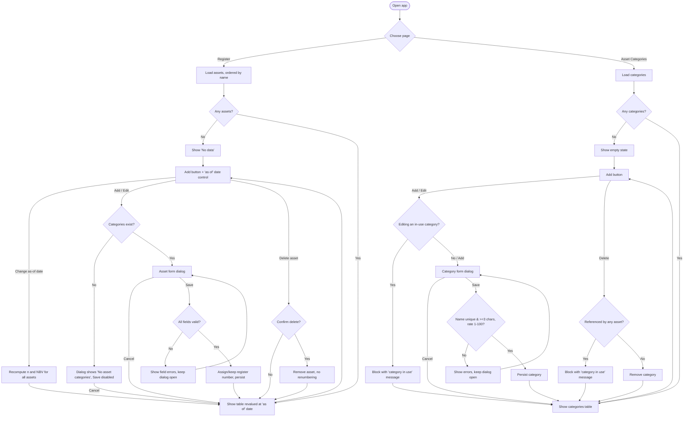

# PRD — FAR (Fixed Asset Register)

---

## 1. Executive Summary

FAR is a highly simplified fixed asset register (MVP). It lets a single accounting user record fixed assets and the depreciation categories that apply to them, and it computes accumulated depreciation and current net book value (NBV) for any chosen valuation date. The product replaces ad‑hoc spreadsheet tracking of straight‑line monthly depreciation.

---

## 2. Problem Statement

Tracking fixed assets and their depreciation today is typically done in manual spreadsheets. Each asset's monthly depreciation charge, accumulated depreciation, and remaining net book value must be recomputed by hand whenever the valuation date changes, which is error‑prone and hard to audit. There is no single place that enforces consistent depreciation rates per asset category or guarantees a unique, ordered register number per asset. Users need a structured register that applies the depreciation rules automatically and shows the correct NBV for a selected date.

---

## 3. Users / Personas

**Accountant (primary).** Maintains the fixed asset register for an organization. Wants to add assets as they are acquired, assign each to a category that carries the correct annual depreciation rate, and read off accumulated depreciation and net book value as of a given date. Expects calculations to follow standard straight‑line monthly depreciation rules and to be reproducible.

**Bookkeeping clerk.** Enters new assets from purchase documents. Wants a simple, validated form that prevents bad data (missing fields, wrong amounts, future purchase dates). Expects clear error messages in Polish and an obvious empty state when there is nothing to show.

**Accounting reviewer.** Periodically checks the register at a period‑end date. Wants to set a valuation ("as of") date and see the whole register revalued for that date without changing any stored data.

---

## 4. Main Flows

### 4.1 View the register (happy path)
1. User opens the Register page.
2. System loads all assets, ordered by asset name ascending.
3. System reads the current "as of" valuation date (defaults to today).
4. For each asset, system computes the monthly depreciation charge, the number of elapsed months `n` up to the valuation date, and the net book value.
5. System displays the table with: register number, name, purchase date, category, initial cost (PLN), net book value (PLN).
6. If there are no assets, system shows the message **"No data"** instead of the table.

### 4.2 Change the valuation ("as of") date
1. On the Register page, user changes the "as of" date control.
2. System recomputes `n` and net book value for every asset using the new date.
3. System re‑renders the table. No stored data is modified.

### 4.3 Add an asset (happy path)
1. User clicks **"Add"** at the top of the Register page.
2. System opens a form dialog with fields: name, purchase date, category (drop‑down), initial cost.
3. If no categories exist, the dialog shows **"No asset categories"** and Save is disabled.
4. User fills all fields and clicks **Save**.
5. System validates all fields (see Acceptance Criteria). On any failure, the dialog stays open and shows field‑level errors; nothing is saved.
6. On success, system assigns the next register number (smallest unused positive integer following the highest existing number), persists the asset, closes the dialog, and refreshes the table.

### 4.4 Add an asset — no categories (alternative)
1. User clicks **"Add"** while the category list is empty.
2. System opens the dialog showing **"No asset categories"**; the category drop‑down is empty and Save is disabled.
3. User clicks **Cancel** (or closes the dialog) and navigates to the Asset Categories page to create categories first.

### 4.5 Edit an asset
1. User triggers edit on an existing asset row.
2. System opens the form dialog pre‑filled with the asset's current values (register number is shown but not editable).
3. User changes values and clicks **Save**; the same validation as Add applies.
4. On success, system persists the changes and refreshes the table. The register number does not change.

### 4.6 Delete an asset
1. User triggers delete on an asset row.
2. System asks for confirmation.
3. On confirm, system removes the asset. Register numbers of other assets are **not** changed (gaps may remain).

### 4.7 Manage asset categories
1. User opens the Asset Categories page.
2. System shows a table of categories: category name, annual depreciation rate (%). If there are no categories, an empty state is shown.
3. User clicks **"Add"** to open a category form dialog (name, rate), fills it, and clicks **Save**.
4. System validates and persists the category, then refreshes the table.
5. User may edit or delete a category **only if it is not referenced by any asset**; otherwise the edit/delete action is blocked with an explanatory message.

---

## 5. User Stories

1. As an accountant, I want each asset to receive a unique, automatically assigned register number in the order assets are added, so that the register is consistently numbered without manual bookkeeping.
2. As a bookkeeping clerk, I want the Add form to reject invalid input (missing fields, name length out of range, cost not greater than 0, future purchase date), so that only valid assets enter the register.
3. As an accountant, I want net book value computed from the annual rate posted monthly, so that the register reflects standard straight‑line monthly depreciation.
4. As an accounting reviewer, I want to choose an "as of" valuation date and see the whole register revalued for that date, so that I can review the register at period end without altering stored data.
5. As a bookkeeping clerk, I want a clear **"No data"** message when the register is empty and a **"No asset categories"** message when I try to add an asset with no categories, so that empty states are unambiguous.
6. As an accountant, I want categories that are in use to be protected from edit and deletion, so that existing assets keep a valid depreciation rate.
7. As an accountant, I want to edit or delete an asset I entered incorrectly, so that I can correct mistakes without rebuilding the register.

---

## 6. Acceptance Criteria

### Register table
- **AC-01** The Register page lists all assets ordered by asset name ascending (case‑insensitive).
- **AC-02** Each row shows exactly: register number, asset name, purchase date (YYYY‑MM‑DD), category name, initial cost in PLN, net book value in PLN.
- **AC-03** When there are no assets, the page displays the text **"No data"** and shows no data table.
- **AC-04** Initial cost and net book value are displayed with exactly 2 decimal places.

### Asset form (Add / Edit)
- **AC-05** Clicking **"Add"** opens a dialog containing fields: asset name, purchase date, category (drop‑down), initial cost; plus **Save** and **Cancel** buttons.
- **AC-06** All four fields are mandatory; **Save** is rejected (with field errors) if any is empty.
- **AC-07** Asset name must be between 5 and 100 characters inclusive; otherwise Save is rejected with a validation error.
- **AC-08** Purchase date must be a valid date in YYYY‑MM‑DD format and must be less than or equal to today; a future date is rejected with a validation error.
- **AC-09** Initial cost must be a number strictly greater than 0, with at most 2 decimal places; otherwise Save is rejected with a validation error.
- **AC-10** The category drop‑down lists every existing category by name; exactly one must be selected.
- **AC-11** If no categories exist when the dialog opens, the dialog displays **"No asset categories"**, the category drop‑down is empty, and **Save** is disabled.
- **AC-12** On successful Save of a new asset, the asset receives a register number equal to (highest existing register number + 1), starting at 1 for the first asset; the dialog closes and the table refreshes.
- **AC-13** On successful Save of an edited asset, all edited fields are persisted and the register number is unchanged.
- **AC-14** Clicking **Cancel** or closing the dialog discards all input and persists nothing.

### Asset categories
- **AC-15** The Asset Categories page shows a table with: category name and annual depreciation rate (%).
- **AC-16** Clicking **"Add"** on the Categories page opens a dialog with fields: category name and annual depreciation rate, plus **Save** and **Cancel**.
- **AC-17** Category name must be unique (case‑insensitive) and at least 3 characters; a duplicate or too‑short name is rejected with a validation error.
- **AC-18** Annual depreciation rate must be an integer between 1 and 100 inclusive; any other value is rejected with a validation error.
- **AC-19** A category that is referenced by at least one asset cannot be edited; the attempt is blocked with an explanatory message.
- **AC-20** A category that is referenced by at least one asset cannot be deleted; the attempt is blocked with an explanatory message.
- **AC-21** When no categories exist, the Categories page shows an empty‑state message and no data rows.

### Calculations
- **AC-22** Monthly depreciation charge = `initial_cost × rate / 12 / 100`, rounded to 2 decimal places using standard half‑up rounding.
- **AC-23** Elapsed months `n` = number of calendar‑month boundaries crossed between the purchase date and the valuation date = `max(0, (asOf.year × 12 + asOf.month) − (purchase.year × 12 + purchase.month))`. The day of month does not affect `n`.
- **AC-24** Net book value = `max(0, initial_cost − n × monthly_depreciation_charge)`.
- **AC-25** When the valuation date is earlier than the purchase date, `n = 0` and net book value equals the initial cost.
- **AC-26** Net book value never falls below 0.

### Valuation date
- **AC-27** The Register page provides an "as of" valuation‑date control that defaults to today's date on first load.
- **AC-28** Changing the "as of" date recomputes `n` and net book value for every asset and re‑renders the table without modifying any stored asset data.

### General
- **AC-29** All user‑facing text (labels, messages, validation errors, empty states) is in Polish.
- **AC-30** Data persists across browser sessions and application restarts (single store; no per‑user separation).

---

## 7. Out of Scope

- **Authentication & authorization** — no login, no roles, no per‑user data separation; a single implicit user.
- **Multi‑currency** — amounts are PLN only.
- **Alternative depreciation methods** — only straight‑line monthly depreciation from an annual rate; no declining‑balance, units‑of‑production, salvage value, or partial‑month proration by day.
- **Asset disposal / revaluation / impairment** — no sale, write‑off, transfer, or revaluation workflows.
- **Reporting & export** — no PDF/Excel/CSV export, no printable reports, no charts.
- **Accumulated‑depreciation column / journal postings** — no general‑ledger integration or posting of charges; NBV is shown, accumulated depreciation is not a stored ledger entry.
- **Audit log / history** — no change history or versioning of assets and categories.
- **Bulk operations & import** — no bulk add, bulk edit, or data import.
- **Renumbering on delete** — deleting an asset does not renumber other assets.
- **Notifications / reminders** — none.
- **Multilingual UI** — Polish only.
- **Mobile / native apps** — web only; no dedicated mobile application.
- **Admin UI / settings** — no configuration screens beyond the two described pages.

---

## 8. Constraints

### Business
- Depreciation rates are defined per category as an annual percentage but charges are posted monthly.
- A category's rate must remain stable while assets reference it (in‑use categories are locked from edit/delete) to keep existing valuations consistent.
- Register numbers are unique positive integers assigned in the order assets are added and are never reused or shifted.

### Functional
- Asset name: 5–100 characters, mandatory.
- Purchase date: valid `YYYY-MM-DD`, mandatory, must be ≤ today (no future dates).
- Initial cost: PLN, numeric, strictly > 0, up to 2 decimal places (grosze), mandatory.
- Category (on asset form): mandatory, chosen from existing categories.
- Category name: unique (case‑insensitive), minimum 3 characters.
- Annual depreciation rate: integer, 1–100 inclusive.
- Register number: integer > 0, unique, auto‑assigned.
- Monetary values displayed with 2 decimal places.
- Rounding: standard half‑up to 2 decimals for the monthly depreciation charge.
- Language: all user‑facing text in Polish.
- Platform: desktop web browser (current evergreen browsers).
- Scope: single user, no authentication, data persisted across sessions.

### External document / data references
Not applicable. The product does not consume external documents or data sources.

---

## 9. UI Description (wireframe level)

### 9.1 Navigation
- A persistent navigation lets the user switch between two pages: **Register** and **Asset Categories**.

### 9.2 Register page
- **Top bar:** an **"Add"** button and an **"as of" valuation‑date** control (defaults to today).
- **Main area:** a table with columns — register number, asset name, purchase date, category, initial cost (PLN), net book value (PLN). Rows ordered by asset name ascending. Each row exposes **edit** and **delete** actions.
- **Empty state:** when there are no assets, the table area is replaced by the text **"No data"**. The **"Add"** button and date control remain visible.
- **Loading state:** while assets are being loaded or recomputed (e.g. after changing the "as of" date), the table area shows a loading indicator.
- **Delete confirmation:** selecting delete shows a confirmation prompt before removal.

### 9.3 Asset form dialog (Add / Edit)
- Opened from the Register page **"Add"** button or a row's edit action.
- **Fields:** asset name (text), purchase date (date, `YYYY-MM-DD`), category (drop‑down of existing categories), initial cost (numeric PLN). In edit mode the register number is displayed read‑only.
- **Buttons:** **Save** and **Cancel** at the bottom.
- **Validation/error state:** invalid fields show inline error messages (in Polish); the dialog stays open until all fields are valid or the user cancels.
- **No‑categories state:** if no categories exist, the dialog shows **"No asset categories"**, the category drop‑down is empty, and **Save** is disabled.

### 9.4 Asset Categories page
- **Top bar:** an **"Add"** button.
- **Main area:** a table with columns — category name, annual depreciation rate (%). Each row exposes **edit** and **delete** actions.
- **In‑use state:** for a category referenced by any asset, edit and delete are disabled or, when attempted, produce an explanatory message that the category is in use.
- **Empty state:** when there are no categories, the table area shows an empty‑state message.

### 9.5 Category form dialog (Add / Edit)
- **Fields:** category name (text), annual depreciation rate (integer %).
- **Buttons:** **Save** and **Cancel** at the bottom.
- **Validation/error state:** duplicate or too‑short name, or out‑of‑range rate, show inline errors (in Polish); the dialog stays open until valid or cancelled.

---

## 10. User Flow Diagram

---

## 11. Agent / System Behavior Specification

Not applicable. FAR contains no AI agent, LLM, or automated decision system; all behavior is deterministic rule‑based calculation as specified in Sections 6 and 8.

---

## 12. Further Notes

- **Assumptions made:**
  - The Register table is sorted by asset name ascending (case‑insensitive); register number remains the unique identifier but is not the sort key.
  - When the "as of" date precedes an asset's purchase date, `n = 0`, so NBV equals the initial cost (assets are still listed, not hidden).
  - Register numbers are not reused after deletion; gaps in the sequence are acceptable.
  - "Standard rounding" for the monthly charge means half‑up to 2 decimal places.
  - Accumulated depreciation is derivable as `initial_cost − net_book_value` but is not shown as a dedicated column in this MVP (only NBV is displayed, per the specified table fields).
- **Deferred to ADR / later stage:**
  - Whether editing a category that is *not* in use is allowed (currently treated as allowed since only in‑use categories are locked).
  - Exact wording of Polish validation, empty‑state, and "category in use" messages.
  - Behavior if the system clock/timezone affects the default "as of" date and the ≤‑today purchase‑date check.
