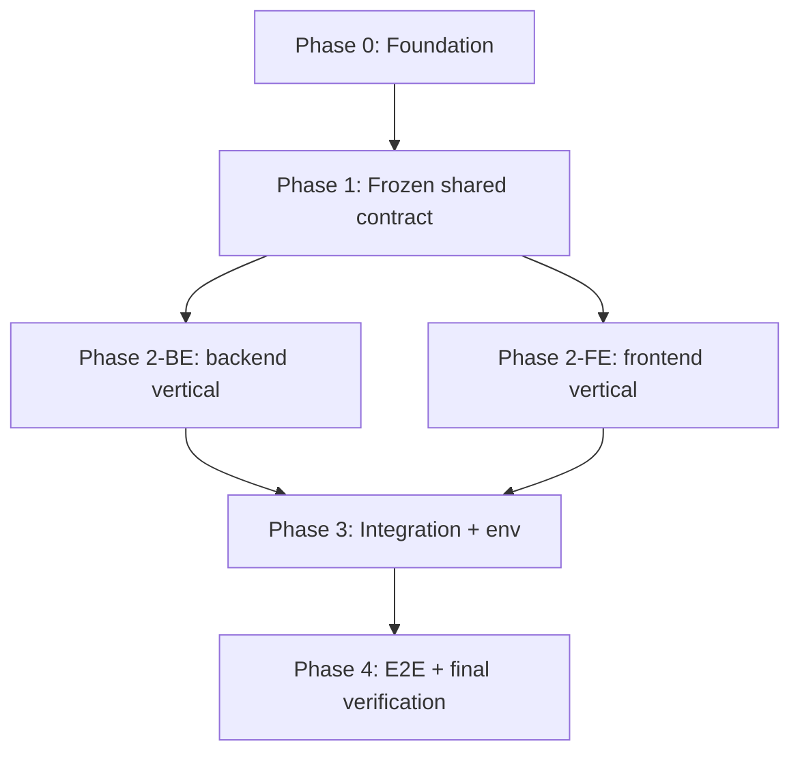
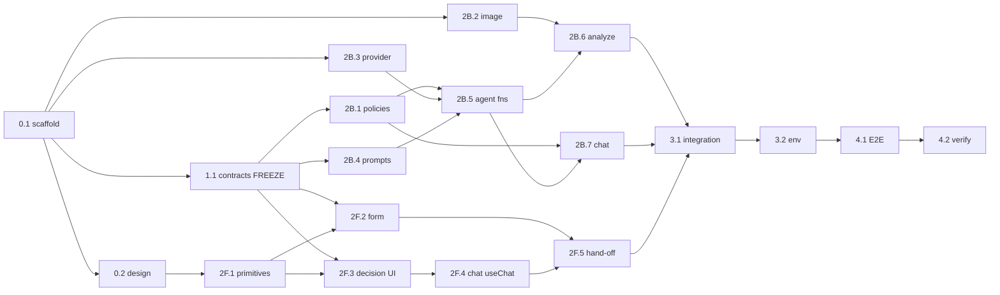

# Implementation Plan — Hardware Service Decision Copilot (PoC)

---

## Context

We are building a **fully working proof of concept** of the *Hardware Service
Decision Copilot* — a Polish-language, self-service web app where a customer submits a
return/complaint intake form + one device photo, a **multimodal LLM** describes the
device condition, and a **separate reasoning LLM** combines that description, the form
data, and the matching policy document into one of five decisions (APPROVE, REJECT,
NEEDS_MORE_INFO, CONDITIONAL, ESCALATE), then continues in a chat.

The product, architecture, and design are already specified:
- `docs/PRD-Product-Requirements-Document.md` — functional spec, AC-01…AC-31.
- `docs/ADR/000-main-architecture.md` … `003-ai-agent.md` — technical decisions.
- `docs/design-guidelines.md` + `assets/design-tokens.json` — dark, Spotify-inspired theme.
- `docs/policies/complaint-policy.md`, `docs/policies/return-policy.md` — agent rules.

`app/` is an **empty scaffold** — no application code exists yet. This plan turns the
specs into running code through **orchestrated sub-agents only**. The orchestrator
writes no production code; it delegates each small step to a specialized agent
with exact, self-contained context, enforces TDD + one-commit-per-step, and
coordinates dependencies so agents work partly in parallel without colliding.

**Confirmed decisions (this session):** (1) deliverable = this plan, pause before
execution; (2) brand = `design-guidelines.md` as-is, "Silky" is only a project name,
no Spotify-branded copy; (3) bootstrap = fresh `create-next-app` (TS, App Router,
Tailwind) + Shadcn/ui + Vitest + Playwright; (4) two OpenRouter models are
env-configurable, defaults `OPENROUTER_MULTIMODAL_MODEL=openai/gpt-4o` (vision) and
`OPENROUTER_DECISION_MODEL=anthropic/claude-3.5-sonnet` (decision + chat).

> ⚠️ Env var **names** are unverified (`.env*` is read-blocked for the orchestrator).
> Task 0.1 reports the actual names from `.env.example` and reconciles with ADR-000 §7
> before any wiring.
>
> ⚠️ PRD §8 names policy files `polityka-zwrotow.md` / `polityka-reklamacji.md`, but the
> real files are `return-policy.md` / `complaint-policy.md` (ADR-000 TD-5). Use the
> real files.

---

## Agents and ownership boundaries

Delegate strictly to the three project agents:
- `.claude/agents/be-developer.md` — backend (commit prefix `Backend:`)
- `.claude/agents/fe-developer.md` — frontend (commit prefix `Frontend:`)
- `.claude/agents/qa-engineer.md` — E2E/QA (commit prefix `QA:`)

To make parallelism safe, each agent **owns disjoint writeable paths**:

| Agent | Owns (writeable) | Must NOT write |
|---|---|---|
| be-developer | `app/api/**`, `lib/ai/**`, `lib/image/**`, `lib/policies/**`, `lib/contracts/**`, backend tests | `app/components/**`, UI pages, styles |
| fe-developer | `app/page.tsx`, `app/layout.tsx`, `app/chat/**`, `app/components/**`, `app/globals.css`, `tailwind.config.*`, FE tests | `app/api/**`, `lib/ai/**`, `lib/image/**` |
| qa-engineer | `e2e/**`, `playwright.config.*`, fixtures, final verification report | production source |

**Shared contract** (`lib/contracts`: Zod schemas + inferred TS types) is authored once
by be-developer in Phase 1, then **frozen**. Both tracks import it read-only. Any
post-freeze change goes through a single orchestrator-mediated contract step.

---

## Execution & coordination protocol

- **Branch:** all work on `feat/poc-implementation` (created in Task 0.1). Never push
  unless the user asks.
- **One step = one commit**, only after the step's changed-scope verification passes
  (`npm test` + `npm run lint`; add `npm run build` at integration/E2E gates). Commit
  format per agent prefix above.
- **TDD every step** (from the agent definitions + AGENTS.md): write/extend tests from
  the AC/TAC → run, confirm they fail for the right reason → minimum implementation →
  verify changed scope → refactor green. Never silently skip tests.
- **Context injection rule:** each task card lists the *exact* files/sections/ACs the
  agent receives — do not hand an agent the whole repo. Cards are self-contained so the
  agent never needs to ask questions. Every agent also always reads `AGENTS.md` + the
  named ADR/PRD sections (per its own definition).
- **Library docs:** agents use Context7 for every library (Next.js `/vercel/next.js`,
  AI SDK `/vercel/ai`, OpenRouter provider `/openrouterteam/ai-sdk-provider`, Tailwind,
  Shadcn/ui, Zod, sharp).
- **Parallelism:** agents run concurrently only inside the same parallel group (P-tag)
  because their paths are disjoint. Phase boundaries are hard sync points: all tasks in
  a phase commit before the next phase begins (unless a card says otherwise).

---

## Phase overview



Phase 2-BE ∥ Phase 2-FE run in parallel (both depend only on the frozen Phase 1
contract; disjoint ownership).

---

## Task cards

Each card: **Owner · Depends-on · Blocks · P-group · Goal · Context to inject ·
TDD/Deliverables · Done-when · Commit.**

### PHASE 0 — Foundation (sequential)

**0.1 — Scaffold + tooling** · be-developer · dep: — · blocks: all
- **Goal:** fresh Next.js App Router + TS in `app/`; install runtime deps (`ai`,
  `@ai-sdk/react`, `@openrouter/ai-sdk-provider`, `zod`, `sharp`) + dev deps (`vitest`,
  `@testing-library/react`, `@testing-library/jest-dom`, `jsdom`, `@playwright/test`);
  configure Vitest (node + jsdom projects), ESLint, scripts `dev|build|lint|test|test:e2e`;
  create branch `feat/poc-implementation`; **report actual `.env.example` names** and
  diff vs ADR-000 §7.
- **Context:** ADR-000 §3 (repo structure, stack) + §7 (env); AGENTS.md (verification,
  test strategy table); Context7 for Next.js, AI SDK, OpenRouter provider.
- **TDD/Done:** trivial sanity test runs; `lint`, `test`, `build` pass on empty app;
  deps pinned; env names reported.
- **Commit:** `Chore: scaffold Next.js app with AI SDK, OpenRouter, Vitest, Playwright`.

**0.2 — Design-system foundation** · fe-developer · dep: 0.1 · blocks: 2F.*
- **Goal:** map `assets/design-tokens.json` into Tailwind theme + CSS vars (colors,
  font stack, spacing, radii); root `app/layout.tsx` (dark `#121212`, fonts, favicon/
  logo from `assets/`); one proof primitive — green-pill **PrimaryButton** (black text,
  pill radius, grow-on-hover).
- **Context:** `docs/design-guidelines.md` (all) + `assets/design-tokens.json` + logo/
  favicon svg; ADR-001 §3 (component list); Tailwind + Shadcn/ui via Context7.
- **TDD/Done:** RTL test asserts PrimaryButton black-text + pill-radius tokens; tokens
  usable as utilities/vars.
- **Commit:** `Frontend: design tokens, root layout, primary button`.

### PHASE 1 — Frozen shared contract (sequential)

**1.1 — Contracts: Zod schemas + types (linchpin)** · be-developer · dep: 0.1 · blocks: all Phase 2
- **Goal:** author `lib/contracts`: `IntakeForm` schema (Polish messages; AC-02 category
  enum; AC-03 trimmed non-empty model; AC-04 date ≤ today; AC-05 reason required iff
  complaint; AC-06/08/09 single image, format, ≤10 MB at type level), `Decision` schema
  (5-outcome enum, justification, nextSteps, missing[], conditions[], disclaimer,
  greeting — **model-compatible: `.nullable()` not `.optional()`**), `ImageAnalysis`,
  `CaseContext`, `AnalyzeResponse`, `ChatRequestBody`; export barrel; mark **frozen**.
- **Context:** PRD AC-01…AC-09, AC-15…AC-19, AC-22; ADR-000 §5/§6; ADR-003 §4; ADR-002 §4; Zod docs.
- **TDD/Done:** one unit test per AC-04…AC-09 pass/fail case + Decision round-trip; all
  green; orchestrator announces **contract frozen**.
- **Commit:** `Backend: shared Zod contracts and types (form, decision, context)`.

### PHASE 2-BE — Backend vertical (P-group **P2-BE**, parallel with P2-FE)

**2B.1 — Policy loader** · dep: 1.1 · blocks: 2B.5, 2B.7
- Goal: `lib/policies.loadPolicy(kind)` reads+caches `complaint-policy.md`/`return-policy.md`.
- Context: ADR-002 §3 (lib/policies), ADR-000 TD-5, the two policy files.
- TDD: return→return text, complaint→complaint text, cache hit identical.
- Commit: `Backend: policy loader with caching`.

**2B.2 — Image compression** · dep: 0.1 · blocks: 2B.6
- Goal: `lib/image.compress(file)` (sharp): enforce JPEG/PNG/WebP, downscale bounded
  edge, re-encode bounded quality, return `{bytes, mediaType}` (AC-10).
- Context: ADR-002 §3 + BE-4; PRD AC-08/09/10; sharp docs.
- TDD: fixtures — large shrinks under bound; bad format rejected; small still
  re-encoded; output ≤ bound (TAC-002-02).
- Commit: `Backend: image compression/normalization (sharp)`.

**2B.3 — OpenRouter provider + model factory** · dep: 0.1 · blocks: 2B.5
- Goal: `lib/ai/provider` — one `createOpenRouter`; `getMultimodalModel()`/
  `getDecisionModel()` from env; never cross-wired.
- Context: ADR-003 §3 + AI-1; ADR-000 §7; OpenRouter provider docs.
- TDD: mock — factory picks `OPENROUTER_MULTIMODAL_MODEL` vs `OPENROUTER_DECISION_MODEL`
  (TAC-003-01); env override honored.
- Commit: `Backend: OpenRouter provider and two-model factory`.

**2B.4 — Prompt builders** · dep: 1.1 · blocks: 2B.5
- Goal: `lib/ai/prompts`: `imageComplaint`, `imageReturn`, `decisionComplaint`,
  `decisionReturn`, `chatSystem`; policy injected at call time; enforce PRD §11 (Polish,
  no invented rules, NEEDS_MORE_INFO on uncertainty, mandatory disclaimer).
- Context: PRD §11, AC-12/13/14/16/17/18/19/26; ADR-003 §3 + AI-3/AI-4/AI-5.
- TDD: complaint vs return image prompts differ (AC-12/13); decision prompts differ
  (AC-14); chat system carries context+policy placeholders.
- Commit: `Backend: prompt builders for image, decision, chat`.

**2B.5 — Agent functions** · dep: 2B.1,2B.3,2B.4 · blocks: 2B.6,2B.7
- Goal: `analyzeImage`, `decide`, `chatStream`; `decide` uses structured output + Zod
  parse; uncertainty→NEEDS_MORE_INFO; parse failure→throw (no fabrication).
- Context: ADR-003 §3/§5/§6 (AI-2,AI-5); PRD AC-15/17/18/19/23/25/26/30.
- TDD: mock LLM — valid Decision parses; missing justification→throw; usable=false→
  NEEDS_MORE_INFO+missing[]; two-model wiring (TAC-003-01..03,05,08).
- Commit: `Backend: image analysis, decision, and chat agent functions`.

**2B.6 — `/api/analyze` route** · dep: 1.1,2B.2,2B.5 · blocks: 3.1
- Goal: Node-runtime route: parse FormData→validate→compress→vision→decide→seed
  message+context→200; 422 validation; 502/503 provider error (no fabricated decision).
- Context: ADR-002 §3/§5/§6 (BE-1..4); ADR-000 §6; PRD AC-07/29/30; Next.js FormData docs.
- TDD: integration (mock only LLM) — valid complaint→200; missing reason→422 PL; future
  date→422; bad format/oversize→422; usable=false→NEEDS_MORE_INFO 200; provider 5xx→
  retryable, no decision (TAC-002-01..05).
- Commit: `Backend: /api/analyze orchestration route`.

**2B.7 — `/api/chat` route (streaming)** · dep: 2B.1,2B.5 · blocks: 3.1
- Goal: Node-runtime stream: parse `{messages,context}`→load policy→system prompt→
  `chatStream`→UI message stream; off-topic declined; revision marked.
- Context: ADR-002 §3/§5 (chat); ADR-003 §3 (chatStream); PRD AC-23/24/25/26; AI SDK UI
  stream docs (`createUIMessageStreamResponse`, `toUIMessageStream`).
- TDD: integration (mock LLM) — system prompt has policy+context; streamed reply;
  off-topic declined (TAC-002-06).
- Commit: `Backend: /api/chat streaming route`.

### PHASE 2-FE — Frontend vertical (P-group **P2-FE**, parallel with P2-BE)

> All FE tasks call **mocked** endpoints; they depend only on the frozen contract.

**2F.1 — UI primitives** · dep: 0.2 · blocks: 2F.2,2F.3
- Goal: Shadcn/ui primitives themed to tokens: Select, Input, Textarea, Card, Dialog,
  SecondaryButton, FieldError, StatusBadge.
- Context: design-guidelines §6; ADR-001 §3; Shadcn/ui docs.
- TDD: RTL render + token-class assertions per primitive.
- Commit: `Frontend: themed UI primitives`.

**2F.2 — Intake form + client validation** · dep: 1.1,2F.1 · blocks: 2F.5
- Goal: form per PRD §9.1 (ordered fields; reason required-state bound to request type;
  single-image dropzone with preview/remove; submit blocked while invalid); client
  validation via shared schema; build `multipart/form-data`; loading/error states.
  Backend **mocked**.
- Context: PRD §9.1, AC-01…AC-09; ADR-001 §3 (Screen 1) + FE-3; frozen contract.
- TDD: RTL — reason toggles required (AC-05); future date blocked (AC-04); format/size
  guard (AC-08/09); single image (AC-11); 422→inline PL; 5xx→error (TAC-001-01/02/06/07).
- Commit: `Frontend: intake form with client validation`.

**2F.3 — Decision card + chat components** · dep: 1.1,2F.1 · blocks: 2F.4
- Goal: `DecisionCard` (greeting, status badge AC-22, justification, next steps,
  disclaimer — ordered AC-21), `MessageBubble`, `TypingIndicator`, `TurnError`.
- Context: PRD AC-19/20/21/22, §9.3; ADR-001 §3 (Screen 2) + FE-2.
- TDD: RTL — all 5 outcomes distinct badge; disclaimer always present (TAC-001-03).
- Commit: `Frontend: decision card and chat message components`.

**2F.4 — Chat screen + useChat wiring** · dep: 2F.3 · blocks: 2F.5
- Goal: `app/chat` with `useChat` + `DefaultChatTransport`; attach `context` via
  `prepareSendMessagesRequest`; seed with decision message; typing/streaming/error
  states; new-request clears state. Transport **mocked**.
- Context: PRD AC-23/24/25/27/28, §9.3; ADR-001 §3 + FE-1; AI SDK UI `useChat` docs.
- TDD: RTL mock transport — every send includes `context` (AC-23); revision marked
  (AC-25); new request resets (AC-28) (TAC-001-04/05).
- Commit: `Frontend: chat screen with useChat transport`.

**2F.5 — Form→chat hand-off + navigation/states** · dep: 2F.2,2F.4 · blocks: 3.1
- Goal: form success → hand off `decision/imageAnalysis/seedMessages/context` to chat
  (client state) → navigate; processing + global error states (PRD §9.2/9.4); new
  request → empty form.
- Context: PRD §9 navigation, AC-27/28; ADR-001 §3 (state) + FE-2.
- TDD: RTL — happy hand-off renders card; error path shows retry; new request resets.
- Commit: `Frontend: form-to-chat hand-off and navigation states`.

### PHASE 3 — Integration (sequential; after P2-BE ∧ P2-FE)

**3.1 — Wire real endpoints + contract reconciliation** · be-developer (lead) + fe-developer (support) · dep: all 2B.*,2F.*
- Goal: point UI at real `/api/analyze` + `/api/chat`; remove FE mocks; reconcile any
  contract drift (frozen contract touched only here); start app; run one real happy-path
  return + one complaint manually (key required).
- Context: ADR-000 §6; ADR-001 §5; ADR-002 §5; running app.
- TDD: keep all unit/integration green; add thin test asserting UI request shapes match
  route parsers; `npm run build` passes.
- Commit: `Chore: wire UI to real API routes, reconcile contracts`.

**3.2 — Env + model configuration** · be-developer · dep: 3.1
- Goal: finalize env (confirm names from 0.1 report; model defaults; fail-fast clear
  message if `OPENROUTER_API_KEY` missing).
- Context: ADR-000 §7; ADR-003 §3; `.env.example` (0.1 report).
- TDD: missing key→explicit startup error; defaults applied when model env unset.
- Commit: `Chore: finalize env and model configuration`.

### PHASE 4 — E2E + verification (qa-engineer)

**4.1 — Manual smoke + Playwright E2E (real stack)** · dep: 3.1,3.2
- Goal: Phase-1 manual smoke (start app, Playwright MCP, screenshot each step, compare
  to PRD §9 + design system, log bugs). Then Phase-2 automated E2E: return→APPROVE,
  complaint→APPROVE, REJECT, NEEDS_MORE_INFO, CONDITIONAL, ESCALATE; validation errors;
  service error+retry; chat follow-up & revision; new request; Polish throughout.
- Context: PRD §4/§5, AC-20…AC-31; ADR-000 §10 scenarios; `playwright-best-practices` skill.
- **Real-stack note (resolve at start of 4.1):** AGENTS.md says E2E uses the real stack
  (no endpoint mocking). Live LLM output is non-deterministic/costly, so drive the
  **OpenRouter network call** through a deterministic test double returning valid canned
  responses per scenario, and assert **structural** behavior (correct outcome label,
  disclaimer present, PL text, error/retry, state reset). Keep one `@live` smoke test
  skipped in CI. *(This is the only open execution question — see "Open items".)*
- TDD: E2E specs authored from AC before fixes they reveal.
- Commit: `QA: Playwright E2E for full decision and chat flows`.

**4.2 — Final verification & AC coverage report** · dep: 4.1
- Goal: run `lint`, `test`, `build`, `test:e2e`; start app; produce AC-01…AC-31 →
  passing-test matrix; report gaps.
- Done-when: all suites green, app starts, every AC backed by a test or a noted
  justified gap.
- Commit: `QA: full verification pass and AC coverage report`.

---

## Dependency matrix

| Task | Owner | Depends on | Blocks | P-group |
|---|---|---|---|---|
| 0.1 Scaffold | be | — | everything | — |
| 0.2 Design system | fe | 0.1 | 2F.* | — |
| 1.1 Contracts (freeze) | be | 0.1 | all Phase 2 | — |
| 2B.1 Policies | be | 1.1 | 2B.5, 2B.7 | P2-BE |
| 2B.2 Image | be | 0.1 | 2B.6 | P2-BE |
| 2B.3 Provider/models | be | 0.1 | 2B.5 | P2-BE |
| 2B.4 Prompts | be | 1.1 | 2B.5 | P2-BE |
| 2B.5 Agent fns | be | 2B.1,2B.3,2B.4 | 2B.6,2B.7 | P2-BE |
| 2B.6 /api/analyze | be | 1.1,2B.2,2B.5 | 3.1 | P2-BE |
| 2B.7 /api/chat | be | 2B.1,2B.5 | 3.1 | P2-BE |
| 2F.1 Primitives | fe | 0.2 | 2F.2,2F.3 | P2-FE |
| 2F.2 Form | fe | 1.1,2F.1 | 2F.5 | P2-FE |
| 2F.3 Decision/chat UI | fe | 1.1,2F.1 | 2F.4 | P2-FE |
| 2F.4 Chat+useChat | fe | 2F.3 | 2F.5 | P2-FE |
| 2F.5 Hand-off/nav | fe | 2F.2,2F.4 | 3.1 | P2-FE |
| 3.1 Integration | be+fe | all 2B.*,2F.* | 3.2 | — |
| 3.2 Env/config | be | 3.1 | 4.1 | — |
| 4.1 E2E | qa | 3.1,3.2 | 4.2 | — |
| 4.2 Verification | qa | 4.1 | — | — |

**Sync points (an agent must wait):** fe-developer cannot start 2F.2/2F.3 until 1.1 is
merged + frozen; integration (3.1) waits for **both** P2-BE and P2-FE complete; qa
starts only after 3.2. Within P2-BE/P2-FE the only shared file is the contract module —
read-only in Phase 2, so tracks never collide.



---

## Verification (how we know the PoC works)

- **Per step:** changed-scope `npm test` + `npm run lint` green before each commit.
- **Phase gates:** Phase 3 adds `npm run build`; Phase 4 runs the full suite + `test:e2e`.
- **End-to-end:** app starts (`npm run dev`); a return and a complaint each flow form →
  decision card → chat follow-up; validation, service-error/retry, and new-request all
  behave per AC.
- **Definition of done:** every AC-01…AC-31 maps to a passing test in the 4.2 report;
  two distinct OpenRouter models wired by role (both env-configurable); no persistence;
  all user-facing text Polish; commits focused on `feat/poc-implementation` (unpushed).

---

## Open items to confirm at execution start (not blocking the plan)

1. **Env var names** — Task 0.1 reads `.env.example` and reconciles with ADR-000 §7.
2. **E2E LLM strategy** — confirm the network-level OpenRouter test double for 4.1 (vs
   paid live calls); default = test double + one skipped `@live` smoke.
3. **Parallel execution mechanism** — FE and BE run as concurrent background agents on
   the shared branch with disjoint paths (default), or sequentially interleaved if you
   prefer simpler review.
```
